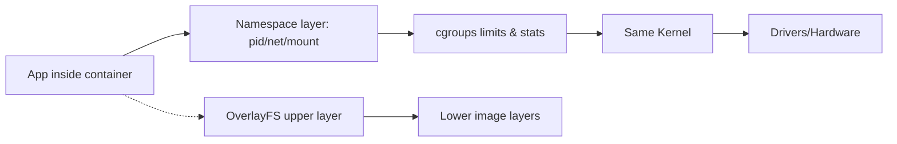

# Virtuallaşdırma və Konteynerlər

Virtuallaşdırma — tam OS-ləri hypervisor üzərində VM kimi işlədir. Konteynerlər — eyni kernel-i paylaşaraq proses səviyyəsində izoliyadır.

## VM-lər

- Type-1/Type-2 hypervisor; KVM (Linux), Hyper-V (Windows), ESXi.
- VirtIO sürücüləri: I/O performansını artırır.
- Snapshot, live migration kimi imkanlar.

## Konteynerlər

- Namespaces: `pid`, `net`, `mnt`, `uts`, `ipc`, `user` — görünən resursları ayırır.
- cgroups: CPU, RAM, I/O limitləri və metriklər.
- Image-lər: layer-lər, union FS (overlayfs).

## Təhlükəsizlik

- rootless containers, seccomp profilləri, AppArmor/SELinux politikaları.
- Capability-lər: `CAP_NET_ADMIN` və s. minimal prinsip.

## Praktika

- CPU/RAM kvotalarını real ehtiyacla uyğunlaşdırın; OOM killer trigger-lərini anlayın.
- PID limitləri, açıq fayl limitləri (`ulimit -n`) kimi resursları tənzimləyin.
- Host və container arasında vaxt sinxronu və timezone fərqlərini nəzərə alın.

## Internals (Hypervisor və Container mexanizmləri)

- HW Virt (VT-x/AMD-V):
  - VMX root vs non-root; bəzi təlimatlar VM-exit yaradır → hypervisor idarə edir.
  - EPT/NPT (Second-level address translation): Guest virtual → guest physical → host physical xəritələnməsi; TLB-də nested entries.
- KVM yolu (Linux):
  - QEMU/KVM userspace → `ioctl(KVM_RUN)` → VM-entry → Guest icra → VM-exit səbəbi (IO, CPUID, EPT violation, irq) → KVM handle → yenidən `KVM_RUN`.
  - Virtio: paravirtual sürücülər; virtqueue ring-lər ilə effektiv I/O.
- Container izoliyası:
  - Namespaces görünüşü dəyişir (pid/net/mount/uts/ipc/user/cgroup), kernel eynidir.
  - cgroups v2 ilə CPU, RAM, I/O limitləri və ölçmələr; `pids.max`, `memory.max`, `cpu.max`.
  - Storage: overlayfs (lower/upper/worker/merged) ilə image layer-ləri.

### VM Exit nümunəsi
- Guest `hlt` və ya IO port əməliyyatı edir → VM-exit → hypervisor event loop bu hadisəni emal edir → lazım gələrsə emulyasiya → VM-entry ilə qayıdış.

### Observability və Praktika
- KVM: `kvm_stat`, `perf kvm --host --guest` VM-exit statistikaları.
- Containers: `cat /proc/self/status`, `/proc/self/cgroup`, `runc state` ilə izoliyanı yoxlayın.
- Security: `userns` + rootless, `seccomp` profilləri; minimal capability set.
