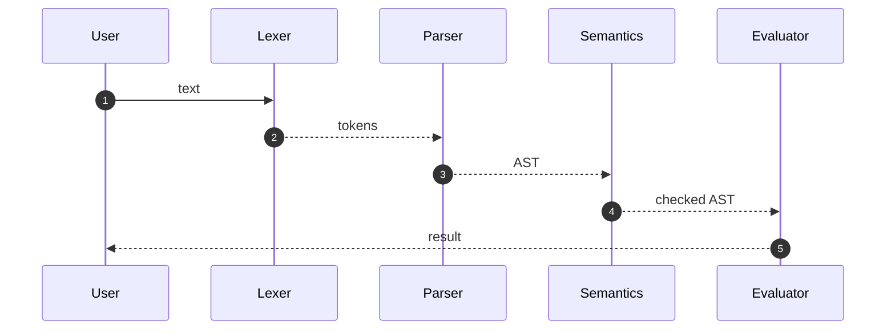

# Kompilyatorlar və İnterpreters — Proqramçı Perspektivi

Bu bölmə proqram dilinin mətnindən icra oluna bilən koda gedən yolu praktik və "internals" fokusunda izah edir. Məqsəd: öz DSL-inizi yazmaq, dil genişləndirmək, ya da performans tənzimləmək üçün lazım olan əsas anlayışları qısa, nümunəli şəkildə verməkdir.

## Böyük Şəkil: Pipeline

- Lexing (Tokenləşdirmə): mətn → token axını
- Parsing: tokenlər → AST/CST
- Semantic Analysis: ad həlli, tip yoxlaması, attribute-lar
- IR (Intermediate Representation) və SSA: dil-agnostik ara dil
- Optimizasiyalar və Dataflow: DCE, GVN, inlining, loop opts
- Code Generation: instruction selection, register allocation
- Linking/Loading: obyekt faylları → icra faylı → prosesə yükləmə
- Runtime/GC/JIT: kitabxana, yaddaş idarəsi, VM/JIT qatları


## AOT vs JIT vs Interpreter

- AOT (Ahead-of-Time): C/C++ kimi dillərdə compile zamanı maşın kodu yaradılır.
- Interpreter: AST və ya bytecode-u oxuyub addım-addım icra edir; start-up sürətli, peak performans aşağı.
- JIT: profil məlumatına əsaslanıb run-time-da isti yolları native kod kimi generasiya edir; deopt/OSR lazımdır.

## Kiçik Nümunə (Mini-Expr dili)

- Dil: toplama və vurma, dəyişənlər, tam ədəd literalı
- Məqsəd: giriş mətni → AST → sadə evaluator

```text
input: x = 2 + 3*4
```



## Praktik İstifadə Halları

- Konfiqurasiya/Query DSL-ləri (məs., analytics filtrləri)
- Codegen/templatinq (ORM, RPC stublar, API schema → kod)
- Təhlükəsizlik: sandbox VM-ində plugin icrası

## Terminlər və Alətlər

- Parser generator-lar: ANTLR, Bison/Yacc, PEG (pest, peg.js)
- IR/Backend: LLVM, Cranelift, GCC GIMPLE/RTL
- VM/JIT: HotSpot, V8, .NET RyuJIT, LuaJIT

## Observability və Praktika

- "Print the IR": optimizasiya mərhələlərindən əvvəl/sonra IR-i çıxarın
- Profil yönümlü optimizasiya: runtime profilini yığın; JIT ya da PGO istifadə edin
- Səhv mesajları: token/AST düyünlərində span/loc saxlayın; istifadəçiyə dəqiq kontekst verin
