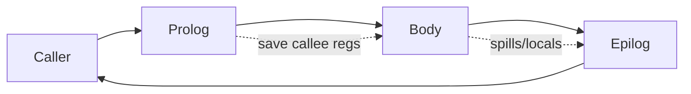
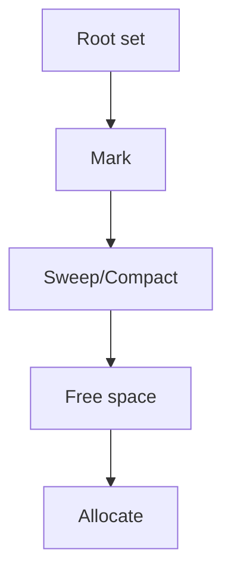

# Runtime və GC (Yaddaş İdarəsi)

Kompilyator sonrası icra mühiti (runtime) tip metadatası, yaddaş allokasiyası, səhv/exception mexanizmi və çox vaxt GC (garbage collector) daxil olmaqla dilin davranışını təmin edir.

## Runtime komponentləri

- Startup/Teardown: `main`/`crt` kodu, TLS (thread‑local storage), modul initializer-ləri.
- Çağırış konvensiyaları: ABI qaydaları (register/stack), exception unwind məlumatı (DWARF EH, SEH).
- Stack frame: return addr, saved regs, locals, spill slot-lar.
- Exception mexanizmi: zero‑cost (table‑driven) vs setjmp/longjmp; landing pad-lər.



## Allokasiya və obyekt layout-u

- Bump‑pointer/TLAB: sürətli tək istiqamətli allokasiya (thread‑local allocation buffer).
- Free‑list/segregated fit: müxtəlif ölçülü bloklar üçün siyahılar.
- Obyekt başlığı: tip pointer, flags, GC mark bitləri, lock word (synchronized).

## GC ailələri

- Mark‑Sweep: canlı obyektləri işarələ, qalanı süpür; fragmentasiya problemi.
- Generational: gənc/yaşlı regionlar; gəncdə tez‑tez collection.
- Incremental/Concurrent: pauzaları azaltmaq üçün işin bir hissəsi mutator ilə paralel.
- Moving/Compacting: fragmentasiyanı aradan qaldırır; pointer-lərin yenilənməsi lazımdır.



## Safepoint-lər və Barrier-lər

- Safepoint: mutator-un dayandırılıb GC mərhələsinə giriş nöqtəsi (polling, page‑trap, return‑check).
- Write barrier: generational/ concurrent GC üçün lazımdır (remembered set/kart tablosu).
- Read barrier: moving/relocation üçün (məs., Brooks barrier, Shenandoah/ZGC).

```c
// Kart işarələmə (write barrier) skeleti
void write_field(Object* o, Field* f, Object* val){
  o->f = val;
  card_table[(uintptr_t)o >> CARD_SHIFT] = DIRTY;
}
```

## Stop‑the‑World və pauza ölçümü

- STW mərhələləri: root scan → mark → relocate → restart.
- Pauza büdcəsi: GC tezliyi, region ölçüləri, mutator throughput balansı.

## Exceptions və Unwind

- Zero‑cost model: normal yolda overhead yoxdur; yalnız throw zamanı tablolara baxılır (LSDA).
- Windows SEH vs DWARF EH vs Itanium ABI; landing pad-lərdə cleanup/handler çağırışları.

## Praktika

- Obrazlı ölçü: obyekt ölçülərini 8/16‑aligned saxlayın; cache line hitlərini artırın.
- GC Tuning: heap ölçüsü, gənc nəsil (young gen) ölçüsü, promotion threshold.
- Native interop-da pinning/handle-lərdən istifadə edin; moving GC ilə təhlükəsizlik.
