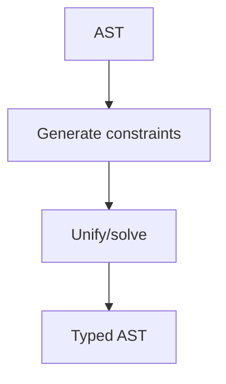

# Tip Sistemləri (Static/Dynamic, Inference, Subtyping)

Tip sistemi proqramların səhvlərini erkən tapmaq və niyyətini ifadə etmək üçün rəsmi çərçivədir. Kompilyator bu qaydaları tətbiq edərək AST üzərində tip atributlarını hesablayır.

## Static vs Dynamic

- Static: tiplər compile‑time yoxlanır (C, Rust, Haskell, Java). Performans və tooling üstünlükləri.
- Dynamic: tiplər run‑time (Python, Ruby, JS). JIT/IC ilə optimizasiya mümkündür; gradual typing (TypeScript) keçid verir.

## Inference (Hindley–Milner və s.)

- HM: polimorfizm üçün let‑polymorphism, unification əsasında inference.
- Constraint‑based: AST‑dən məhdudiyyətlər çıxarılır, solver həll edir.

```text
let id x = x        -- id : ∀a. a → a
let f g x = g (id x)
```



## Subtyping və Traits/Interfaces

- Subtyping: `S <: T` → `S` lazım olan yerdə `T` kimi istifadə edilə bilər (LSP).
- Nominal vs structural typing: ad əsasında vs forma əsasında uyğunluq.
- Interfaces/Traits: metod dəstini tələb edən müqavilə; default metodlar, blanket impl (Rust) kimi xüsusiyyətlər.

## Variance

- Covariant: T artdıqca konteyner də artır (List<T>). Contravariant: əksinə (Func<T> parametrləri). Invariant: heç biri.
- Reference/borrow tip sistemlərində varians təhlükəsizlik üçün kritikdir.

## Effects və Ownership

- Effect systems: `async`, `throws`, `IO` kimi yan təsirləri tip səviyyəsində qeyd etmək.
- Ownership/Borrowing (Rust): aliasing qaydaları, lifetime parametrləri ilə data yarışlarının qarşısı.

```rust
fn push<'a>(v: &'a mut Vec<i32>, x: i32) { v.push(x); } // borrow rules
```

## Nullability və Option tipləri

- `Option<T>`/`Nullable<T>` ilə null təhlükəsini modelləşdirin; pattern matching ilə yoxlayın.

## Generics: Monomorphization vs Reification

- Monomorphization: hər T üçün ayrıca kod (sürət, daha böyük binary).
- Reification/Erasure: vahid kod, metadata ilə (JVM/.NET); reflection və runtime checks.

## Praktika və Diaqnostika

- Nəticə tiplərini göstərən `--explain-types` çıxışı; IDE hover.
- Səhv mesajlarında constraint zəncirini minimallaşdırın; sadə izahlar verin.
- Açıq anotasiya sərhədləri: API-lərdə açıq tiplər, içəridə inference.
