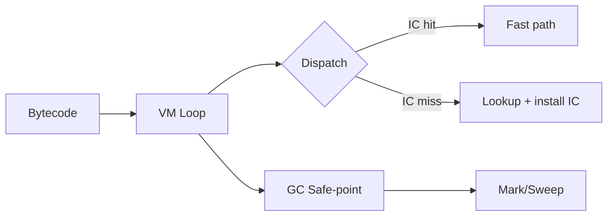

# İnterpreterlər və VM-lər (Bytecode)

İnterpreter dilin AST və ya bytecode-nu oxuyub əmrləri birbaşa icra edir. VM (Virtual Machine) adətən bytecode üçün yazılmış icra mühərrikidir; JIT ilə birləşdirildikdə isti yollar native koda çevrilə bilər.

## Modellər

- Tree-walking: AST üzərindən birbaşa gəzərək icra. Sadədir, lakin cache locality zəif, branch sayı çoxdur.
- Bytecode VM: AST → bytecode → VM döngüsü. Daha sıxdır, instruksiyalar sabitdir, dispatch daha səmərəli ola bilər.
- Tracing/Method JIT: profiler isti yolları aşkar edir, native koda çevirir (məs., LuaJIT, V8, HotSpot).

## Stack VM vs Register VM

- Stack VM (JVM, CPython): əmrlər operandları stack-dan götürür/qoyur. Sadə bytecode, lakin daha çox əməliyyat ola bilər.
- Register VM (LuaJIT IR, Dalvik): əmrlər virtual registrlərə işarə edir. Daha az instruksiya, amma bytecode daha geniş.

## Sadə Stack VM nümunəsi

```c
// Instruksiyalar
#define OP_CONST  0
#define OP_ADD    1
#define OP_MUL    2
#define OP_PRINT  3
#define OP_HALT   4

int run(const int* code, const int* k, int code_len){
  int ip=0, sp=-1; long stack[256];
  for(;;){
    int op = code[ip++];
    switch(op){
      case OP_CONST: stack[++sp] = k[ code[ip++] ]; break;
      case OP_ADD:   stack[sp-1] = stack[sp-1] + stack[sp]; sp--; break;
      case OP_MUL:   stack[sp-1] = stack[sp-1] * stack[sp]; sp--; break;
      case OP_PRINT: printf("%ld\n", stack[sp--]); break;
      case OP_HALT:  return 0;
    }
  }
}
```

## Dispatch Texnikaları

- switch-dispatch: portable, lakin hər instruksiya üçün əlavə branch overhead.
- direct threading (computed goto): GCC/Clang ilə `&&label`/`goto *pc++` — branch predictor üçün daha əlverişli.
- inline caching (IC): dinamik dillərdə məkan lokallığı olan property/method lookup nəticələrini keşləyin; megamorphic hallarda polymorphic inline cache (PIC).

```c
// Direct threaded skelet (GCC/Clang)
static void* JT[] = {&&L_CONST, &&L_ADD, &&L_PRINT, &&L_HALT};
#define DISPATCH() goto *JT[code[ip++]]
L_CONST: stack[++sp] = k[ code[ip++] ]; DISPATCH();
L_ADD:   stack[sp-1]+=stack[sp--];      DISPATCH();
L_PRINT: printf("%ld\n", stack[sp--]); DISPATCH();
L_HALT:  return;
```

## Frame/Stack və Çağırışlar

- Hər çağırış üçün frame: return ip, local-lar, upvalue-lər/closure konteksti.
- Tail-call optimizasiyası VM səviyyəsində dəstəklənə bilər.
- Exception-lar üçün unwind məlumatı: handler tabloları (try-range → target ip).

## GC ilə inteqrasiya

- Root-lar: VM stack-ı, global-lar, JIT kodundakı köçəbə (relocation) referansları.
- Tri-color marking (white/gray/black), generational GC; stop-the-world və ya incremental.
- Write barrier: mutator update-lərində kart/remembered set işarələmə.



## Profiling və JIT üçün siqnallar

- Counter-lar: instruksiya/edge icra sayları, callsite isti mi?
- OSR (On-Stack Replacement): VM döngüsündən JIT koduna isti loop daxilində keçid.
- Deopt: yanlış ehtimal/assumption qırıldıqda JIT kodundan VM state-ə dönüş.

## Praktika və Observability

- Bytecode-u sadə saxlayın; hər instruksiya üçün operand sayını sabit tutun.
- `--trace` flag-i ilə disassembler çıxışı verin; debugging asanlaşır.
- Hot path-larda bounds-check-ləri birləşdirin; side-exit-lərlə sadələşdirin.
