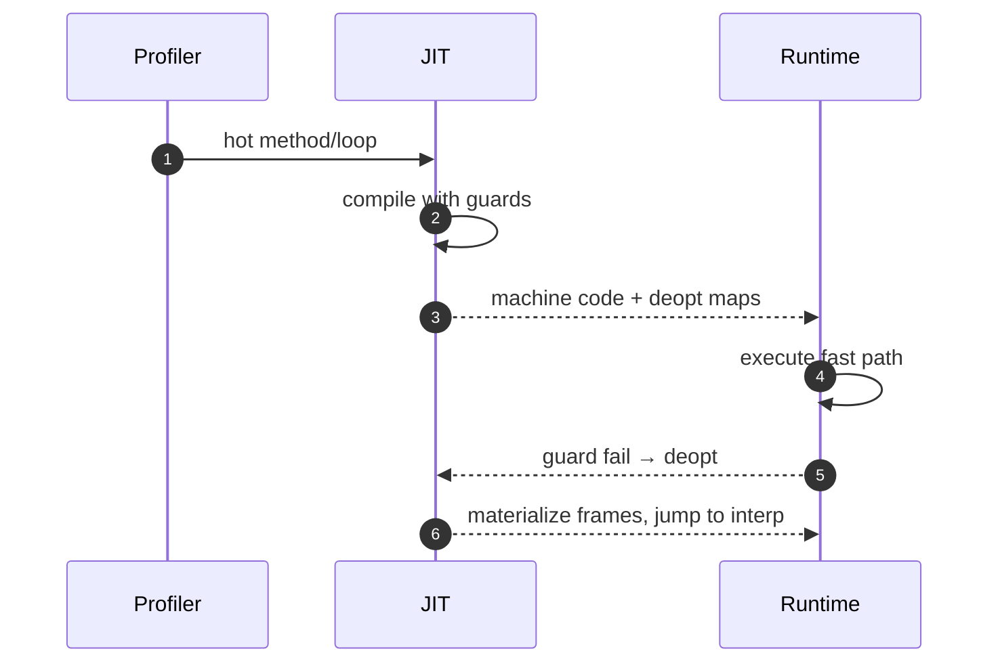

# JIT Kompilyasiya (Tiered, Profiling, Deopt)

JIT (Just‑in‑Time) runtime profilinə əsaslanaraq isti yolları native maşın koduna çevirir. Tiered yanaşma start‑up və peak performans arasında balans yaradır.

## Tiered JIT

- Tier 0: çox sürətli, sadə JIT (və ya interpreter) — profil toplamaq üçün.
- Tier 1/2: daha aqressiv optimizasiya, inlining, LICM, loop opts.
- Siyasət: isti metod/loop eşikləri, back‑edge sayğacları, invocation sayğacları.


## Profil Məlumatı və Guard-lar

- Inline cache (IC): property/method lookup nəticələrini keşlə; monomorphic→polymorphic→megamorphic keçid.
- Type/profile data: arg/return tipləri, branch ehtimalları, loop trip‑count.
- Guard-lar: ehtimala əsaslanan assumpsiyalar üçün yoxlama; qırıldıqda deopt.

```c
// Pseudo: IC guard
if (obj->shape == shape_cached) return fast_path;
else return miss_slowpath(obj);
```

## OSR (On‑Stack Replacement)

- İsti loop daxilində interpreter/JIT Tier0 kodundan TierN koduna keçid.
- Frame xəritəsi: lokal/stack dəyişənlərinin JIT koddakı yerləşimi.

## Deoptimization

- Deopt xəritələri: hər JIT instruksiyası üçün source‑level state bərpası (locals, stack, pc).
- Side exit: guard qırıldıqda VM state‑ə qayıdış; tez‑tez təkrarlanan miss-lərdə recompile.



## Kod patching və Recompilation

- Lazy deopt patching: guard‑ın target-i dəyişdirilir.
- On‑stack recompile: daha yüksək tier üçün materialized state ilə yenidən giriş.

## Praktika

- Profil səs/kükürü: soyuq kod üçün profil toplama overhead-ni məhdudlaşdırın.
- IC megamorphic hallarda fallback strategiyası hazırlayın.
- Deopt saylarını ölçün; aşırı deopt optimizasiya qazancını yeyə bilər.
