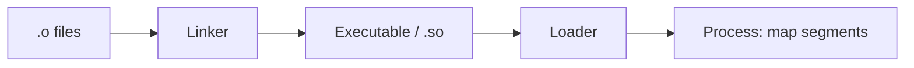
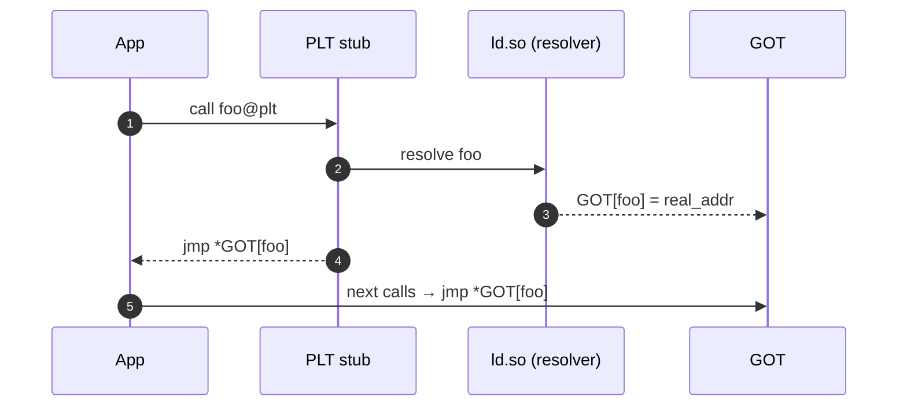

# Linkerlər və Yükləyicilər (ELF/COFF/Mach‑O)

Kompilyator obyekt faylları (.o/.obj) yaradır; linker onları birləşdirib icra faylı və ya kitabxana (.so/.dll/.dylib) çıxarır. Loader isə icra zamanı bu faylları prosesə xəritələyir və relocations/PLT/GOT vasitəsilə simvolları həll edir.

## Obyekt faylı strukturu

- ELF (Linux), COFF/PE (Windows), Mach‑O (macOS): bölmələr/seqmentlər, symbol table, relocations.
- Bölmələr: `.text` (kod), `.data` (init data), `.bss` (zero‑init), `.rodata` (sabitlər).



## Relocations və Simvol Həlli

- Statik link: bütün simvollar link zamanı həll edilir; relocations final adreslərə yazılır.
- Dinamik link: bəzi simvollar run‑time ld.so tərəfindən həll olunur; GOT/PLT vasitəsilə gec (lazy) çağırış.

```text
Reloc nümunələri (ELF): R_X86_64_PC32, R_X86_64_GLOB_DAT, R_X86_64_JUMP_SLOT, R_X86_64_RELATIVE
```

## PLT/GOT mexanizmi (ELF)

- GOT: qlobal simvolların (adreslərin) saxlandığı cədvəl.
- PLT: fun çağırışları üçün trampolin; ilk çağırışda resolver-ə gedir, sonra GOT-a yazılır (lazy binding).



## TLS (Thread‑Local Storage)

- TLS modelləri: local‑exec, initial‑exec, global‑dynamic, local‑dynamic — link zamanı/loader zamanı qərarlar.
- `__thread`/`thread_local` obyektlər üçün TLS relocations və TLS segment (PT_TLS).

## Windows və macOS qeydləri

- Windows PE/COFF: IAT (Import Address Table), delay‑load; SEH tablolari; PDB ayrı debug simvolları.
- Mach‑O: LC_LOAD_DYLIB load commands; dyld (loader), two‑level namespace.

## Loader addımları (ELF)

- ELF başlığı oxu → PT_LOAD seqmentlərini xəritələ → relocations tətbiqi → PLT/GOT hazırlığı → `init_array`/`ctors` çağır → `main`.

```mermaid
flowchart TD
    A[execve()] --> B[Kernel: mmap segments]
    B --> C[ld.so start]
    C --> D[Relocations apply]
    D --> E[Resolve needed libs]
    E --> F[Run .init_array]
    F --> G[Jump to entry/main]
```

## Statik vs Dinamik Linkləmə

- Statik: asan deploy, böyük binary, təhlükəsizlik update-ləri üçün yenidən build tələb edir.
- Dinamik: paylaşım, daha kiçik binary; ABI sabitliyi və versiyalama vacibdir.

## Praktika

- `-fPIC/-fPIE` və `-pie` bayraqları (ELF) — ASLR uyğunluq və GOT/GLOBAL‑REL relocları.
- Simvol zərifləşdirmə: `-Wl,--gc-sections`, `-ffunction-sections` lazımsız kodu atır.
- Linker skriptləri ilə layout nəzarəti; böyük layihələrdə LTO (link‑time optimization).
