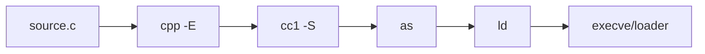
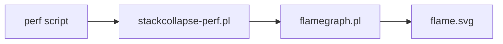

# Toolchain, Debugging və Profiling

Kompilyatorun istehsal etdiyi kodu yığmaq, diaqnostika və performans problemi tapmaq üçün toolchain və debugging/profiling alətlərinə ehtiyac var.

## Toolchain zənciri

- Preprocess → Compile → Assemble → Link → Load/Run
- Aralıq artefaktlar: `.i` (preprocessed), `.s` (assembly), `.o/.obj` (object), icra faylı, `.a/.lib` (static), `.so/.dll/.dylib` (shared)



## Əmrlər və faydalı alətlər

- Disassembly: `objdump -d`, `llvm-objdump -d`, `otool -tvV`
- Simvol xəritəsi: `nm`, `llvm-nm`
- Simvolizasiyanın bərpası: `addr2line -e a.out 0xADDR`, `atos` (macOS)
- OBJCOPY/STRIP: `objcopy`, `strip` — simvolları azaltmaq, ayrı debug faylı çıxarmaq
- Arşivləşdirmə: `ar rcs libx.a file1.o file2.o`

```bash
# Ayrı debug simvolları (ELF)
objcopy --only-keep-debug app app.debug
strip --strip-debug --strip-unneeded app
objcopy --add-gnu-debuglink=app.debug app
```

## Debug info

- DWARF (ELF/Mach‑O), PDB (Windows): source line map, local varlar, tip məlumatı.
- Inline frames, optimized kodda varların materializasiyası məhdud ola bilər.
- GDB/LLDB: breakpoints, watchpoints, reverse‑continue (LLDB xray/record deyil, bəzi uzantılar)

```gdb
(gdb) break foo
(gdb) run
(gdb) bt
(gdb) frame 2
(gdb) p var
```

## Sanitizers

- ASan (Address), UBSan (Undefined), TSan (Thread), MSan (Memory init), LeakSan.
- Compile/link bayraqları: `-fsanitize=address,undefined -fno-omit-frame-pointer -g`
- Prod problemləri üçün `ASAN_SYMBOLIZER_PATH` və `fast unwind` ayarları.

## Profiling

- Linux: `perf stat/record/report`, `perf top`, `BPF/bpftrace` skriptləri.
- Windows: ETW + WPA, Visual Studio Profiler.
- macOS: Instruments (Time Profiler), DTrace (məhdud), `sample` CLI.
- CPU vs wall‑time, sampling tezliyi; frame pointers vs DWARF unwinding.

```bash
perf record -F 999 -g -- ./app
perf report
```

## Flamegraph axını



## Crash analizi və core dump

- Linux: `ulimit -c unlimited`; `gcore` ilə core alma.
- Core-u açmaq: `gdb -q ./app core.1234` → `bt`, `info threads`, `thread apply all bt`
- macOS: `lldb -c corefile`, Windows: `.dmp` + WinDbg/VS.

## Praktika

- `-g` ilə debug info yaradın; prod-da ayrı debug fayl saxlayın.
- Reproducible builds: `-ffile-prefix-map`/`SOURCE_DATE_EPOCH`.
- Simvolizasiyanı CI-də arxivləyin; addr2line xidmətləri ilə inteqrasiya edin.
