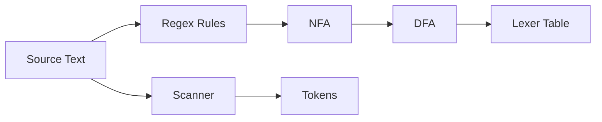

# Lexing və Tokenləşdirmə

Lexer mətni məna daşıyan atomlara — token-lərə çevirir. Bu mərhələ parsing üçün giriş axını yaradır və çox vaxt yüksək performans tələb edir.

## Əsas anlayışlar

- Token: (tip, lexeme, span) üçlüyü; tip: IDENT, NUMBER, PLUS, ...
- Trivia: whitespace, comment-lər — adətən atılır, lakin formatlama/səhv mesajı üçün span saxlanır.
- Regex → NFA → DFA: klassik yanaşma; DFA daha sürətlidir, amma yaddaş tələbini artırır.



## Qayda nümunəsi (re2c)

```c
/*!re2c
re2c:define:YYCTYPE = "unsigned char";
WS      = [ \t\r\n]+;
IDENT   = [a-zA-Z_][a-zA-Z0-9_]*;
NUMBER  = [0-9]+;

*      { /* default */ }
<INITIAL>{
  {WS}        { /* skip */ }
  "+"        { return TOK_PLUS; }
  {IDENT}     { return TOK_IDENT; }
  {NUMBER}    { return TOK_NUM; }
}
*/
```

## Performans və praktika

- Hot path: input-u `memchr`/SIMD ilə tez skan edin; uzun ident və rəqəmlərdə branch-ləri azaldın.
- Backtracking-dən qaçın: greedy qaydaları diqqətlə yazın; maximal munch.
- Unicode: UTF-8 kodlanmada ident qaydalarını genişləndirin; qrafem klasterlərinə ehtiyac ola bilər.
- Error tokens: tanınmayan simvollarda xüsusi TOK_ERROR yaradın, parser recover edə bilsin.

## Lexer → Parser interfeysi

- Lookahead: parser ehtiyacına görə 1 və ya daha çox; token buffer-ing (ring) istifadə edin.
- Span/Location: hər token üçün `line/column` və `byte offset` saxlayın; səhv mesajında istifadə edin.
- Channels/Trivia: bəzi dillər comment-ləri ayrıca kanalda saxlayır (məs., ANTLR).

## Test və Observability

- Golden tests: input → token ardıcıllığı; snapshot diff-lə sındırıcı dəyişiklikləri görün.
- Profil: böyük fayllarla lexing throughput-u ölçün (MB/s); perf/VTune ilə hotspot-ları tapın.
- Diagnostika: `--dump-tokens` rejimi ilə token axınını çıxarın.
