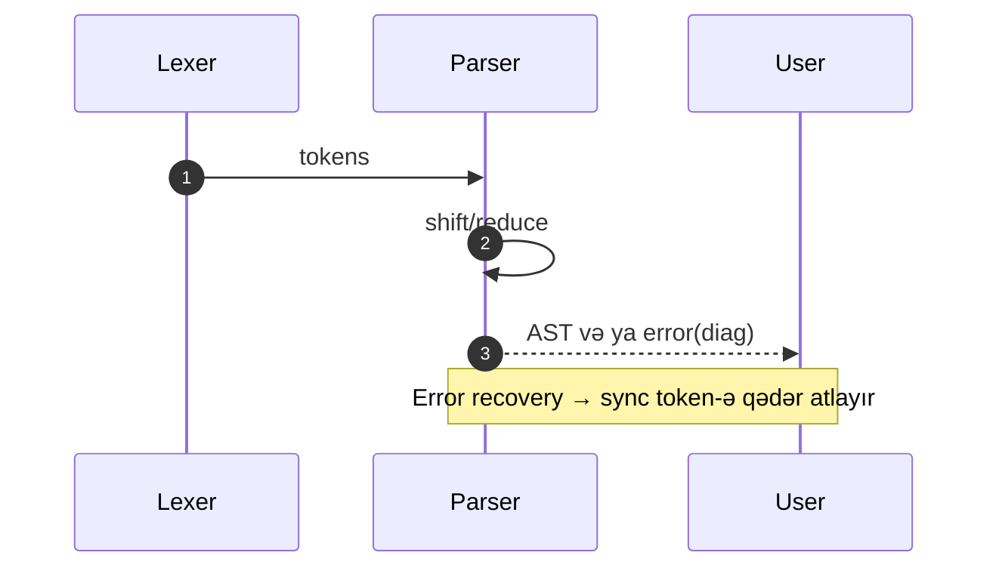

# Parsing (LL/LR, Pratt, PEG)

Parser token axınından sintaktik quruluş (AST/CST) yaradır. Strategiyanın seçimi dilin grammatikasına, error mesajlarına və performans tələblərinə bağlıdır.

## Yanaşmalar

- Recursive‑descent (RD): əl ilə yazılan, oxunaqlı; LL(1)-yaxın grammatikalar üçün təbii.
- Pratt parser: ifadelər üçün operator prioritet/associativity sadə idarə olunur.
- LL/LR generator-ları: ANTLR (LL(*)), Bison/Yacc (LR/LALR/GLR) ilə avtomatik parser.
- PEG: backtracking + packrat (linear zaman). Sadə yazılır, lakin yaddaş istifadəni izləyin.

```text
grammar Expr: term (("+"|"-") term)*; term: factor (("*"|"/") factor)*; factor: NUMBER | "(" Expr ")";
```

## Pratt Parser skeleti (C‑style)

```c
// binding power (BP) ilə sadə Pratt
int parse_expr(int min_bp){
  Node* lhs = parse_atom();
  for(;;){
    Token t = lookahead();
    int lbp = left_bp(t.type);
    if (lbp < min_bp) break;
    next(); // operatoru yeyir
    int rbp = right_bp(t.type);
    Node* rhs = parse_expr(rbp);
    lhs = make_binop(t.type, lhs, rhs);
  }
  return lhs;
}
```

## LR parser (Bison) nümunəsi

```bison
%token NUM '+' '-' '*' '/' '(' ')'
%%
expr: expr '+' term  { $$ = mk_binop('+', $1, $3); }
    | expr '-' term  { $$ = mk_binop('-', $1, $3); }
    | term           { $$ = $1; }
    ;
term: term '*' factor { $$ = mk_binop('*', $1, $3); }
    | term '/' factor { $$ = mk_binop('/', $1, $3); }
    | factor          { $$ = $1; }
    ;
factor: NUM          { $$ = mk_num($1); }
      | '(' expr ')'  { $$ = $2; }
      ;
```

## Error recovery

- Panic mode: `sync token`-ə qədər atla (məs., `;` və ya `}`); çoxlu səhv selinin qarşısı.
- Contextual heuristics: gözlənilən tokenləri göstər, yaxın tokenləri təklif et.
- Partial AST: IDE-lər üçün bərpa edilə bilən ağac saxla ("green tree").



## Praktika

- Left factoring və left recursion aradan qaldırma RD üçün lazımdır.
- Operator tablosu ilə Pratt tez qurulur; parser generatorları ilə kompleks dillərdə daha sabit səhv mesajları.
- Səhv diaqnostikası: token span-ları, yaxın simvollar, "did you mean" təklifləri.
