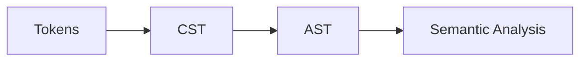

# AST (Abstract Syntax Tree)

AST — proqramın sintaktik quruluşunu təmsil edən ağacdır. Parser çox vaxt əvvəlcə CST (Concrete Syntax Tree) yaradır, sonra AST‑ə sadələşdirir.

## CST vs AST

- CST: hər simvol/token saxlanır; formatlama/trivia daxil olmaqla tam sintaksis.
- AST: semantik cəhətdən vacib düyünlər; lazımsız parantezlər/trivia atılır.



## Node tipləri və nümunə struktur

```c
// Sadə AST nümunəsi (C‑style)
typedef enum { N_NUM, N_VAR, N_BINOP, N_LET } NodeKind;

typedef struct Node {
  NodeKind kind;
  Span span; // [start,end) — diaqnostika üçün
  union {
    long num;                 // N_NUM
    const char* ident;        // N_VAR
    struct { int op; struct Node* l; struct Node* r; } bin; // N_BINOP
    struct { const char* name; struct Node* val; struct Node* body; } let; // N_LET
  } as;
} Node;
```

## Immutability və paylaşım

- İmmutable AST: çox thread‑li analizlər üçün təhlükəsiz; copy‑on‑write ilə paylaşımı asanlaşdırır.
- Arena allocator: node-ların ömrünü birlikdə idarə edin; GC-yə yük azaldır.

## Visitor/Walker pattern

```c
void visit(Node* n){
  switch(n->kind){
    case N_NUM: /* ... */ break;
    case N_VAR: /* ... */ break;
    case N_BINOP: visit(n->as.bin.l); visit(n->as.bin.r); break;
    case N_LET: visit(n->as.let.val); visit(n->as.let.body); break;
  }
}
```

## IDE‑yönümlü Green/Red Tree

- Green tree: immutably stored syntax (CST), parentless; paylaşım effektivdir.
- Red tree: green node-lara parent/semantic kontekst əlavə edən yüngül wrapper; IDE funksiyaları üçün əlverişli.

```mermaid
flowchart TD
    G[Green nodes (immutable)] --> R1[Red node (with parent/ref)]
    G --> R2[Red node]
    R1 --> API1[Find parent]
    R2 --> API2[Find children]
```

## AST → IR xəritələnməsi

- Hər AST düyünü üçün IR generasiyası qaydası saxlayın (lowering).
- Span məlumatlarını IR instruksiyalarına daşıyın (debug/diags).

## Praktika

- Parantez/önəmli trivia (məs., doc‑comment) üçün ayrıca sahələr saxlayın.
- Node ID/Stable ID verin — map-lərdə/diagnostikada sabit istinad üçün.
- “Builder” API ilə AST yaradılmasını standartlaşdırın; testlərdə qısa DSL istifadə edin.
