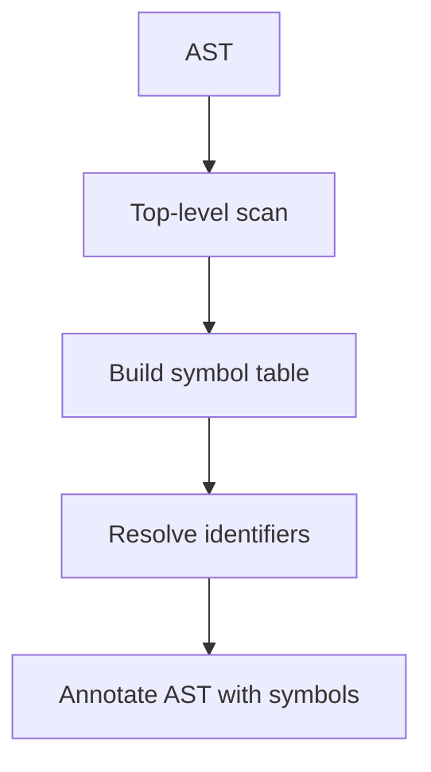
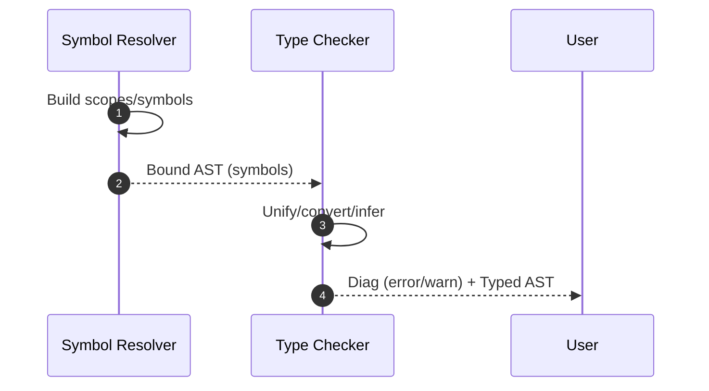

# Semantik Analiz (Ad Həlli, Tiplər)

Parserdən gələn AST üzərində məna yoxlamaları aparılır: adların həlli, tiplərin uyğunluğu, erişim hüquqları, overload seçimi və s. Nəticə olaraq AST zənginləşdirilir (types/attributes) və ya səhvlər yaradılır.

## Symbol Table və Scope-lar

- Scope iyerarxiyası: file/module → class/function → block.
- Tablo girişləri: adı, növü (var/fun/type), tip imzası, visibility (public/private), mutability.
- Overload toplusu: eyni adda çox imza; seçim mərhələsi çağırışda edilir.

```c
// Sadə scope stack
push_scope();
insert(symtab, "x", TY_INT);
// ...
pop_scope();
```

## Ad Həlli (Name Resolution)

- Mərhələlər: import-ların həlli → üst səviyyə deklarasiyalar → lokallar.
- Qualified adlar: `pkg::Type` və ya `mod.func` şəkilində.
- İrəli istinadlar (forward decl) üçün iki keçid və ya predecl zəruridir.



## Tip Sisteminin əsasları

- Tip inference: bəzi dillərdə annotasiyasız tip çıxarılır (HM, local inference).
- Subtyping/Traits: `T <: U` və ya interface/trait implementasiyası.
- Implicit conversions: yalnız açıq qaydalarla; qeyri-müəyyənlikdən qaçın.

```c
// Fun çağırışında overload seçimi (pseudo)
Fun* pick_overload(List<Fun*> cands, List<Type> args){
  // 1) uyğun gələnləri filtr et (arity, konversiyalar)
  // 2) üstünlük (exact match > promotion > conversion)
  // 3) qeyri-müəyyənlikdə səhv
}
```

## Generics

- Monomorphization (Rust/C++): instantiation zamanı konkret tiplərlə kod generasiyası; sürətli, lakin kod şişməsi.
- Reification (Java/.NET): run-time tip metadatası ilə paylaşılan kod; reflection/erasure nüansları.

## Flow‑sensitive analizlər

- Definite assignment, nullability, pattern matching sonrası daralma (type narrowing).
- Borrow/lifetime yoxlamaları (Rust‑vari modellərdə) — ownership/aliasing qaydaları.

## Diaqnostika

- Səhv mesajları üçün span və expected vs actual tipləri göstərin.
- “Note”/“Help” əlavələri: məsələn, “bu yerdə T tələb olunur, ancaq U verilmişdir; cast və ya generics parametrləri yoxlayın”.



## Praktika

- Birlikdə işləyən pass-lar: resolution → types → const eval.
- IDE üçün qismən uğursuz AST‑də də atributlar saxlayın (tolerant checker).
- Incremental: fayl dəyişəndə yalnız əlaqəli modul/scope-ları yenidən yoxlayın.
