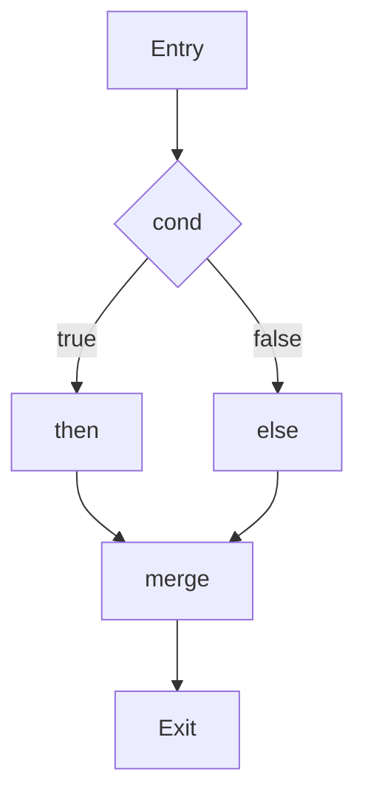
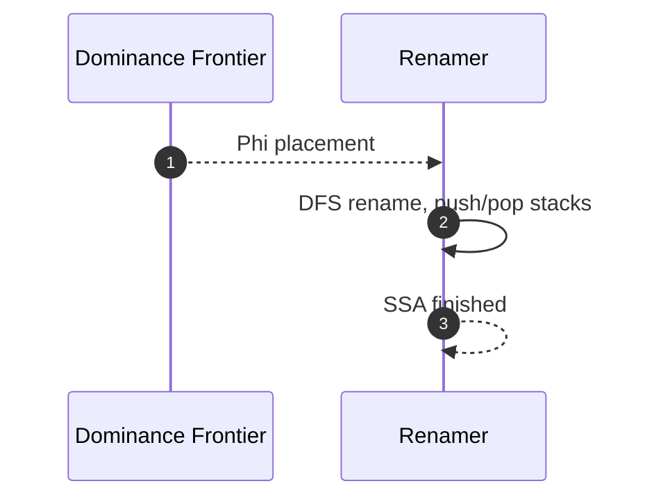

# IR və SSA (Ara Təqdimat)

IR (Intermediate Representation) dillərdən asılı olmayan ara formatdır. Optimizasiyalar və codegen bu təbəqədə işləyir. SSA (Static Single Assignment) — hər dəyişənin yalnız bir dəfə təyin olunduğu forma — analizi sadələşdirir.

## IR səviyyələri

- High-level IR (HIR): dillə yaxın (exceptions, closures). Məntiqi optimizasiya üçün əlverişli.
- Mid-level IR (MIR): əməliyyatlar açılıb, control-flow aydın, hədəf‑agnostik.
- Low-level IR (LIR): arxitekturaya yaxın; register allokasiyası öncəsi/sonrası formalar.

## CFG və Dominance

- CFG (Control‑Flow Graph): bloklar (basic block) və keçid kənarları.
- Dominator: D bir bloku hər giriş yolunda hökmən görürsə, D onu domina edir. IDOM ağacı SSA quruluşunda əsasdır.



## SSA və φ düyünləri

- SSA: `x1 = 1; x2 = x1 + 2;` hər təyinat yeni versiya.
- φ (phi): control‑flow birləşmələrində variant seçimi: `x3 = φ(x1 from then, x2 from else)`.

```llvm
; LLVM IR nümunəsi
entry:
  %c = icmp sgt i32 %a, 0
  br i1 %c, label %then, label %else
then:
  %t1 = add i32 %a, 1
  br label %merge
else:
  %t2 = sub i32 %a, 1
  br label %merge
merge:
  %x = phi i32 [ %t1, %then ], [ %t2, %else ]
  ret i32 %x
```

## SSA qurulması (mem2reg)

- Placement: dominator önkəsi ilə φ yerləri (iterated dominance frontier) hesablanır.
- Renaming: DFS ilə dəyişən adları versiyalanır (stack‑based).



## Lowering və Raising

- Lowering: HIR → MIR/LIR (məs., exceptions → explicit CFG, iterators → state machine).
- Raising: bəzi JIT-lərdə LIR → daha zəngin IR-ə qismən qaldırılıb optimizasiya edilir.

## Praktika

- IR‑i çap edin: pass öncəsi/sonrası diff — səhvləri tez aşkarlayır.
- Canonical form: sadə və təkrarsız patternlər optimizatoru asanlaşdırır.
- Metadata/Debug: span/loc, inlining info, tbaa/alias analiz üçün hints saxlayın.
