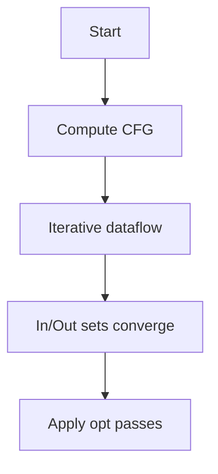
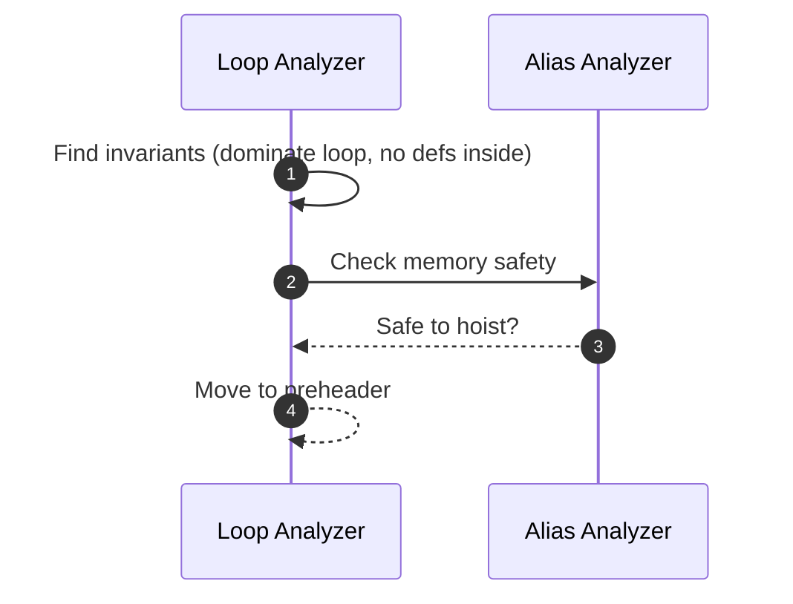

# Dataflow Analizi və Optimizasiyalar

Optimizasiyalar IR/SSA üzərində dataflow məlumatı hesablayıb lazımsız işi azaldır, CPU/memory istifadəni yaxşılaşdırır.

## Əsas Dataflow analizləri

- Reaching Definitions: hansı təyinat bu nöqtəyə çata bilər?
- Liveness: dəyişən gələcəkdə istifadə olunacaqmı? (register allokasiya üçün kritik)
- Available Expressions: ifadə artıq hesablanıbmı? (CSE üçün)
- Dominance/Post-dominance: CFG-nin struktur analizi.



## GVN/CSE (Global Value Numbering)

- Məqsəd: eyni ifadələri tanımaq və reuse etmək.
- SSA-də eyni operandlarla eyni op → eyni dəyər; hash-consing ilə tapılır.

```c
// Pseudo: GVN
valnum[x = add a b] = hash("add", valnum[a], valnum[b]);
if (existing temp t with same valnum) replace x with t;
```

## DCE (Dead Code Elimination)

- Canlılıqdan istifadə: live-out olmayan nəticələr və yan təsirsiz instruksiyalar silinir.
- Yan təsir (memory store, call with side effects) qorunur; `readonly/argmemonly` annotasiyalar kömək edir.

## LICM (Loop-Invariant Code Motion)

- Dəyişməyən ifadələri loop xaricinə çıxarın (dominance + alias analiz lazımdır).



## Strength Reduction və Peephole

- `i*2` → `i<<1`, `x/2^k` → `x>>k` (signed/unsigned nüanslarına diqqət).
- Peephole: kiçik assembler pattern-ləri birləşdirmə/sadələşdirmə.

## Inlining

- Kiçik, isti funksiyaları çağırış yerində açmaq; daha çox optimizasiya fürsəti yaradır.
- Heuristics: kod şişməsi vs sürət qazancı balansı, hotness, recursion limitləri.

## Loop optimizasiyaları

- Unroll/peel, vectorization (SIMD), fusion/fission, interchange, tiling.
- Asılılıq (dependence) analizi, polyhedral model (isl)

## Praktika

- Pass sırası vacibdir: GVN → DCE → LICM → (təkrar) və s.
- IR‑də alias/nonnull/range metadata saxlayın; optimizator qərarlarına kömək edir.
- Heç bir optimizasiya davranışı dəyişməməlidir: UB/strict aliasing qaydalarına diqqət.
