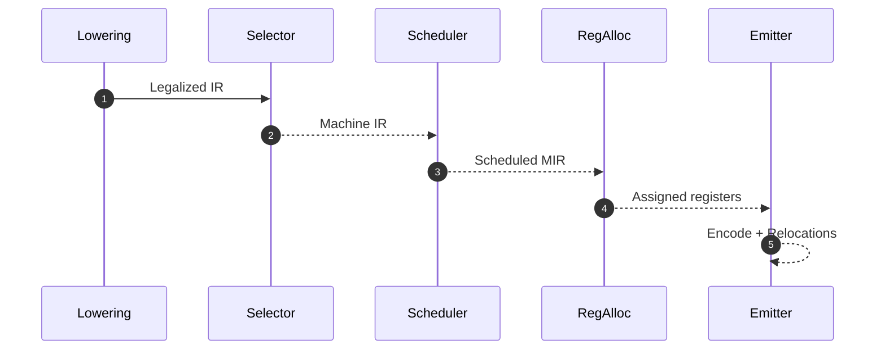

# Code Generation (ISel, Lowering, Scheduling)

Codegen IR‑dən hədəf arxitekturanın maşın əmrlərinə keçid mərhələsidir. Əsas addımlar: instruction selection, calling convention/prolog‑epilog, scheduling, register allocation, emit və asm/obj çıxışı.

## Instruction Selection

- Pattern‑based: ağac/DAG üzərində pattern‑mətncədirmə (LLVM SelectionDAG, GCC RTL peephole-lar).
- GlobalISel: LLVM‑də yeni infrastruktur — SSA maşın IR ilə hədəf‑agnostikdən hədəfə.
- TableGen/ISel tabloları: target‑spesifik qaydaların deklrativ verilməsi.

```mermaid
flowchart LR
    A[IR (SSA)] --> B[Legalization]
    B --> C[Selection (patterns/DAG)]
    C --> D[Machine IR]
    D --> E[Scheduling]
    E --> F[RegAlloc]
    F --> G[Emit MC/Asm]
```

## Calling Convention və Prolog/Epilog

- ABI: arqumentlər hansı registrlərdə/stack-da? qaytarma necə? alignment?
- Callee‑saved vs caller‑saved registrlər; shadow space (Win64), red zone (SysV AMD64).
- Prolog: frame pointer, stack frame, spill slot-lar; Epilog: bərpa və `ret`.

```text
SysV AMD64: args → RDI,RSI,RDX,RCX,R8,R9; qalanı stack. RBP optional, RSP 16‑aligned.
```

## Lowering və Legalization

- Qeyri‑dəstəkli əmrlər/ tiplər (məs., i128) target‑dəstəklənən ardıcıllığa bölünür.
- Addr mode folding: yük/toplama/offset birləşdirilir (LEA və s.).

## Instruction Scheduling

- Məqsəd: stalls/delay slotları azaltmaq, ILP artırmaq, latency gizlətmək.
- List scheduling: hazır düyünlərdən latency/priority əsasında seçim.
- Heterojen portlar (uop schedulers) üçün hədəf‑spesifik modellər.

## Branch Relaxation və Layout

- Uzaq hədəflər üçün branch ölçüsünü böyütmək; block layout ilə icra axını isti yollar üçün optimallaşdırılır (fall‑through, i‑cache locality).

## Emit (Asm/Object)

- MC layer: maşın təlimatlarının kodlanması; relocations siyahısı.
- Obj format: ELF/COFF/Mach‑O; `.text/.data/.bss`, symbol table, relocation entries.



## Praktika

- Target özellikləri (endianness, addr modes, calling conv) üçün vahid utility qat saxlayın.
- Codegen səhvləri üçün MIR/asm dump çıxarın; fərqli O‑səviyyələrində diff.
- Inline asm varsa, clobber/constraint-lərə diqqət edin; UB yaranmasın.
