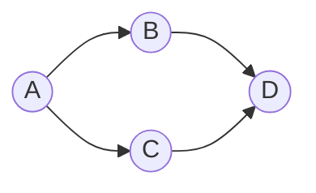

# Topological Sort

Topological sort yalnız DAG (Directed Acyclic Graph) üçün müəyyən olunur və hər kənar u→v üçün u, v-dən əvvəl gəlir.



## Kahn (BFS, indegree) — Java

<details>
<summary>Koda bax</summary>

```java
import java.util.*;

public class TopoSortKahn {
    public static List<Integer> topoSort(int n, List<List<Integer>> g) {
        int[] indeg = new int[n];
        for (int u = 0; u < n; u++)
            for (int v : g.get(u)) indeg[v]++;
        Deque<Integer> q = new ArrayDeque<>();
        for (int i = 0; i < n; i++) if (indeg[i] == 0) q.add(i);
        List<Integer> order = new ArrayList<>();
        while (!q.isEmpty()) {
            int u = q.removeFirst();
            order.add(u);
            for (int v : g.get(u)) if (--indeg[v] == 0) q.add(v);
        }
        if (order.size() != n) throw new IllegalStateException("Cycle var (DAG deyil)");
        return order;
    }
}
```

</details>

Qeyd: DFS post-order (stack) ilə də etmək olar; cycle aşkarı üçün rəngləmə (0/1/2) istifadə olunur.