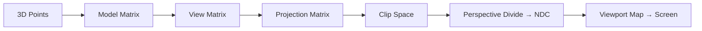

# Transformasiyalar və Proyeksiyalar

Bu səhifə 3D səhnədə obyektlərin və kameranın matris əsaslı hərəkətini izah edir.

## Model, Görünüş və Proyeksiya Matrisləri

- Model (M): Obyektin öz lokallığından dünya məkanına keçid (translate, rotate, scale).
- Görünüş (V): Kameranın dünya məkanındakı vəziyyətini səhnəyə tətbiq: `V = lookAt(eye, target, up)`.
- Proyeksiya (P): Perspektiv (gözətraf) və ya ortoqrafik xəritələmə.

Səhnə boru xəttində vertex-lər tipikən belə dönüşür:

```
clipPos = P × V × M × vec4(position, 1)
ndc = clipPos.xyz / clipPos.w
screen = viewportMap(ndc)
```

## Kamera: LookAt Matrisinin Qurulması

```java
class Vec3 { float x,y,z; /* ctor, minus, cross, dot, normalize ... */ }
class Mat4 { float[][] m = new float[4][4]; /* identity, etc. */ }

// Right-handed lookAt (OpenGL üslubu)
static Mat4 lookAt(Vec3 eye, Vec3 center, Vec3 up) {
    Vec3 f = normalize(sub(center, eye));
    Vec3 s = normalize(cross(f, up));
    Vec3 u = cross(s, f);
    Mat4 r = new Mat4();
    for (int i=0;i<4;i++) for (int j=0;j<4;j++) r.m[i][j]=0f;
    r.m[0][0]= s.x; r.m[0][1]= s.y; r.m[0][2]= s.z; r.m[0][3]= -dot(s, eye);
    r.m[1][0]= u.x; r.m[1][1]= u.y; r.m[1][2]= u.z; r.m[1][3]= -dot(u, eye);
    r.m[2][0]= -f.x;r.m[2][1]= -f.y;r.m[2][2]= -f.z;r.m[2][3]=  dot(f, eye);
    r.m[3][3]= 1f;
    return r;
}
```

## Perspektiv və Ortoqrafik Proyeksiya

- Perspektiv: Uzaq obyektlər kiçik görünür, FOV və aspect nisbəti önəmlidir.
- Ortoqrafik: Paralel proyeksiya, ölçülər məsafədən asılı deyil (UI, CAD üçün).



## Viewport Xəritələnməsi

NDC diapazonu [-1,1]×[-1,1] ekran piksellərinə xəritələnir:

```
screenX = (ndc.x*0.5 + 0.5) * width
screenY = (ndc.y*0.5 + 0.5) * height
```

## Məşq

- LookAt və perspektiv matrislərini yazıb bir vertex-i ekran koordinatına çevirin.
- Near/far planlarını səhv seçdikdə Z-fighting riskini müşahidə edin.
