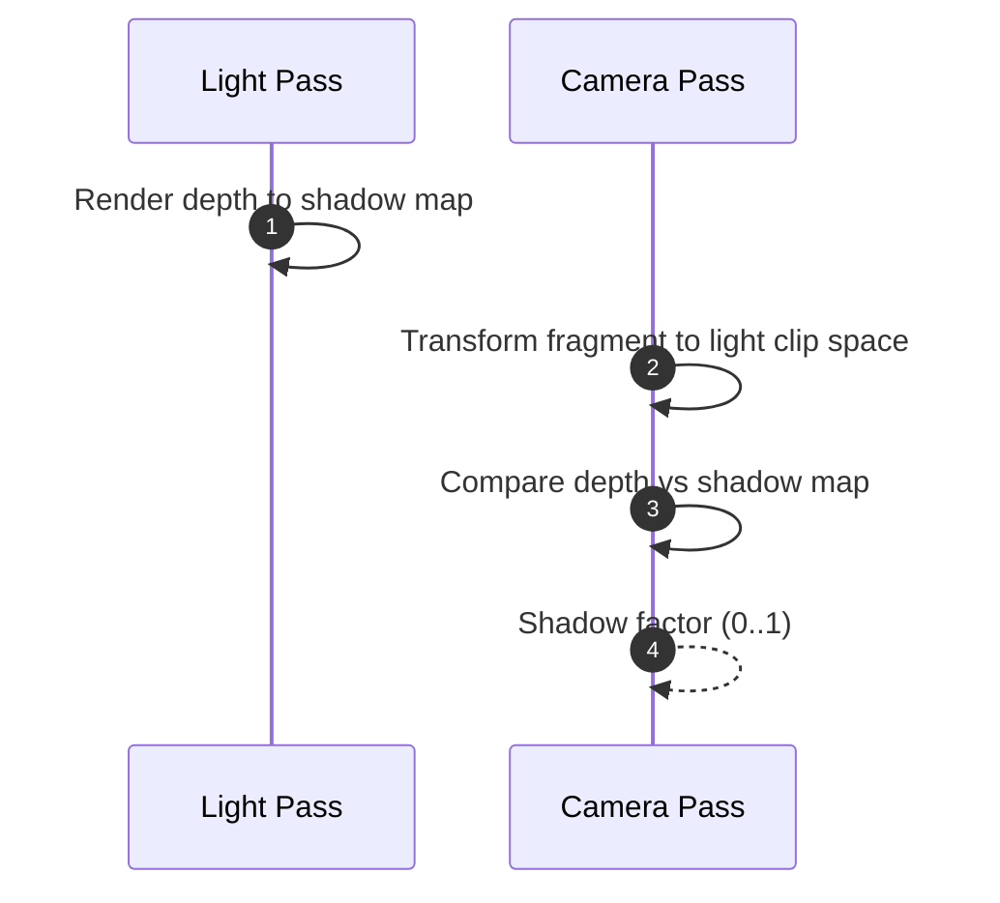

# İşıqlanma və Kölgələr

Bu səhifə səhnədə işıqlanma hesablanması və kölgələrin generasiyası metodlarını izah edir.

## İşıq Tipləri

- Directional: Sonsuz məsafədən paralel şüalar (günəş).
- Point: Nöqtə mənbə, 1/r^2 zəifləmə.
- Spot: Konus formalı işıq, cutoff bucağı.

## Klassik Model: Blinn-Phong

```
color = ambient + k_d * L_d * max(dot(N, L), 0) + k_s * L_s * pow(max(dot(N, H),0), shininess)
```

- Normal xəritəsi (normal map) ilə detallı işıqlanma.

## PBR Qısa Baxış

- Enerji qorunması; BRDF parametrləri: albedo, metallic, roughness.
- IBL (Image-Based Lighting) üçün environment map-lər (irradiance + prefiltered specular).

## Shadow Mapping

1. İşıq nöqteyi-nəzərindən depth map render edilir.
2. Kamera pass-ında fragment-in işıq məkanındakı dərinliyi shadow map ilə müqayisə olunur.



### Java-da shadow bias hesabı (konseptual)

```java
float computeShadow(float depthFromLight, float sampledShadow, float bias) {
    return depthFromLight - bias > sampledShadow ? 1f : 0f; // 1=shadow
}
```

- Bias olmadan özünü-gölgələmə (self-shadowing) artefaktları görünə bilər.
- PCF (Percentage Closer Filtering): Shadow map ətrafında çoxlu nümunə ilə yumşaltma.

## Kontakt Kölgələr və SSAO

- Screen-space ambient occlusion (SSAO) kölgə deyil, ambient sönümləşdirmədir.
- Kontakt kölgələr üçün ray traced shadows və ya ekran-məkan metodları istifadə edilə bilər.

## Məşq

- Fərqli bias dəyərləri ilə shadow acne və peter panning təsirlərini müqayisə edin.
- PCF kernel ölçüsünü dəyişdirərək kənar yumşaqlığını müşahidə edin.
