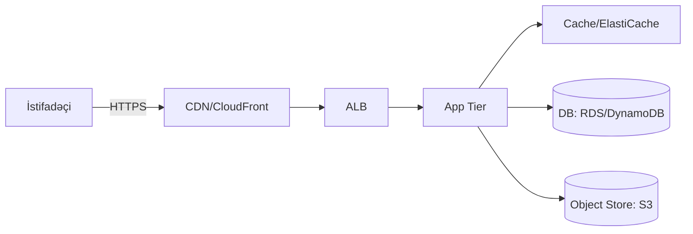

# Bulud Hesablama Əsasları

Bulud hesablama resursların (hesablama, yaddaş, şəbəkə, xidmətlər) internet üzərindən istehlakı və idarəsidir. Əsas xüsusiyyətlər:

- Elastiklik və avtomatik miqyaslama
- Pay-as-you-go qiymətləndirmə modeli
- Globallaşdırılmış infrastruktur (region/availability zone)
- İdarə olunan xidmətlər (managed services)

## İstifadə Ssenariləri

- Veb və mobil arxitekturalar
- Analitika və Big Data boru xətləri
- Stream processing və event-driven sistemlər
- Machine learning model hostinqi

## Xidmət Təchizatçıları

- AWS, Azure, Google Cloud – oxşar baza xidmətləri, fərqli terminlər və ekosistemlər.

## Əsas Terminlər

- Region/AZ, VPC, Subnet, Security Group, IAM, KMS, SLA.
