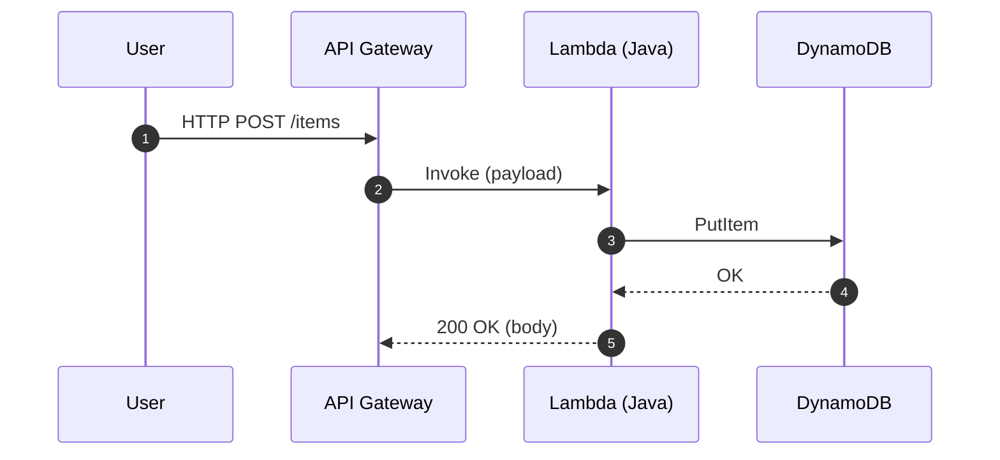

# Serverless və AWS Lambda (Java nümunəsi)

Serverless yanaşmada infrastruktur idarəsi minimumdur; kod hadisələrə cavab olaraq icra olunur və ödəniş icra müddəti ilə ölçülür.

## Əsas Anlayışlar

- Event-driven: S3, API Gateway, SQS, EventBridge kimi qaynaqlardan tetiklenmə
- Cold Start: İlk çağırış gecikməsi; Java üçün Provisioned Concurrency ilə azalda bilərik
- Concurrency və Retries: Lambda paralelliyi və avtomatik təkrar cəhdlər



## Java ilə Sadə Lambda

Maven layihəsində `com.amazonaws:aws-lambda-java-core` istifadə edin.

```java
import com.amazonaws.services.lambda.runtime.Context;
import com.amazonaws.services.lambda.runtime.RequestHandler;

public class Handler implements RequestHandler<Input, Output> {
    @Override
    public Output handleRequest(Input input, Context context) {
        context.getLogger().log("Got: " + input);
        // Biznes məntiqi: məsələn, DynamoDB-yə yazmaq
        return new Output("ok", 200);
    }
}

class Input { public String id; public String value; }
class Output { public String message; public int status; public Output(String m,int s){message=m;status=s;} }
```

`Handler` adı: `package.Handler::handleRequest`

## Deployment Variantları

- ZIP + Java 17 runtime
- Container Image (AWS SAM/Serverless Framework ilə)

## Performans Məsləhətləri

- Provisioned Concurrency kritik endpoint-lərdə
- Memory artırmaq CPU/NET-i də artırır – latency-ni yaxşılaşdırır
- Reuse: SDK client-ləri static sahələrdə saxlayın (connection reuse)

## Məşq

- API Gateway + Lambda + DynamoDB ilə CRUD endpoint-i qurun.
- Cold start təsirini Provisioned Concurrency ilə müqayisə edin.
