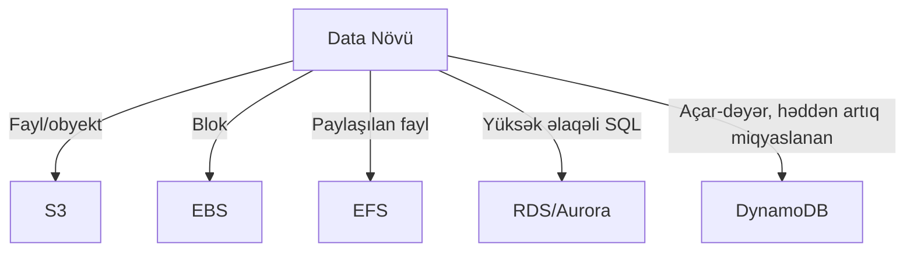

# AWS-də Saxlama və Məlumat Bazaları

Bu səhifə AWS saxlama və DB xidmətlərini müqayisə edir və seçim meyarlarını verir.

## Saxlama

- S3: Obyekt saxlama, yüksək davamlılıq (11 9s), lifecycle, event-lər.
- EBS: EC2 üçün blok cihazları; IOPS profilləri (gp3, io2).
- EFS: Paylaşılan POSIX fayl sistemi; bir neçə AZ-dən qoşulma.

## Məlumat Bazaları

- RDS/Aurora: İdarə olunan SQL, Multi-AZ, read replica, backup snapshot-lar.
- DynamoDB: NoSQL, auto-scaling, on-demand/RCU/WCU, TTL, Streams, DAX keş.

## Düzgün Seçim



## Konsistensiya və Transaksiyalar

- S3: Eventual consistency (bəzi API-lər üçün), Strong read-after-write for new objects.
- DynamoDB: Default eventual, optional strong read; TransactWriteItems ilə ACID.
- RDS: Tam ACID, SQL transaksiyaları.

## Backup və Bərpa

- S3 lifecycle → Glacier/Deep Archive.
- RDS snapshot və point-in-time recovery.
- DynamoDB backup/restore, PITR.

## Java Nümunəsi: S3-ə Fayl Yükləmə

```java
// AWS SDK v2
import software.amazon.awssdk.auth.credentials.DefaultCredentialsProvider;
import software.amazon.awssdk.core.sync.RequestBody;
import software.amazon.awssdk.regions.Region;
import software.amazon.awssdk.services.s3.S3Client;
import software.amazon.awssdk.services.s3.model.PutObjectRequest;

public class UploadExample {
  public static void main(String[] args) {
    S3Client s3 = S3Client.builder()
        .region(Region.EU_CENTRAL_1)
        .credentialsProvider(DefaultCredentialsProvider.create())
        .build();
    s3.putObject(
      PutObjectRequest.builder().bucket("my-bucket").key("docs/report.pdf").build(),
      RequestBody.fromBytes("hello".getBytes())
    );
  }
}
```
