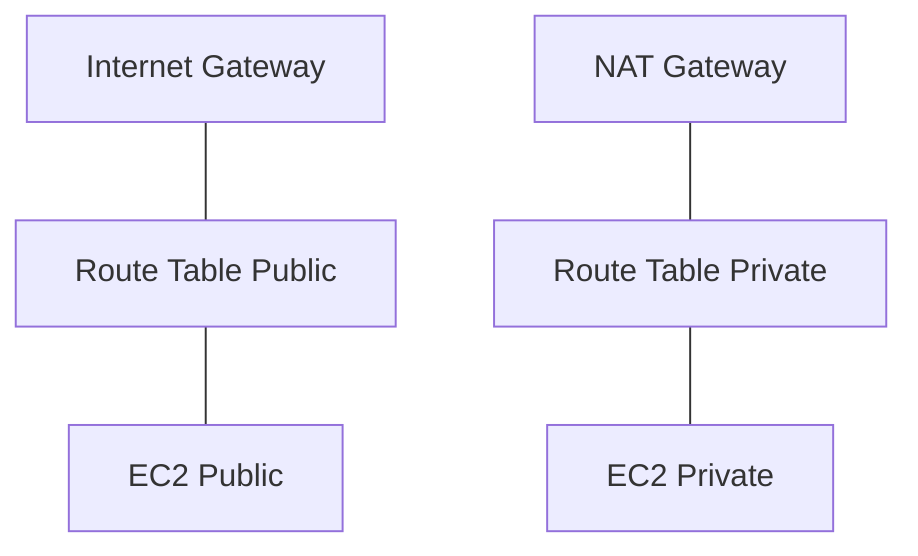

# AWS-də Şəbəkə və Təhlükəsizlik

## VPC Əsasları

- VPC: İzolyasiya olunmuş virtual şəbəkə; CIDR blokları.
- Subnet: Publik və özəl subnet-lər (Internet Gateway, NAT Gateway ilə çıxış).
- Route Table: Marşrutların təyini (0.0.0.0/0 → IGW/NAT GW).



## Security Group vs NACL

- Security Group: Stateful, instansiya səviyyəsində firewall (allow-only).
- NACL: Stateless, subnet səviyyəsində (allow/deny qaydaları).

## Identitet və Giriş İdarəsi

- IAM Users, Roles, Policies; ən minimal imtiyaz prinsipi.
- STS və müvəqqəti token-lər.

## Şifrələmə

- KMS CMK-lar: S3, EBS, RDS, DynamoDB-da at-rest şifrələmə.
- TLS ilə in-transit şifrələmə; ACM ilə sertifikat idarəsi.

## Java: Temporary Credentials ilə S3 oxuma

```java
import software.amazon.awssdk.auth.credentials.StsAssumeRoleCredentialsProvider;
import software.amazon.awssdk.regions.Region;
import software.amazon.awssdk.services.s3.S3Client;

S3Client s3 = S3Client.builder()
  .region(Region.EU_CENTRAL_1)
  .credentialsProvider(
    StsAssumeRoleCredentialsProvider.builder()
      .refreshRequest(r -> r.roleArn("arn:aws:iam::123456789012:role/app-role").roleSessionName("app"))
      .build()
  ).build();
```

## Best Practices

- Multi-AZ yerləşdirmə, ən az 2 AZ.
- Security Group-ları spesifik portlarla məhdudlaşdırın.
- VPC Flow Logs və CloudTrail aktiv edin.
