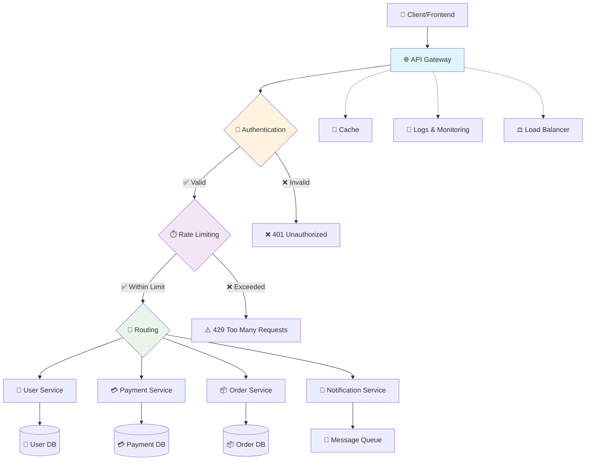

# API Gateway

## Istifadə olunduğu yerlər
- **Routing:** İstifadələri doğru servislərə yönləndirir.
- **Rate Limiting:** İstifadəçi sorğularını müəyyən limitlərlə məhdudlaşdırır, sistem yüklənməsinin qarşısını alır.
- **Caching:** Tez-tez soruşulan məlumatları saxlayaraq cavab müddətini azaldır.
- **Authentication/Authorization:** İstifadəçilərin kimliyini təsdiqləyir və resurslara giriş hüququnu idarə edir.
- **Monitoring:** API çağırışlarını izləyir, performans və səhv statistikalarını toplayır.
- **Load Balancing:** Gələn sorğuları bir neçə backend server arasında paylayır (bəzən dəstəklənir).
- **Request/Response Mapping və Formatting:** İstifadəçi sorğularını və server cavablarını uyğun formata çevirir.
- **Circuit Breaker:** Problemli servislərə qarşı qoruyucu mexanizm kimi işləyir, sistemin çökməsinin qarşısını alır.
- **API Versioning:** API-lərin fərqli versiyalarını idarə edir və istifadəçiyə uyğun versiyanı təqdim edir.
- **Service Discovery:** Mövcud servisləri tapmaq və əlaqə qurmaq üçün mexanizm təmin edir.
- **Error Handling:** Xətaları idarə edir və istifadəçiyə standart formatda cavab verir.
- **Service Aggregation:** Müxtəlif backend servislərdən gələn cavabları toplayıb bir cavab formatında birləşdirir.

