# API Gateway

## Istifadə olunduğu yerlər
- **Routing:** İstifadələri doğru servislərə yönləndirir.
- **Rate Limiting:** İstifadəçi sorğularını müəyyən limitlərlə məhdudlaşdırır, sistem yüklənməsinin qarşısını alır.
- **Caching:** Tez-tez soruşulan məlumatları saxlayaraq cavab müddətini azaldır.
- **Authentication/Authorization:** İstifadəçilərin kimliyini təsdiqləyir və resurslara giriş hüququnu idarə edir.
- **Monitoring:** API çağırışlarını izləyir, performans və səhv statistikalarını toplayır.
- **Load Balancing:** Gələn sorğuları bir neçə backend server arasında paylayır (bəzən dəstəklənir).
- **Request/Response Mapping və Formatting:** İstifadəçi sorğularını və server cavablarını uyğun formata çevirir.
- **Circuit Breaker:** Problemli servislərə qarşı qoruyucu mexanizm kimi işləyir, sistemin çökməsinin qarşısını alır.
- **API Versioning:** API-lərin fərqli versiyalarını idarə edir və istifadəçiyə uyğun versiyanı təqdim edir.
- **Service Discovery:** Mövcud servisləri tapmaq və əlaqə qurmaq üçün mexanizm təmin edir.
- **Error Handling:** Xətaları idarə edir və istifadəçiyə standart formatda cavab verir.
- **Service Aggregation:** Müxtəlif backend servislərdən gələn cavabları toplayıb bir cavab formatında birləşdirir.

```mermaid
graph TB
Client[👤 Client/Frontend] --> Gateway[🌐 API Gateway]

    Gateway --> Auth{🔐 Authentication}
    Auth -->|✅ Valid| RateLimit{⏱️ Rate Limiting}
    Auth -->|❌ Invalid| Reject[❌ 401 Unauthorized]
    
    RateLimit -->|✅ Within Limit| Route{🚦 Routing}
    RateLimit -->|❌ Exceeded| Throttle[⚠️ 429 Too Many Requests]
    
    Route --> UserService[👥 User Service]
    Route --> PaymentService[💳 Payment Service]
    Route --> OrderService[📦 Order Service]
    Route --> NotificationService[🔔 Notification Service]
    
    UserService --> UserDB[(👥 User DB)]
    PaymentService --> PaymentDB[(💳 Payment DB)]
    OrderService --> OrderDB[(📦 Order DB)]
    NotificationService --> Queue[📨 Message Queue]
    
    Gateway -.-> Cache[💾 Cache]
    Gateway -.-> Logs[📝 Logs & Monitoring]
    Gateway -.-> LoadBalancer[⚖️ Load Balancer]
    
    style Gateway fill:#e1f5fe
    style Auth fill:#fff3e0
    style RateLimit fill:#f3e5f5
    style Route fill:#e8f5e8
```

