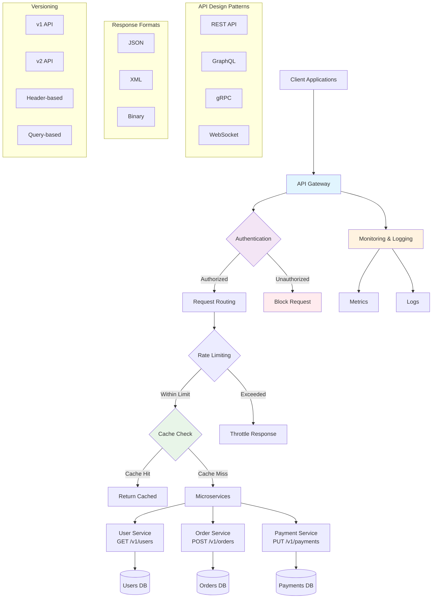

# API Design
API Design tətbiqlərin fərqli komponentləri arasında kommunikasiya protokollarının yaradılması prosesidir. Yaxşı API dizaynı sistemin genişləndirilə bilməsini, saxlanmasını və istifadəsini asanlaşdırır.

### Nə üçün lazımdır?
- **Aydın kommunikasiya:** Sistemlər arasında standartlaşdırılmış əlaqə
- **Təkrar istifadə:** Kodun müxtəlif yerlərində istifadəsi
- **Scalability:** Sistemin böyüməsinə uyğunlaşma
- **Maintainability:** Sadə saxlama və yeniləmə
- **Interoperability:** Fərqli sistemlərin birlikdə işləməsi

### API Növləri
- **REST:** HTTP metodları ilə resurs əsaslı dizayn
- **GraphQL:** Məlumatların dəqiq sorğulanması
- **gRPC:** Yüksək performanslı RPC protokolu
- **WebSocket:** Real-time əlaqə üçün
- **SOAP:** XML əsaslı protokol

### Performance Optimallaşdırması
- **Pagination:** Böyük nəticələrin hissə-hissə göndərilməsi. Yaddaş istifadəsini azaldır. Cavab vaxtını qısaldır
- **Async Logging:** Girişlərin asinxron yazılması performansı artırır. Bloklanmanı minimuma endirir
- **Caching:** Tez-tez soruşulan məlumatların saxlanması, sürətləndirmə. Server yükünü azaldır
- **Payload Compression:** Məlumatın ötürülmə ölçüsünü kiçiltmək üçün sıxılma. Şəbəkə trafikini azaldır
- **Connection Pool:** Mövcud əlaqələrin təkrar istifadəsi, gecikməni azaldır. Resurs istehlakını optimallaşdırır

### Dizayn Yanaşmaları
- **Code First:** API əvvəlcə kod kimi hazırlanır, sonra sənədləşdirilir. Tez başlamaq üçün yaxşı. Sənədləşdirmə problemi
- **API First:** API dizaynı əvvəlcə hazırlanır, sonra kod yazılır. Daha planlı və standartlıdır. Komandalar arası koordinasiya yaxşı

### REST API Prinsipi
- **Plural Resource Names:** Resurs adları çoxluq şəklində istifadə edilir (məsələn, `/users`, `/orders`). Daha aydın və REST prinsiplərinə uyğundur
- **HTTP Methods:** GET (oxumaq), POST (yaratmaq), PUT (yeniləmək), DELETE (silmək)
- **Status Codes:** 2xx (müvəffəq), 4xx (client səhvi), 5xx (server səhvi)
- **Stateless:** Hər sorğu müstəqildir

### Etibarlılıq və Təhlükəsizlik
- **Idempotency:** Eyni əməliyyatın təkrar icrası nəticəni dəyişdirməməlidir. PUT və DELETE idempotentdir, POST olmaya bilər
- **Rate Limiting:** İstifadəçi sorğularının sayı müəyyən limitlə məhdudlaşdırılır. Server yüklənməsinin qarşısını alır
- **Authentication:** JWT, OAuth, API keys ilə kimlik doğrulama
- **Authorization:** İstifadəçi icazələrinin idarə edilməsi

### Versioning Strategiyaları
- **URL Versioning:** Versiya URI-də göstərilir (`/v1/users`, `/v2/users`)
- **Header Versioning:** HTTP header-də versiya məlumatı
- **Query Parameter:** Sorğu parametri kimi versiya
- **Geriyə uyğunluq:** Köhnə versiyaları qorumaq

### Sənədləşdirmə
- **Diagram as Code:** API dizaynını kod şəklində yaratmaq (Swagger/OpenAPI, AsyncAPI)
- **Interactive Docs:** İstifadəçilərin test edə biləcəyi sənədlər
- **Code Examples:** Müxtəlif dillər üçün nümunələr
- **Changelog:** Dəyişikliklərin təfərrüatlı tarixçəsi

### Əsas Problemlər
- **Over-fetching:** Lazım olmayan məlumatın alınması → GraphQL və ya field selection işlət
- **Under-fetching:** Çox sorğu lazım olan hallar → Data aggregation və batch operations
- **Breaking Changes:** API dəyişiklikləri mövcud client-ları pozur → Versioning strategiyası
- **Poor Documentation:** Zəif sənədləşdirmə → Avtomatik sənəd generatoru işlət
- **Security Issues:** Təhlükəsizlik zəiflikləri → OWASP API Security Guidelines

