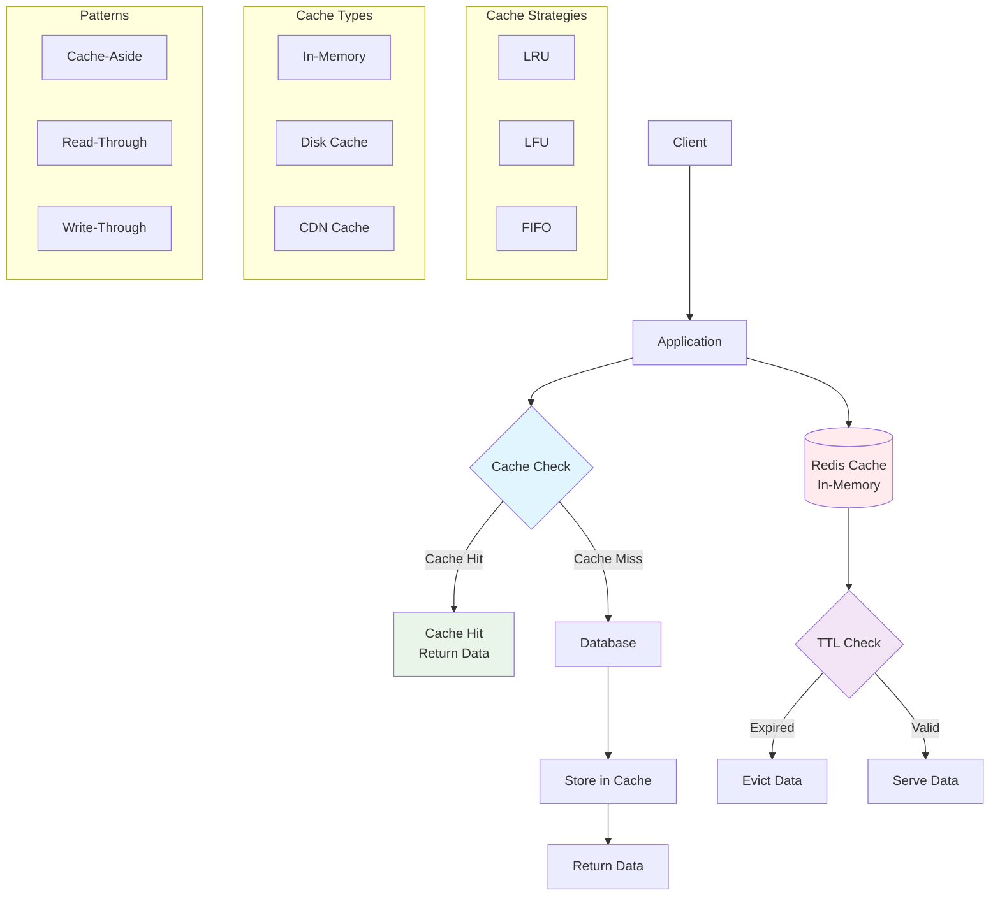

# Cache (Keş)
Cache tez-tez istifadə olunan məlumatların müvəqqəti saxlanması üçün istifadə edilən texnologiyadır. Bu sistemin performansını artırmaq və gecikməni azaltmaq üçün vacibdir.

### Nə üçün lazımdır?
- **Performans artırır:** Məlumatların sürətlə əldə edilməsini təmin edir
- **Latency azaldır:** Database və API sorğularının cavab vaxtını qısaldır
- **Server yükünü azaldır:** Tez-tez soruşulan məlumatları saxlayır
- **Bandwidth qənaət edir:** Şəbəkə trafikini minimuma endirir
- **İstifadəçi təcrübəsini yaxşılaşdırır:** Sürətli yükləmə təmin edir
- **Xərcləri azaldır:** Server resurslarından daha səmərəli istifadə

### Cache Növləri
- **In-Memory Cache:** Yaddaşda saxlanılan ən sürətli növ. Redis, Memcached. Sürətli, lakin restart zamanı məlumat itkisi
- **Disk Cache:** Sabit diskdə saxlanır. Böyük həcmli məlumatlar üçün. Davamlı, lakin yavaş
- **Database Cache:** SQL sorğularının nəticələri. MySQL Query Cache, PostgreSQL shared_buffers. Sorğuları sürətləndirir, lakin yeniləmə problemi
- **Client-Side Cache:** Browser və mobile app cache. Şəbəkə trafikini azaldır, lakin client kontrolunda
- **Server-Side Cache:** HTML səhifələri və API response-ları. Server performansını artırır, lakin yenilənmə lazım
- **CDN Cache:** Statik kontentin coğrafi paylanması. CloudFlare, AWS CloudFront. Sürətli çatdırılma, lakin əlavə xərc
- **DNS Cache:** Domain adlarının IP ünvanları. DNS sorğularını sürətləndirir, lakin TTL məhdudluğu

### Yerləşdirmə Strategiyası
Cache-lərin sistem arxitekturasında düzgün yerləşdirilməsi vacibdir:
- **Client-side cache:** Browser və mobile app səviyyəsində
- **CDN cache:** Content Delivery Network üzərində
- **Load Balancer cache:** Yük paylaşdırıcısı səviyyəsində
- **Application cache:** Tətbiq server səviyyəsində
- **Database cache:** Məlumat bazası səviyyəsində

### Replacement Strategiyaları
- **LRU (Least Recently Used):** Ən son istifadə olunanı silir. Temporal locality prinsipinə uyğun. Implementation kompleksdir
- **LFU (Least Frequently Used):** Ən az istifadə olunanı silir. Uzunmüddətli pattern-ləri tutur. Counter saxlamaq lazımdır
- **FIFO (First In, First Out):** İlk daxil olanı ilk silir. Sadə implementation. İstifadə tezliyini nəzərə almır
- **Random Replacement:** Təsadüfi məlumat silir. Ən sadə method. Optimal performans vermir

### Cache Invalidation Strategiyaları
- **Write-Through:** Cache və database eyni anda yazılır. Data consistency yüksək. Write latency artır
- **Write-Around:** Database-ə birbaşa yazır. Write performansı yaxşı. İlk read zamanı cache miss
- **Write-Back:** Əvvəl cache-ə, sonra asinxron database-ə yazır. Yüksək write performansı. Cache crash riski

### Cache Reading Patterns
- **Cache-Aside (Lazy Loading):** Application cache-i idarə edir. Çox populyar pattern. Cache miss zamanı yavaşlıq
- **Read-Through:** Cache database ilə əlaqə saxlayır. Application üçün sadə. Cache provider dəstəyi lazım

### Texnologiyalar
- **Redis:** In-memory data structure store. Yüksək performans. Dərslik məlumat strukturları. Memory məhdudluğu
- **Memcached:** Sadə key-value cache. Çox sürətli. Minimal memory overhead. Əlavə funksiya yoxdur
- **Apache Ignite:** Distributed in-memory platform. SQL dəstəyi. Kompleks setup
- **Hazelcast:** Java-based in-memory grid. Real-time analytics dəstəyi. Java-specific

### Əsas Problemlər
- **Cache Stampede:** Eyni məlumat üçün çoxlu sorğu → TTL randomization və lock mechanism
- **Cold Start:** İlk başlanğıcda cache boşdur → Cache warming strategiyası
- **Memory Overflow:** Cache həcmi artıq böyüyür → Uyğun eviction policy seç
- **Stale Data:** Köhnə məlumat problemi → Düzgün TTL və invalidation
- **Distributed Cache Sync:** Cluster-də sync problemi → Consistent hashing istifadə et

