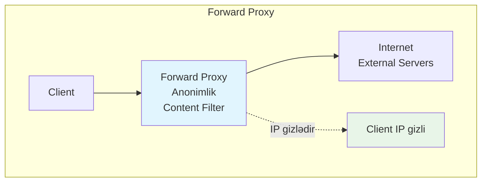

# Proxy
Proxy istifadəçi ilə server arasında vasitəçi rolunu oynayan xidmətdir. Bu sistem şəbəkə sorğularını idarə edərək performans, təhlükəsizlik və nəzarət məsələlərini həll edir.

### Nə üçün lazımdır?
- **Performance artırır:** Keşləmə mexanizmi ilə sürəti yüksəldir
- **Təhlükəsizlik təmin edir:** İstifadəçiləri birbaşa internetə çıxışdan qoruyur  
- **Anonimlik verir:** Real IP ünvanını gizlədərək məxfilik təmin edir
- **Mərkəzi nəzarət:** Bütün trafikə vahid nöqtədən nəzarət imkanı
- **Resurs qənaəti:** Bandwidth və server yükünü optimallaşdırır
- **Giriş idarəetməsi:** Məzmuna çıxışı məhdudlaşdırma imkanı

### Proxy Növləri
- **Forward Proxy:** İstifadəçi tərəfində işləyir və onların adından sorğular göndərir. Anonimlik təmin edir. Məzmun filtrlər. İstifadəçi konfiqurasiyası lazımdır
- **Reverse Proxy:** Server tərəfində yerləşir və serverlər üçün vasitəçilik edir. Yük balansı təmin edir. SSL termination. İstifadəçilər görmür
- **Transparent Proxy:** İstifadəçi tərəfindən görünməz proxy. Avtomatik yönləndirmə. Sadə idarəetmə. Bəzi tətbiqlər problemli
- **Anonymous Proxy:** İstifadəçinin IP-sini tamamilə gizləyir. Yüksək məxfilik. Anonimlik qoruyur. Bəzi saytlar blokleyir

### Cache Mexanizmi
- **Web Caching:** HTTP məzmununu keşləyir və sürətli çatdırılma təmin edir. Bandwidth qənaət edir. Stale content problemi
- **DNS Caching:** Domain adlarının IP ünvanlarını keşləyir. DNS sorğu sayını azaldır. TTL əsasında idarə olunur
- **Database Query Caching:** Tez-tez soruşulan sorğuları keşləyir. Database yükünü azaldır. Data consistency problemi

### SSL/TLS İşləmə
- **SSL Termination:** Proxy-də SSL şifrəsizləşdirmə həyata keçirilir. Backend serverlər üçün yük azalır. Daxili trafikin şifrələnməsi problemi
- **SSL Passthrough:** SSL trafik olduğu kimi ötürülür. End-to-end şifrələmə. Proxy məzmunu görə bilmir
- **SSL Bridging:** Proxy həm client, həm də server tərəfində SSL istifadə edir. Tam nəzarət. Performans yükü artır

### Forward Proxy vs Reverse Proxy
- **Forward Proxy:** İstifadəçi tərəfində, anonimlik üçün istifadə. Corporate şəbəkələrdə məzmun filtrləmə. İstifadəçi konfiqurasiyası. Kənar serverlərdən qorunma
- **Reverse Proxy:** Server tərəfində, load balancing üçün. Web serverlərin qorunması. SSL termination. İstifadəçilər bilmir

### Authentication və Authorization
- **Basic Authentication:** Sadə istifadəçi adı və şifrə yoxlaması. Sadə konfiqurasiya. Zəif təhlükəsizlik
- **LDAP Integration:** Active Directory ilə inteqrasiya. Mərkəzi istifadəçi idarəsi. Korporativ mühitlər üçün uyğun
- **Multi-factor Authentication:** Əlavə təhlükəsizlik qatları. Token və biometrik yoxlama. Kompleks konfiqurasiya

### Logging və Monitoring
- **Access Logs:** İstifadəçi fəaliyyətlərini qeyd edir və audit imkanı verir. Compliance tələbləri. Böyük həcmli məlumat
- **Performance Metrics:** Cavab vaxtı, throughput və digər metrikalar. Sistem performansının izlənməsi. Real-time monitoring
- **Security Events:** Təhlükəsizlik hadisələrinin qeydiyyatı. Hücum cəhdlərinin aşkarlanması. Incident response

### Əsas Problemlər
- **Single Point of Failure:** Proxy nasaz olarsa bütün trafik dayanır → High Availability və clustering həlli
- **Performance Bottleneck:** Yüksək yük zamanı darboğaz yaranır → Load balancing və horizontal scaling
- **Configuration Complexity:** Kompleks tənzimləmə xətaları → Automation tools və template istifadəsi
- **SSL Certificate Management:** Sertifikat idarəetməsi çətindir → Automated certificate management
- **Cache Invalidation:** Köhnə məlumatın təmizlənməsi problemi → Smart TTL və purging strategiyası
- **Security Vulnerabilities:** Proxy özü hücum hədəfi ola bilər → Regular updates və security hardening



```mermaid
graph TB
    subgraph "Reverse Proxy" 
        Internet2[Internet<br/>Client Requests] --> RProxy[Reverse Proxy<br/>Load Balance<br/>SSL Termination]
        RProxy --> Server1[Web Server 1]
        RProxy --> Server2[Web Server 2] 
        RProxy --> Server3[Web Server 3]
        RProxy -.->|Server gizlədir| HiddenServer[Server detallari gizli]
    end
    style RProxy fill:#f3e5f5
    style HiddenServer fill:#e8f5e8
 ```

```mermaid
graph TB  
    subgraph "Forward vs Reverse"
        FP[Forward Proxy<br/>Client terefinde<br/>Istifadeci mexfiliyi<br/>Mezmun bloklama]
        RP[Reverse Proxy<br/>Server terefinde<br/>Server qorunmasi<br/>Performance artirma]
    end
    
    subgraph "Use Cases"
        UC1[Corporate Network<br/>Content Filtering]
        UC2[CDN<br/>Geographic Distribution]
        UC3[API Gateway<br/>Rate Limiting]
        UC4[Microservices<br/>Service Discovery]
    end

    style FP fill:#fff3e0
    style RP fill:#fce4ec
```
