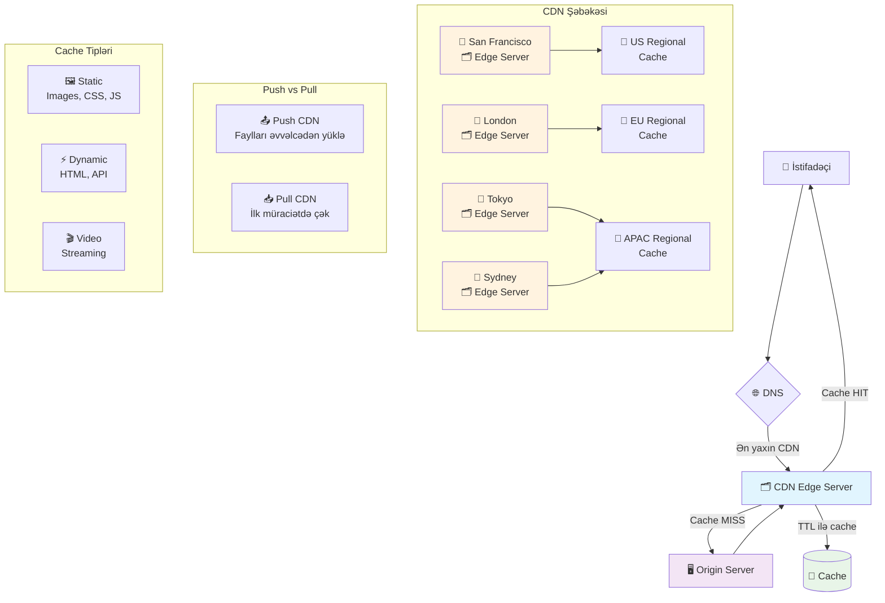

# CDN (Content Delivery Network)
CDN statik məzmunu istifadəçilərə ən yaxın serverdən çatdıran coğrafi olaraq paylanmış şəbəkədir. Bu sistem veb saytların yüklənmə sürətini artırır və performansını yaxşılaşdırır.

### Nə üçün lazımdır?
- **Sürəti artırır:** İstifadəçiyə ən yaxın serverdən məzmun göndərir
- **Yükü azaldır:** Əsas serverlərin yükünü azaldır
- **Coğrafi coverage:** Bütün dünyada sürətli məzmun çatdırılması
- **Availability yaxşılaşdırır:** Birdən çox server varsa daha etibarlı
- **Bandwidth xərclərini azaldır:** Əsas serverlərə az müraciət

### Cache Növləri
- **Static Cache:** Şəkillər, CSS, JS, video fayllar
- **Dynamic Cache:** HTML səhifələr, API cavabları (məhdud)
- **Edge Cache:** İstifadəçiyə ən yaxın cache
- **Regional Cache:** Böyük regional mərkəzlər

### CDN Strategiyaları
- **Push CDN:** Faylları əvvəlcədən CDN-ə yükləyir. Kiçik saytlar üçün yaxşı. Tam nəzarət verir
- **Pull CDN:** İlk müraciətdə faylı çəkir. Böyük traffic üçün ideal. Az yer tutur, amma ilk müraciət yavaş
- **Hybrid:** İkisinin qarışığı. Vacib məzmun push, digərləri pull

### Yerləşdirmə Strategiyası
- Statik fayllar (images, CSS, JS) üçün
- Video və media məzmun üçün
- API cavabları üçün (caching headers ilə)
- Download faylları üçün
- Mobile app assetləri üçün

### Cache Konfiqurasiyası
- **TTL (Time to Live):** Məzmunun nə qədər cache-də qalacağı
- **Cache Headers:** Browser və CDN cache davranışını idarə edir
- **Invalidation:** Köhnə məzmunu silmək üçün
- **Version Control:** URL parametrləri ilə yeni versiya (file.css?v=2)

### Texnologiyalar
- **Amazon CloudFront:** AWS ekosistemi. Qlobal edge locations. Lambda@Edge dəstəyi
- **Cloudflare:** Geniş şəbəkə, security features. Asan konfiqurasiya
- **Fastly:** Real-time purging. Developer-friendly API
- **KeyCDN:** Sadə, ucuz. Kiçik və orta layihələr üçün

### Monitoring və Metrics
- **Hit Ratio:** Cache-dən neçə faiz cavab verilir
- **Response Time:** Məzmunun çatdırılma sürəti
- **Bandwidth:** İstifadə olunan trafik həcmi
- **Geographic Reports:** Hansı bölgələrdən çox müraciət

### Əsas Problemlər
- **Köhnə məzmun:** TTL uzun olarsa yeniliklər gecikmə ilə görsənir → Qısa TTL və smart invalidation
- **Xərc:** Çox traffic bahalı ola bilər → Ağıllı caching strategiyası
- **Konfiqurasiya:** Yanlış tənzim problemlər yaradır → Test mühitində sınaq
- **Fallback:** CDN nasaz olarsa nə ediləcək → Origin server fallback
- **Security:** Cache poisoning hücumları → Secure headers istifadə et

