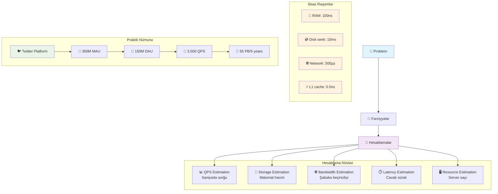

# Back-of-the-Envelope Hesablamalar
Back-of-the-envelope hesablamalar sistem dizaynında əsas parametrləri tez qiymətləndirmək üçün istifadə olunan təxmini hesablama üsuludur. Bu üsul sistem tələblərini başa düşmək və doğru arxitektura seçmək üçün vacibdir.

### Nə üçün lazımdır?
- **Tez qiymətləndirmə:** Sistem tələblərini sürətlə təyin etmək
- **Resurs planlaması:** Lazımi resursları təxmin etmək
- **Bottleneck aşkarlama:** Potensial problemləri erkən tapmaq  
- **Dizayn seçimi:** Fərqli dizayn variantlarını müqayisə etmək
- **Feasibility yoxlama:** Sistemin həyata keçirilə bilinməsini yoxlamaq

### Əsas Parametrlər
- **QPS (Queries Per Second):** Saniyədə sorğu sayı
- **Storage:** Məlumat saxlama tələbləri  
- **Bandwidth:** Şəbəkə keçiricilik tələbləri
- **Latency:** Cavab verməsinə tələb olunan vaxt
- **Resources:** Server, CPU, RAM tələbləri

### Hesablama Növləri
- **Load Estimation:** Trafik və istifadəçi yükü təxmini
- **Storage Estimation:** Verilənlər bazası və faylların həcmi
- **Bandwidth Estimation:** Şəbəkə trafik həcmi  
- **Latency Estimation:** Cavab sürəti təxmini
- **Resource Estimation:** Server və avadanlıq sayı

### Əsas Rəqəmlər (Jeff Dean)
- **L1 cache:** 0.5 ns
- **L2 cache:** 7 ns  
- **RAM:** 100 ns
- **SSD random read:** 150 µs
- **Disk seek:** 10 ms
- **Network (same datacenter):** 500 µs
- **Network (intercontinental):** 150 ms

### Məlumat Vahidləri
- **KB:** 10³ = 1,000 bytes
- **MB:** 10⁶ = 1,000,000 bytes  
- **GB:** 10⁹ = 1,000,000,000 bytes
- **TB:** 10¹² = 1,000,000,000,000 bytes
- **PB:** 10¹⁵ bytes

### Availability Rəqəmləri
- **99%:** 3.65 gün downtime/il
- **99.9%:** 8.8 saat downtime/il
- **99.99%:** 52.6 dəqiqə downtime/il
- **99.999%:** 5.3 dəqiqə downtime/il

### Hesablama Nümunəsi: Twitter Kimi Platform
**Fərziyyələr:**
- 300 milyon aylıq aktiv istifadəçi
- 50% istifadəçi gündəlik aktiv
- Hər istifadəçi gündə 2 tweet yazır
- 10% tweet media məzmun daşıyır
- Data 5 il saxlanılır

**Hesablamalar:**
```
QPS Hesablama:
DAU = 300M × 50% = 150M
Tweet QPS = 150M × 2 ÷ 86,400 saniyə ≈ 3,500
Peak QPS = 2 × 3,500 ≈ 7,000

Storage Hesablama:
Tweet məzmunu = 64 byte (ID) + 140 byte (text) ≈ 200 byte
Media = 1 MB (10% tweet)
Gündəlik media = 150M × 2 × 10% × 1MB = 30 TB
5 illik storage = 30 TB × 365 × 5 ≈ 55 PB
```

### Hesablama Üsulları
- **Yuvarlaqlaşdırma:** 99,987 ÷ 9.1 → 100,000 ÷ 10 = 10,000
- **Fərziyyələri yazmaq:** Bütün təxmini rəqəmləri qeyd et
- **Vahidləri göstərmək:** "5" əvəzinə "5 MB" yazmaq
- **Təcrübə:** QPS, storage, cache hesablamalarını məşq etmək

### Hesablama Strategiyaları
- **Order of Magnitude:** 10-un dərəcələri ilə təxmin
- **Analogy:** Tanış sistemlərlə müqayisə
- **Dimensional Analysis:** Ölçü vahidləri ilə əlaqələr
- **Rule of Thumb:** Sahə üzrə tanınan qaydalar
- **Benchmarking:** Sənaye standartları ilə müqayisə

### Əsas Problemlər
- **Dəqiqlik çatışmazlığı:** Təxmini hesablamalar həmişə dəqiq olmur → Mümkün qədər real məlumat istifadə et
- **Fərziyyələrə asılılık:** Yanlış fərziyyələr səhv nəticələr verir → Fərziyyələri təsdiqləmək lazımdır
- **Məhdud əhatə:** Bütün mürəkkəbliyi əhatə etmir → Detallı analiz üçün başqa üsullarla tamamla
- **Təcrübə asılılığı:** Nəticələr mühəndisin təcrübəsindən asılıdır → Komanda ilə müzakirə et
- **Nazik faktortların atlanması:** Vacib detallar gözləm atına bilir → Checklist istifadə et



