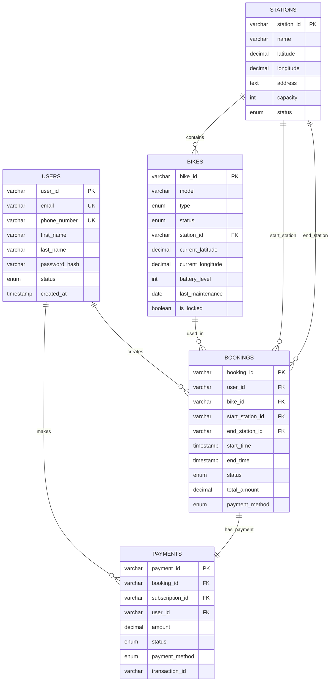
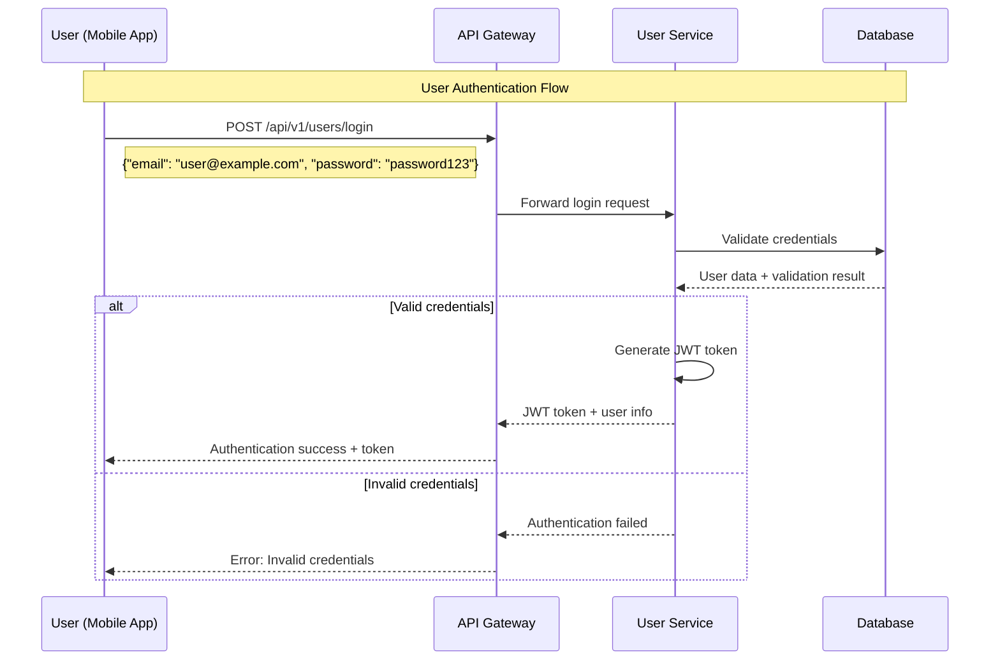
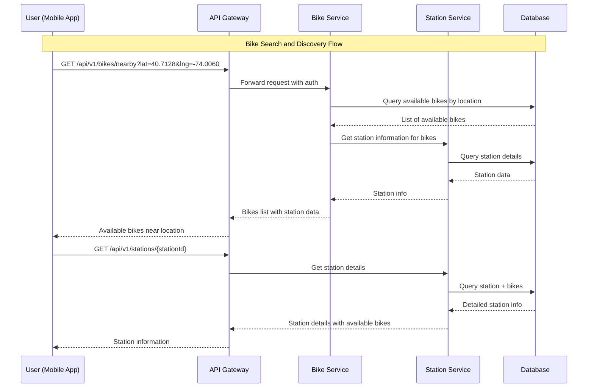
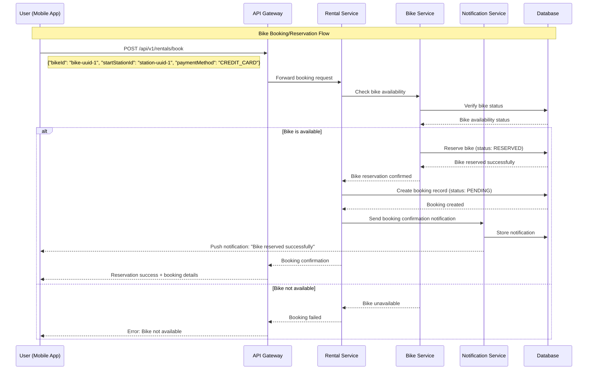
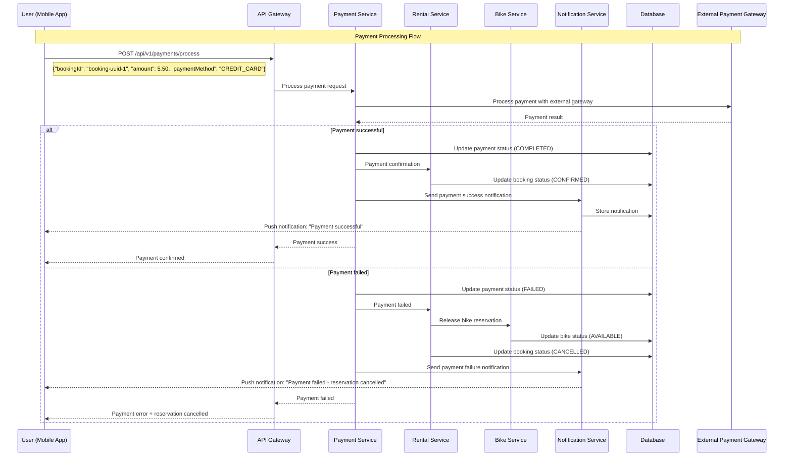
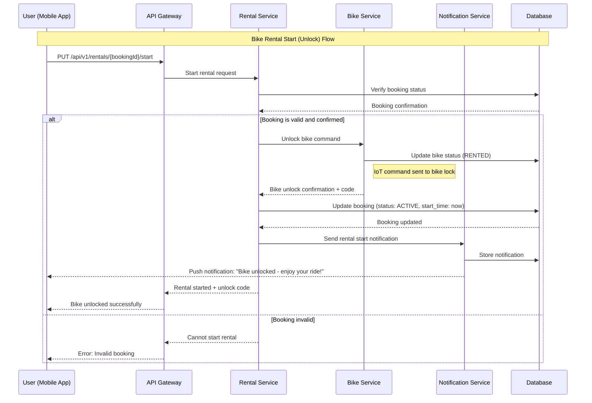
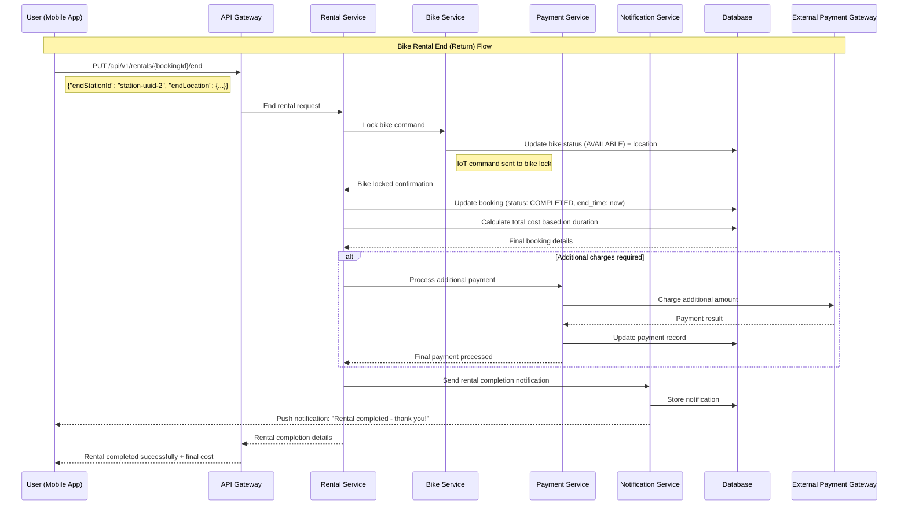
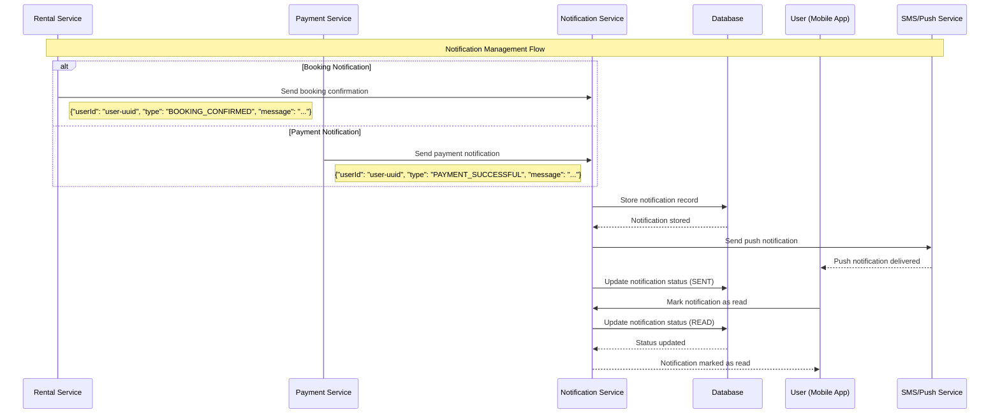

# Bike Rental Sistem Dizaynı

Bu sualda bizdən bike rental sistem dizayn etməyimizi istəyirlər.

## Requirements

- İstifadəçilər qeydiyyatdan keçə bilər (login/register)
- Mobil proqramı açaraq boş olan velosipedləri rent edə bilər
- Subscription və ya bir dəfəlik ödəniş ola bilər
- Notification sistemi olacaq
- Admin velosipedləri idarə edə bilər status check edə bilər

## Komponentlər və Dizayn

- **User Service** - qeydiyyat, auth. və s.
- **Rent Service** - clientdən sorğu bura gəlir, bu servis həm payment həm də booking işlərini idarə edir
- **Payment Service** - subscription ödəmə və s. işlərə nəzarət edir
- **Bike Service** - həm inventory işi görür, velosipedlərin statusu harda olduğu göstərilir
- **Notification Service** - bildirşlərə nəzarət edir


## High Level Detailed Arxitektura və Komponent Dizayn


### Komponent detayları:

**Client Layer:**
- **Mobile App**: İstifadəçi interfeysi, velosiped axtarışı, booking, ödəmə
- **Web Admin**: Admin panel, velosiped idarəetməsi, analytics

**API Gateway:**
- Rate limiting, authentication, routing, load balancing
- SSL termination və request/response logging

**Microservices:**
- **User Service**: Authentication, authorization, user profile management
- **Rental Service**: Booking logic, rental lifecycle, availability check
- **Payment Service**: Payment processing, subscription management, billing
- **Bike Service**: Inventory management, location tracking, maintenance
- **Notification Service**: Push notifications, SMS, email alerts
- **Analytics Service**: Usage analytics, reporting, business intelligence

## Sadə Class Diagram (UML)


## Database Table Dizayn və Aralarındakı Əlaqə

<details>
<summary>Koda bax</summary>

### Users Table
```sql
CREATE TABLE users (
    user_id VARCHAR(36) PRIMARY KEY,
    email VARCHAR(255) UNIQUE NOT NULL,
    phone_number VARCHAR(20) UNIQUE,
    first_name VARCHAR(100) NOT NULL,
    last_name VARCHAR(100) NOT NULL,
    password_hash VARCHAR(255) NOT NULL,
    status ENUM('ACTIVE', 'INACTIVE', 'SUSPENDED') DEFAULT 'ACTIVE',
    created_at TIMESTAMP DEFAULT CURRENT_TIMESTAMP,
    updated_at TIMESTAMP DEFAULT CURRENT_TIMESTAMP ON UPDATE CURRENT_TIMESTAMP,
    INDEX idx_email (email),
    INDEX idx_phone (phone_number)
);
```

### Stations Table
```sql
CREATE TABLE stations (
    station_id VARCHAR(36) PRIMARY KEY,
    name VARCHAR(255) NOT NULL,
    latitude DECIMAL(10, 8) NOT NULL,
    longitude DECIMAL(11, 8) NOT NULL,
    address TEXT,
    capacity INTEGER NOT NULL DEFAULT 20,
    status ENUM('ACTIVE', 'MAINTENANCE', 'CLOSED') DEFAULT 'ACTIVE',
    created_at TIMESTAMP DEFAULT CURRENT_TIMESTAMP,
    INDEX idx_location (latitude, longitude)
);
```

### Bikes Table
```sql
CREATE TABLE bikes (
    bike_id VARCHAR(36) PRIMARY KEY,
    model VARCHAR(100) NOT NULL,
    type ENUM('STANDARD', 'ELECTRIC', 'PREMIUM') NOT NULL,
    status ENUM('AVAILABLE', 'RENTED', 'MAINTENANCE', 'OUT_OF_SERVICE') DEFAULT 'AVAILABLE',
    station_id VARCHAR(36),
    current_latitude DECIMAL(10, 8),
    current_longitude DECIMAL(11, 8),
    battery_level INTEGER DEFAULT 100,
    last_maintenance DATE,
    is_locked BOOLEAN DEFAULT TRUE,
    created_at TIMESTAMP DEFAULT CURRENT_TIMESTAMP,
    updated_at TIMESTAMP DEFAULT CURRENT_TIMESTAMP ON UPDATE CURRENT_TIMESTAMP,
    FOREIGN KEY (station_id) REFERENCES stations(station_id),
    INDEX idx_status (status),
    INDEX idx_station (station_id),
    INDEX idx_location (current_latitude, current_longitude)
);
```

### Bookings Table
```sql
CREATE TABLE bookings (
    booking_id VARCHAR(36) PRIMARY KEY,
    user_id VARCHAR(36) NOT NULL,
    bike_id VARCHAR(36) NOT NULL,
    start_station_id VARCHAR(36),
    end_station_id VARCHAR(36),
    start_time TIMESTAMP,
    end_time TIMESTAMP,
    status ENUM('PENDING', 'ACTIVE', 'COMPLETED', 'CANCELLED') DEFAULT 'PENDING',
    total_amount DECIMAL(10, 2),
    payment_method ENUM('CREDIT_CARD', 'SUBSCRIPTION', 'WALLET') NOT NULL,
    created_at TIMESTAMP DEFAULT CURRENT_TIMESTAMP,
    FOREIGN KEY (user_id) REFERENCES users(user_id),
    FOREIGN KEY (bike_id) REFERENCES bikes(bike_id),
    FOREIGN KEY (start_station_id) REFERENCES stations(station_id),
    FOREIGN KEY (end_station_id) REFERENCES stations(station_id),
    INDEX idx_user (user_id),
    INDEX idx_bike (bike_id),
    INDEX idx_status (status),
    INDEX idx_time (start_time, end_time)
);
```

### Payments Table
```sql
CREATE TABLE payments (
    payment_id VARCHAR(36) PRIMARY KEY,
    booking_id VARCHAR(36),
    subscription_id VARCHAR(36),
    user_id VARCHAR(36) NOT NULL,
    amount DECIMAL(10, 2) NOT NULL,
    status ENUM('PENDING', 'COMPLETED', 'FAILED', 'REFUNDED') DEFAULT 'PENDING',
    payment_method ENUM('CREDIT_CARD', 'DEBIT_CARD', 'PAYPAL', 'APPLE_PAY') NOT NULL,
    transaction_id VARCHAR(255),
    processed_at TIMESTAMP,
    created_at TIMESTAMP DEFAULT CURRENT_TIMESTAMP,
    FOREIGN KEY (booking_id) REFERENCES bookings(booking_id),
    FOREIGN KEY (user_id) REFERENCES users(user_id),
    INDEX idx_user (user_id),
    INDEX idx_status (status),
    INDEX idx_transaction (transaction_id)
);
```

### Subscriptions Table
```sql
CREATE TABLE subscriptions (
    subscription_id VARCHAR(36) PRIMARY KEY,
    user_id VARCHAR(36) NOT NULL,
    type ENUM('MONTHLY', 'QUARTERLY', 'YEARLY', 'UNLIMITED') NOT NULL,
    start_date DATE NOT NULL,
    end_date DATE NOT NULL,
    monthly_fee DECIMAL(8, 2) NOT NULL,
    status ENUM('ACTIVE', 'EXPIRED', 'CANCELLED') DEFAULT 'ACTIVE',
    remaining_rides INTEGER,
    created_at TIMESTAMP DEFAULT CURRENT_TIMESTAMP,
    FOREIGN KEY (user_id) REFERENCES users(user_id),
    INDEX idx_user (user_id),
    INDEX idx_status (status),
    INDEX idx_dates (start_date, end_date)
);
```

### Notifications Table
```sql
CREATE TABLE notifications (
    notification_id VARCHAR(36) PRIMARY KEY,
    user_id VARCHAR(36) NOT NULL,
    type ENUM('BOOKING_CONFIRMED', 'BIKE_UNLOCKED', 'PAYMENT_SUCCESSFUL', 'SUBSCRIPTION_EXPIRED', 'MAINTENANCE_ALERT') NOT NULL,
    title VARCHAR(255) NOT NULL,
    message TEXT NOT NULL,
    status ENUM('PENDING', 'SENT', 'READ', 'FAILED') DEFAULT 'PENDING',
    sent_at TIMESTAMP,
    read_at TIMESTAMP,
    created_at TIMESTAMP DEFAULT CURRENT_TIMESTAMP,
    FOREIGN KEY (user_id) REFERENCES users(user_id),
    INDEX idx_user (user_id),
    INDEX idx_status (status),
    INDEX idx_type (type)
);
```

</details>

### Database Əlaqə Diaqramı:


## API Dizayn

### RESTful API Endpoints

<details>
<summary>Ətraflı izah</summary>
#### 1. User Service API

**Base URL**: `/api/v1/users`

```http
POST /api/v1/users/register
Content-Type: application/json
Authorization: Not required

Request Body:
{
  "email": "user@example.com",
  "password": "securePassword123",
  "firstName": "John",
  "lastName": "Doe",
  "phoneNumber": "+1234567890"
}

Response (201 Created):
{
  "userId": "uuid-string",
  "email": "user@example.com",
  "firstName": "John",
  "lastName": "Doe",
  "status": "ACTIVE",
  "createdAt": "2023-09-21T16:45:00Z"
}
```

```http
POST /api/v1/users/login
Content-Type: application/json

Request Body:
{
  "email": "user@example.com",
  "password": "securePassword123"
}

Response (200 OK):
{
  "token": "jwt-token-string",
  "refreshToken": "refresh-token-string",
  "user": {
    "userId": "uuid-string",
    "email": "user@example.com",
    "firstName": "John",
    "lastName": "Doe"
  },
  "expiresIn": 3600
}
```

```http
GET /api/v1/users/profile
Authorization: Bearer jwt-token

Response (200 OK):
{
  "userId": "uuid-string",
  "email": "user@example.com",
  "firstName": "John",
  "lastName": "Doe",
  "phoneNumber": "+1234567890",
  "status": "ACTIVE",
  "subscriptions": []
}
```

#### 2. Bike Service API

**Base URL**: `/api/v1/bikes`

```http
GET /api/v1/bikes/nearby?lat=40.7128&lng=-74.0060&radius=1000
Authorization: Bearer jwt-token

Response (200 OK):
{
  "bikes": [
    {
      "bikeId": "bike-uuid-1",
      "type": "ELECTRIC",
      "batteryLevel": 85,
      "location": {
        "latitude": 40.7129,
        "longitude": -74.0058,
        "stationId": "station-uuid-1",
        "stationName": "Central Park Station"
      },
      "status": "AVAILABLE"
    }
  ],
  "totalCount": 15
}
```

```http
PUT /api/v1/bikes/{bikeId}/lock
Authorization: Bearer jwt-token

Response (200 OK):
{
  "bikeId": "bike-uuid-1",
  "status": "LOCKED",
  "timestamp": "2023-09-21T16:45:00Z"
}
```

```http
PUT /api/v1/bikes/{bikeId}/unlock
Authorization: Bearer jwt-token

Request Body:
{
  "bookingId": "booking-uuid-1"
}

Response (200 OK):
{
  "bikeId": "bike-uuid-1",
  "status": "UNLOCKED",
  "unlockCode": "1234",
  "timestamp": "2023-09-21T16:45:00Z"
}
```

#### 3. Rental Service API

**Base URL**: `/api/v1/rentals`

```http
POST /api/v1/rentals/book
Authorization: Bearer jwt-token
Content-Type: application/json

Request Body:
{
  "bikeId": "bike-uuid-1",
  "startStationId": "station-uuid-1",
  "paymentMethod": "CREDIT_CARD"
}

Response (201 Created):
{
  "bookingId": "booking-uuid-1",
  "bikeId": "bike-uuid-1",
  "userId": "user-uuid-1",
  "status": "PENDING",
  "startTime": "2023-09-21T16:45:00Z",
  "estimatedCost": 5.50
}
```

```http
PUT /api/v1/rentals/{bookingId}/start
Authorization: Bearer jwt-token

Response (200 OK):
{
  "bookingId": "booking-uuid-1",
  "status": "ACTIVE",
  "startTime": "2023-09-21T16:45:00Z",
  "bikeUnlockCode": "1234"
}
```

```http
PUT /api/v1/rentals/{bookingId}/end
Authorization: Bearer jwt-token
Content-Type: application/json

Request Body:
{
  "endStationId": "station-uuid-2",
  "endLocation": {
    "latitude": 40.7150,
    "longitude": -74.0070
  }
}

Response (200 OK):
{
  "bookingId": "booking-uuid-1",
  "status": "COMPLETED",
  "startTime": "2023-09-21T16:45:00Z",
  "endTime": "2023-09-21T17:15:00Z",
  "duration": 30,
  "totalCost": 7.50,
  "paymentStatus": "COMPLETED"
}
```

```http
GET /api/v1/rentals/history?page=1&limit=20
Authorization: Bearer jwt-token

Response (200 OK):
{
  "bookings": [
    {
      "bookingId": "booking-uuid-1",
      "bikeId": "bike-uuid-1",
      "startTime": "2023-09-21T16:45:00Z",
      "endTime": "2023-09-21T17:15:00Z",
      "duration": 30,
      "totalCost": 7.50,
      "status": "COMPLETED"
    }
  ],
  "pagination": {
    "page": 1,
    "limit": 20,
    "total": 45,
    "hasNext": true
  }
}
```

#### 4. Payment Service API

**Base URL**: `/api/v1/payments`

```http
POST /api/v1/payments/process
Authorization: Bearer jwt-token
Content-Type: application/json

Request Body:
{
  "bookingId": "booking-uuid-1",
  "amount": 7.50,
  "paymentMethod": "CREDIT_CARD",
  "cardToken": "encrypted-card-token"
}

Response (200 OK):
{
  "paymentId": "payment-uuid-1",
  "status": "COMPLETED",
  "amount": 7.50,
  "transactionId": "txn-12345",
  "processedAt": "2023-09-21T17:16:00Z"
}
```

```http
POST /api/v1/payments/subscriptions
Authorization: Bearer jwt-token
Content-Type: application/json

Request Body:
{
  "subscriptionType": "MONTHLY",
  "paymentMethod": "CREDIT_CARD",
  "cardToken": "encrypted-card-token"
}

Response (201 Created):
{
  "subscriptionId": "subscription-uuid-1",
  "type": "MONTHLY",
  "startDate": "2023-09-21",
  "endDate": "2023-10-21",
  "monthlyFee": 29.99,
  "status": "ACTIVE",
  "paymentId": "payment-uuid-2"
}
```

#### 5. Station Service API

**Base URL**: `/api/v1/stations`

```http
GET /api/v1/stations/nearby?lat=40.7128&lng=-74.0060&radius=2000
Authorization: Bearer jwt-token

Response (200 OK):
{
  "stations": [
    {
      "stationId": "station-uuid-1",
      "name": "Central Park Station",
      "location": {
        "latitude": 40.7129,
        "longitude": -74.0058,
        "address": "Central Park West, New York, NY"
      },
      "capacity": 20,
      "availableBikes": 8,
      "availableSpaces": 12,
      "status": "ACTIVE"
    }
  ],
  "totalCount": 5
}
```

```http
GET /api/v1/stations/{stationId}
Authorization: Bearer jwt-token

Response (200 OK):
{
  "stationId": "station-uuid-1",
  "name": "Central Park Station",
  "location": {
    "latitude": 40.7129,
    "longitude": -74.0058,
    "address": "Central Park West, New York, NY"
  },
  "capacity": 20,
  "availableBikes": 8,
  "bikes": [
    {
      "bikeId": "bike-uuid-1",
      "type": "ELECTRIC",
      "batteryLevel": 85,
      "status": "AVAILABLE"
    }
  ],
  "status": "ACTIVE"
}
```

#### 6. Notification Service API

**Base URL**: `/api/v1/notifications`

```http
GET /api/v1/notifications?page=1&limit=20&status=UNREAD
Authorization: Bearer jwt-token

Response (200 OK):
{
  "notifications": [
    {
      "notificationId": "notification-uuid-1",
      "type": "BOOKING_CONFIRMED",
      "title": "Booking Confirmed",
      "message": "Your bike rental has been confirmed for Bike #1234",
      "status": "UNREAD",
      "createdAt": "2023-09-21T16:45:00Z"
    }
  ],
  "unreadCount": 3,
  "pagination": {
    "page": 1,
    "limit": 20,
    "total": 15,
    "hasNext": false
  }
}
```

```http
PUT /api/v1/notifications/{notificationId}/read
Authorization: Bearer jwt-token

Response (200 OK):
{
  "notificationId": "notification-uuid-1",
  "status": "READ",
  "readAt": "2023-09-21T17:00:00Z"
}
```

### API Authentication və Security

#### JWT Token Structure:
```json
{
  "header": {
    "alg": "HS256",
    "typ": "JWT"
  },
  "payload": {
    "sub": "user-uuid",
    "email": "user@example.com",
    "role": "USER",
    "iat": 1695312300,
    "exp": 1695315900
  }
}
```

#### Error Response Format:
```json
{
  "error": {
    "code": "BIKE_NOT_AVAILABLE",
    "message": "The requested bike is not available for rental",
    "details": {
      "bikeId": "bike-uuid-1",
      "currentStatus": "MAINTENANCE"
    },
    "timestamp": "2023-09-21T16:45:00Z"
  }
}
```

### HTTP Status Codes:

- **200 OK**: Successful GET, PUT requests
- **201 Created**: Successful POST requests (resource creation)
- **400 Bad Request**: Invalid request parameters
- **401 Unauthorized**: Missing or invalid authentication
- **403 Forbidden**: Insufficient permissions
- **404 Not Found**: Resource not found
- **409 Conflict**: Resource conflict (e.g., bike already booked)
- **422 Unprocessable Entity**: Validation errors
- **429 Too Many Requests**: Rate limit exceeded
- **500 Internal Server Error**: Server-side errors
</details>

### Rate Limiting:

- **Authenticated users**: 1000 requests/hour
- **Anonymous users**: 100 requests/hour  
- **Bike availability queries**: 10 requests/minute per user
- **Booking operations**: 5 requests/minute per user

### API Versioning Strategy:

- URL path versioning: `/api/v1/`, `/api/v2/`
- Header-based versioning support: `API-Version: v1`
- Backward compatibility məhdudiyyəti: minimum 2 major versions

## Sequence Diaqramları - Use Case Əsaslı

Bike rental sistemindəki əsas use case-lər üçün ayrıca sequence diaqramları:

### 1. İstifadəçi Authentication



### 2. Bike Axtarışı və Kəşf



### 3. Bike Booking/Rezervasiya



### 4. Payment İşləmə



### 5. Bike Rental Başlama (Unlock)



### 6. Bike Rental Bitirmə (Return)



### 7. Notification İdarəetməsi



### Use Case Diaqramlarının Açıqlamaları:

**1. Authentication:** İstifadəçi login prosesi və JWT token yaradılması

**2. Bike Search:** Yaxınlıqdakı bike-ların axtarışı və station məlumatlarının əldə edilməsi

**3. Booking:** Bike rezervasiya prosesi və availability check

**4. Payment:** Ödəmə işləmə və uğursuzluq halında rollback

**5. Rental Start:** Bike unlock və rental başlama

**6. Rental End:** Bike return, lock və final ödəmə hesablaması

**7. Notifications:** Sistem notification-larının idarə edilməsi

Hər use case öz məsuliyyətini daşıyır və ayrıca test edilə bilər.

## Bottleneck və İnkişaf Oluna Biləcəklər

### 1. Performans Bottleneck-ləri:

**Database Bottlenecks:**
- Bike location queries çox tez-tez edilir (real-time tracking)
- Booking table-də concurrency issues ola bilər eyni bike üçün
- User authentication queries yüksək load zamanı slow ola bilər

**Həllər:**
- Redis cache istifadə edərək bike locations cache etmək
- Database connection pooling və read replicas
- Optimistic locking booking zamanı race conditions üçün

**API Bottlenecks:**
- Peak hours-da (səhər/axşam) yüksək traffic
- Real-time bike availability queries

**Həllər:**
- Rate limiting və API throttling
- CDN istifadə edərək static content üçün
- Asynchronous processing message queues ilə

### 2. Scalability İmkanları:

**Horizontal Scaling:**
- Microservices containerization (Docker/Kubernetes)
- Database sharding user_id və location əsasında
- Geographic region-based deployment

**Caching Strategy:**
- Redis Cluster bike availability üçün
- Application-level caching frequently accessed data
- Browser caching mobile app üçün

**Event-Driven Architecture:**
- Kafka/RabbitMQ messaging between services
- Event sourcing critical business events üçün
- CQRS pattern read/write operations ayırmaq üçün

### 3. Monitoring və Alerting:

**Key Metrics:**
- Response time hər service üçün
- Database connection pool usage
- Cache hit/miss ratios
- Business metrics: booking success rate, payment failures

**Alerting:**
- High error rates
- Database connection exhaustion
- Low bike availability specific locations-da
- Payment gateway failures

### 4. Security Enhancements:

- JWT token expiration və refresh mechanism
- API rate limiting per user/IP
- Encrypted bike GPS data transmission
- PCI DSS compliance payment data üçün
- Regular security audits və penetration testing

### 5. Future Enhancements:

**AI/ML Features:**
- Predictive analytics bike demand forecasting
- Dynamic pricing based on demand/supply
- Optimal bike redistribution algorithms
- User behavior analysis və personalized recommendations

**IoT Integration:**
- Smart locks remote control
- Real-time bike health monitoring
- Automated maintenance scheduling
- Weather-based availability predictions

**Advanced Features:**
- Integration navigation apps ilə (Google Maps, Waze)
- Social features - ride sharing, leaderboards
- Corporate subscription packages
- Integration public transportation ilə


