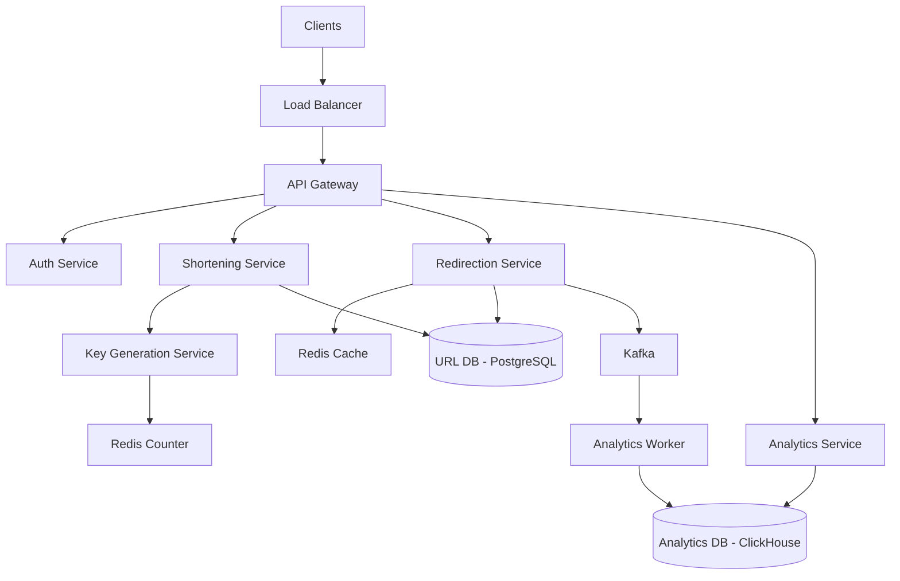
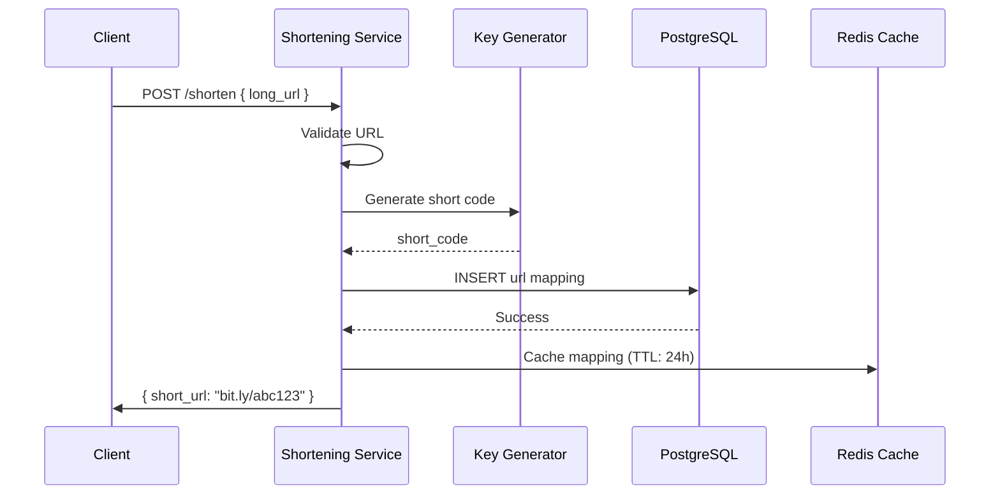
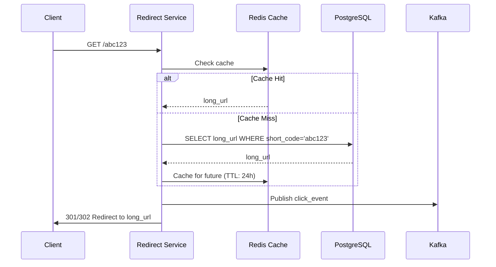

## URL Shortener Sistem Dizaynı

**Problemin Təsviri:**

Bitly və ya TinyURL kimi URL qısaltma servisi dizayn etmək lazımdır. Sistem aşağıdakı əsas komponentləri dəstəkləməlidir:
- URL qısaltma və unikal short code generation
- Redirection servisi
- Analytics və click tracking

**Functional Requirements:**

**Əsas Funksiyalar:**
1. **URL Qısaltma və Generation**
   - Long URL-i qısa URL-ə çevirmək
   - Unikal short code generation
   - Custom alias dəstəyi
   - Expiration time setting
   - QR code generation

2. **Redirection Servisi**
   - Short URL-dən original URL-ə redirect
   - Fast redirection (< 10ms)
   - 301 vs 302 redirect choice
   - Dead link handling

3. **Analytics və Tracking**
   - Click count tracking
   - Geographic location tracking
   - Referrer tracking
   - Device/browser tracking
   - Time-series analytics

### Non-Functional Requirements

**Performance:**
- URL shortening latency < 100ms
- Redirection latency < 10ms
- 99.99% uptime availability
- Handle 1000+ redirects/second

**Scalability:**
- Billions of URLs
- Millions of redirects/day
- Global distribution
- Horizontal scaling

### Capacity Estimation

**Fərziyyələr:**
- 100 milyon active URLs
- 10 milyon new URLs/month
- 100:1 read-to-write ratio
- Orta URL ölçüsü: 100 bytes
- Short code uzunluğu: 7 characters
- Average expiration: 5 years

**Storage:**
- URL pairs: 100M × (100 bytes + 20 bytes) = 12 GB
- Analytics data: 100M × 1 KB = 100 GB
- **Total storage:** ~112 GB (initial)
- **Growth:** ~1.2 GB/month

**QPS:**
- Write (URL creation): 10M/month / (30 × 24 × 3600) = ~4 QPS
- Read (redirects): 4 QPS × 100 = 400 QPS
- **Peak QPS:** ~2,000 QPS

**Bandwidth:**
- Write: 4 QPS × 200 bytes = ~800 bytes/s
- Read: 400 QPS × 200 bytes = ~80 KB/s
- **Total bandwidth:** ~80 KB/s

### High-Level System Architecture



### Əsas Komponentlərin Dizaynı

#### 1. Shortening Service

**Məsuliyyətlər:**
- URL validation
- Short code generation
- URL mapping storage
- Custom alias handling

**Short Code Generation Approaches:**

**Approach 1: Hash-based (MD5/SHA256)**
```python
def generate_short_code_hash(long_url):
    # Generate hash
    hash = md5(long_url).hexdigest()
    
    # Take first 7 characters
    short_code = hash[:7]
    
    # Check collision
    if exists(short_code):
        # Append counter and rehash
        short_code = md5(long_url + str(counter)).hexdigest()[:7]
    
    return short_code
```

**Pros:** Deterministic (same URL → same code)
**Cons:** Collision handling needed

**Approach 2: Base62 Encoding**
```python
def generate_short_code_base62(id):
    # Base62: [0-9a-zA-Z]
    chars = "0123456789abcdefghijklmnopqrstuvwxyzABCDEFGHIJKLMNOPQRSTUVWXYZ"
    base = 62
    
    short_code = ""
    while id > 0:
        short_code = chars[id % base] + short_code
        id = id // base
    
    return short_code.rjust(7, '0')

# Example: ID 125 → "0000021" (7 chars)
```

**Pros:** No collision, sequential
**Cons:** Predictable

**Approach 3: Random Generation (Recommended)**
```python
import random
import string

def generate_short_code_random():
    chars = string.ascii_letters + string.digits
    
    while True:
        short_code = ''.join(random.choices(chars, k=7))
        
        # Check uniqueness
        if not exists(short_code):
            return short_code
```

**Pros:** Unpredictable, secure
**Cons:** Requires uniqueness check

**Key Space Calculation:**
```
62^7 = 3,521,614,606,208 (~3.5 trillion)

With 100M URLs: collision probability ≈ 0.003%
```

**Database Schema (PostgreSQL):**

```sql
urls:
  - id (PK, SERIAL)
  - short_code (UK, VARCHAR(7))
  - long_url (TEXT)
  - user_id (FK → users, nullable)
  - custom_alias (VARCHAR(50), nullable)
  - created_at (TIMESTAMP)
  - expires_at (TIMESTAMP, nullable)
  - is_active (BOOLEAN)
  - click_count (BIGINT)

CREATE INDEX idx_short_code ON urls(short_code);
CREATE INDEX idx_user_id ON urls(user_id, created_at DESC);
CREATE INDEX idx_expires_at ON urls(expires_at) WHERE expires_at IS NOT NULL;
```

**URL Shortening Flow:**



**API Endpoints:**
```
POST /api/v1/shorten
     Body: { long_url, custom_alias?, expires_at? }
     Returns: { short_url, short_code }

GET /api/v1/urls/{short_code}/info
     Returns: { long_url, created_at, click_count }

DELETE /api/v1/urls/{short_code}
     Requires: Authentication
```

#### 2. Redirection Service

**Məsuliyyətlər:**
- Short code lookup
- Redirect to original URL
- Click tracking
- Cache management

**Redirection Flow:**



**Redis Cache Structure:**

```
Key: url:{short_code}
Value: {
  "long_url": "https://example.com/very/long/path",
  "expires_at": "2025-12-31T23:59:59Z"
}
TTL: 24 hours

Key: url:clicks:{short_code}
Type: Counter
Value: click_count
```

**301 vs 302 Redirect:**

| Feature | 301 (Permanent) | 302 (Temporary) |
|---------|----------------|----------------|
| Caching | Browsers cache | No caching |
| SEO | Link juice transferred | No transfer |
| Analytics | Limited tracking | Full tracking |
| Use case | Permanent URLs | Analytics needed |

**Implementation:**

```python
def redirect(short_code):
    # Check cache
    url_data = redis.get(f"url:{short_code}")
    
    if not url_data:
        # Cache miss - query DB
        url_data = db.query("SELECT * FROM urls WHERE short_code = ?", short_code)
        
        if not url_data:
            return "404 Not Found"
        
        # Check expiration
        if url_data.expires_at and url_data.expires_at < now():
            return "410 Gone"
        
        # Cache it
        redis.setex(f"url:{short_code}", 86400, url_data)
    
    # Async click tracking
    kafka.publish("click_events", {
        "short_code": short_code,
        "timestamp": now(),
        "user_agent": request.headers.get("User-Agent"),
        "ip": request.remote_addr,
        "referrer": request.headers.get("Referer")
    })
    
    # Increment counter
    redis.incr(f"url:clicks:{short_code}")
    
    # Redirect
    return redirect(url_data.long_url, code=302)
```

**API Endpoints:**
```
GET /{short_code}
    Returns: 302 Redirect

GET /qr/{short_code}
    Returns: QR code image
```

#### 3. Key Generation Service

**Məsuliyyətlər:**
- Pre-generate unique keys
- Distributed key generation
- Key pool management

**Key Generation Strategies:**

**Strategy 1: Counter-based with Zookeeper**
```
- Zookeeper maintains global counter
- Each server gets range: [1000-2000], [2001-3000]
- Convert to Base62
- No coordination needed within range
```

**Strategy 2: Twitter Snowflake**
```
64-bit ID:
- 41 bits: timestamp
- 10 bits: machine ID
- 12 bits: sequence

Converted to Base62 for short code
```

**Strategy 3: Key Generation Pool (Recommended)**
```python
class KeyGenerator:
    def __init__(self):
        self.pool_size = 1000000
        self.refill_threshold = 100000
        self.generate_pool()
    
    def generate_pool(self):
        # Pre-generate 1M keys
        keys = set()
        while len(keys) < self.pool_size:
            key = generate_random_key(length=7)
            keys.add(key)
        
        # Store in Redis
        redis.sadd("key_pool", *keys)
    
    def get_key(self):
        key = redis.spop("key_pool")
        
        # Check pool size
        pool_size = redis.scard("key_pool")
        if pool_size < self.refill_threshold:
            # Async refill
            background_task(self.generate_pool)
        
        return key
```

**Key Pool in Redis:**

```
Key: key_pool
Type: Set
Value: [abc1234, def5678, ...]
Size: 1M keys

Refill when < 100K
```

#### 4. Analytics Service

**Məsuliyyətlər:**
- Click event processing
- Geographic tracking
- Time-series aggregation
- Dashboard data

**Database Schema (ClickHouse):**

```sql
CREATE TABLE clicks (
    click_id UUID,
    short_code VARCHAR(7),
    timestamp DateTime,
    ip_address VARCHAR(45),
    country VARCHAR(2),
    city VARCHAR(100),
    referrer TEXT,
    user_agent TEXT,
    device_type VARCHAR(20),
    browser VARCHAR(50),
    os VARCHAR(50)
) ENGINE = MergeTree()
ORDER BY (short_code, timestamp);

-- Aggregated statistics
CREATE MATERIALIZED VIEW daily_stats
ENGINE = SummingMergeTree()
ORDER BY (short_code, date)
AS SELECT
    short_code,
    toDate(timestamp) as date,
    count() as click_count,
    uniq(ip_address) as unique_visitors
FROM clicks
GROUP BY short_code, date;
```

**Analytics Worker:**

```python
def process_click_event(event):
    # Parse event
    short_code = event['short_code']
    ip = event['ip']
    user_agent = event['user_agent']
    
    # GeoIP lookup
    location = geoip.lookup(ip)
    
    # User-agent parsing
    device_info = parse_user_agent(user_agent)
    
    # Insert to ClickHouse
    clickhouse.insert({
        'click_id': uuid4(),
        'short_code': short_code,
        'timestamp': event['timestamp'],
        'ip_address': ip,
        'country': location.country,
        'city': location.city,
        'referrer': event.get('referrer'),
        'user_agent': user_agent,
        'device_type': device_info.device,
        'browser': device_info.browser,
        'os': device_info.os
    })
```

**Analytics Queries:**

```sql
-- Total clicks
SELECT count() FROM clicks 
WHERE short_code = 'abc123';

-- Clicks by country
SELECT country, count() as clicks
FROM clicks
WHERE short_code = 'abc123'
GROUP BY country
ORDER BY clicks DESC;

-- Clicks over time
SELECT 
    toDate(timestamp) as date,
    count() as clicks
FROM clicks
WHERE short_code = 'abc123'
GROUP BY date
ORDER BY date;

-- Top referrers
SELECT 
    domain(referrer) as referrer_domain,
    count() as clicks
FROM clicks
WHERE short_code = 'abc123' AND referrer != ''
GROUP BY referrer_domain
ORDER BY clicks DESC
LIMIT 10;
```

**API Endpoints:**
```
GET /api/v1/analytics/{short_code}/summary
    Returns: { total_clicks, unique_visitors, top_countries }

GET /api/v1/analytics/{short_code}/timeline
    Query: start_date, end_date
    Returns: { data: [{ date, clicks }] }

GET /api/v1/analytics/{short_code}/referrers
    Returns: { data: [{ referrer, clicks }] }

GET /api/v1/analytics/{short_code}/devices
    Returns: { desktop, mobile, tablet percentages }
```

### Database Sharding Strategy

**Range-based Sharding:**
```
Shard 1: short_codes starting with [0-9, a-g]
Shard 2: short_codes starting with [h-o]
Shard 3: short_codes starting with [p-z, A-Z]

Benefits:
- Even distribution
- Easy lookup
- No hotspots
```

**Hash-based Sharding:**
```
Shard = hash(short_code) % num_shards

Benefits:
- Uniform distribution
- Scalable
```

### Caching Strategy

**Multi-Level Cache:**

1. **CDN Cache:**
   - Cache redirects at edge
   - Reduce latency
   - TTL: 1 hour

2. **Redis Cache:**
   - URL mappings (TTL: 24h)
   - Click counters (persistent)
   - Key pool (persistent)

3. **Application Cache:**
   - In-memory LRU cache
   - Hot URLs
   - Size: 10,000 entries

**Cache Invalidation:**
- On URL deletion: invalidate immediately
- On expiration: lazy deletion
- On update: write-through

### Rate Limiting

**Per-User Limits:**
```
Anonymous: 10 URLs/hour
Registered: 100 URLs/hour
Premium: 1000 URLs/hour
```

**Implementation:**
```python
def check_rate_limit(user_id):
    key = f"rate_limit:shorten:{user_id}"
    
    count = redis.incr(key)
    if count == 1:
        redis.expire(key, 3600)  # 1 hour
    
    if count > get_limit(user_id):
        raise RateLimitExceeded()
    
    return True
```

### Security Considerations

- **URL validation:** Prevent malicious URLs
- **Spam detection:** ML-based filtering
- **Rate limiting:** Prevent abuse
- **CAPTCHA:** For anonymous users
- **Blacklist:** Known malicious domains
- **HTTPS enforcement:** Secure redirects
- **XSS prevention:** Sanitize inputs

### Failure Handling

**Database Failures:**
- Read replicas for failover
- Write-ahead logging
- Automated backups

**Cache Failures:**
- Fallback to database
- Graceful degradation
- Cache warming on recovery

**Key Generation Failures:**
- Multiple key pools
- Fallback to random generation
- Monitor pool size

### Monitoring və Observability

**Key Metrics:**
- Shortening latency (p50, p95, p99)
- Redirection latency
- Cache hit rate
- QPS (read/write)
- Error rates
- Key pool size

**Alerts:**
- Shortening latency > 200ms
- Redirection latency > 20ms
- Cache hit rate < 90%
- Key pool < 10,000
- Error rate > 1%

### Əlavə Təkmilləşdirmələr

Sistemə əlavə edilə biləcək feature-lər:
- **Link Management Dashboard:** Bulk operations
- **A/B Testing:** Multiple URLs per short code
- **Link Preview:** OG tags for social media
- **Password Protection:** Secure links
- **Branded Domains:** Custom domain support
- **Deep Linking:** Mobile app support
- **API Rate Limiting:** Fine-grained control
- **Webhook Integration:** Click notifications
- **Link Bundles:** Group related URLs
- **UTM Parameter Injection:** Auto-add tracking params
