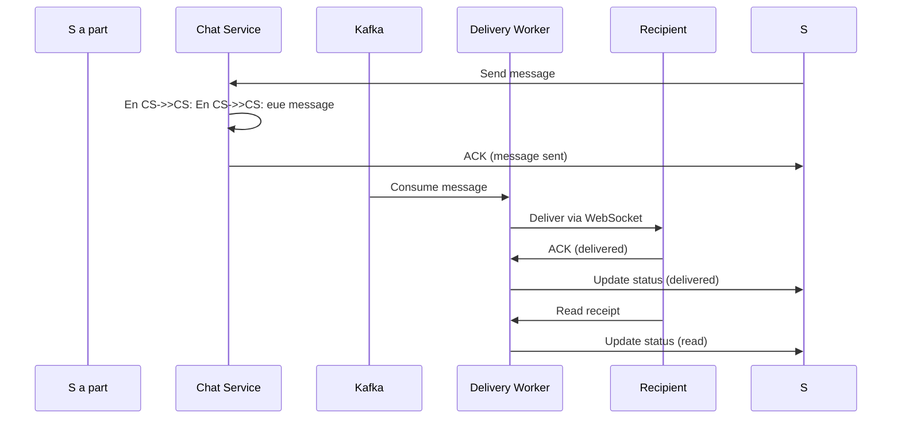

## WhatsApp Sistem Dizaynı

**Problemin Təsviri:**

WhatsApp kimi real-time messaging platforması dizayn etmək lazımdır. Sistem aşağıdakı əsas komponentləri dəstəkləməlidir:
- Mesajlaşma və çatdırılma
- Qrup chat
- End-to-end encryption

**Functional Requirements:**

**Əsas Funksiyalar:**
1. **Mesajlaşma və Çatdırılma**
   - One-to-one messaging
   - Real-time message delivery
   - Message status (sent, delivered, read)
   - Media sharing (photo, video, audio, documents)
   - Voice/Video calls

2. **Qrup Chat**
   - Group creation və management
   - Add/remove members
   - Group admin privileges
   - Broadcast lists

3. **End-to-End Encryption**
   - Signal Protocol
   - Key exchange
   - Forward secrecy
   - Security notifications

### Non-Functional Requirements

**Performance:**
- Message delivery latency < 100ms
- 99.99% uptime availability
- Support billions of users
- Low bandwidth consumption

**Scalability:**
- 2 milyard users
- 100 milyard messages/day
- Real-time synchronization
- Global distribution

### Capacity Estimation

**Fərziyyələr:**
- 2 milyard users
- 1 milyard daily active users (DAU)
- Hər user gündə 40 mesaj göndərir
- Hər user gündə 200 mesaj alır
- Orta mesaj ölçüsü: 100 bytes
- 10% mesajlarda media var (orta 1 MB)

**Storage:**
- Daily messages:- Daily messages:- Dages/day
- Text messages: 40B × 100 bytes × 0.9 = 3.6 TB/day
- Media messages: 40B × 0.1 × 1 MB = 4 PB/day
- **Total daily:** ~4 PB/day

**QPS:**
- Message send: 40B /- Message send,000 QPS
- Message receive: 463K × 5 (avg recipients) = ~2.3M QPS
- **Peak QPS:** ~5M QPS

### High-Level System Architecture

```mermaid
graph TD
    A[Mobile Clie    A[Mobile Cliealancer]
    B --> C[WebSocket Gateway]
    
    C --> D[Chat Service]
    C --> E[Presence Service]
    C --> F[Group Ser    C --> F[Grou --> G[Message Queue - Kafka]
    
    G --> H[Message Delivery Worker]
      --> I[Offline Storage Worker]
    
    D --> J[(Message DB - Cassandra)]
    E --> K[Redis Presence Cache]
    F --> L[(Group DB - PostgreSQ    F --> L[(Group M[Push Notification Service]
    I --> N[S3 Media Storage]
```

### Əsas Komponentlərin Dizaynı

#### 1. Chat Service

**Məsuliyyətlər:**
- Message routing
- Delivery confirmation
- Message persistence
- Media handling

**Message Flow:**



**Database Schema (Cassandra):**

```sql
messages:
  - message_id (PK, UUI  - message_id (PKUUID)
  - recipient_id (UUID)
  - content (encrypted blob)
                  lable)
  - timestamp
  - status (sent/delivered/read)

user_messages:
  - user_id (PK)
  - timestamp (CK, DESC)
  - message_id (UUID)
  - is_sender (boolean)
```

#### 2. #### 2. #### 2. ####abase Schema:**

```sql
groups:
  - group_id (PK, UUID)
  - name
  - created_by (FK → users)
  - created_at
  - member_count

group_members:
  - group_id (PK)
  - user_id (CK)
  - role (admin/member)
  - joined_at
```

#### 3. End-to-End Encryption

**Signal Protocol:**
- Double Ratchet Algorithm
- X3DH key exchange
- Forward secrecy
- Post-compromise security

### Əlavə Təkmilləşdirmələr

- **Status Updates:** Stories feature
- **Voice Messages:** Audio - **Voice Mes*Location Sharing:** Real-time location
- **Disappearing Messages:** Auto-delete
- **Multi-device Support:** Web/Desktop clients
