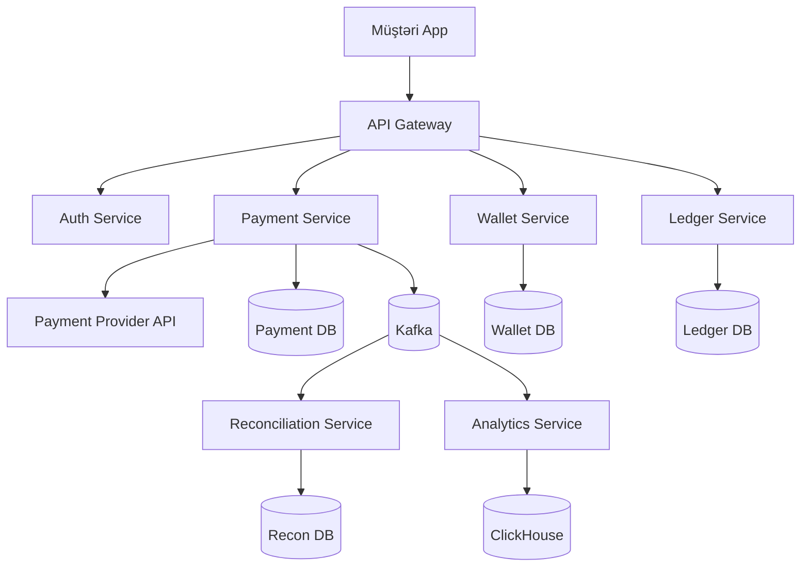
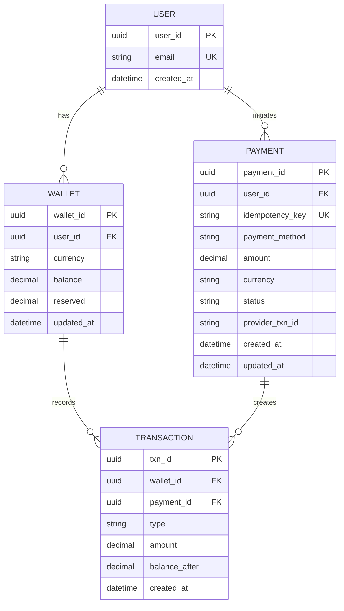
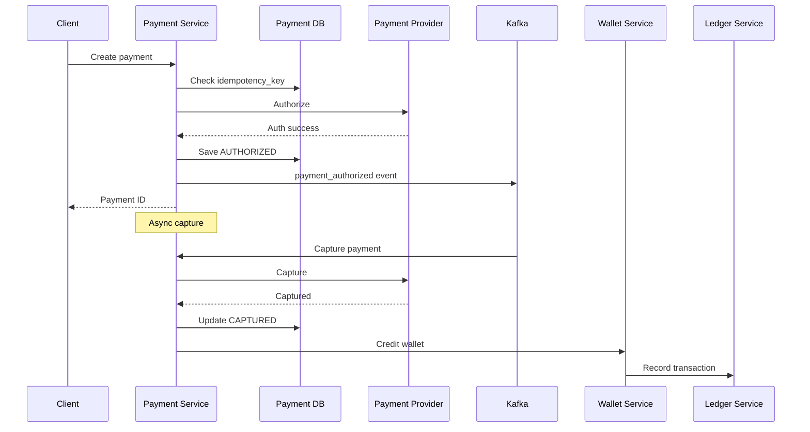

# Design Card Payment System
draft: true

## Problem Statement

Design a robust and secure card payment processing system that:
- Processes credit/debit card transactions securely and reliably
- Handles authorization, clearing, and settlement processes
- Detects and prevents fraudulent transactions
- Integrates with various banks, payment networks, and merchants
- Scales to handle millions of transactions per day with high availability

## Requirements

### Functional Requirements
- Process payment authorization requests from merchants
- Validate card details and check for sufficient funds
- Support various payment methods (credit cards, debit cards, digital wallets)
- Handle payment capture, refunds, and chargebacks
- Generate detailed transaction records and reports
- Provide APIs for merchant integration
- Support recurring payments and subscription billing
- Implement fraud detection and prevention mechanisms

### Non-Functional Requirements
- High availability (99.999% - five nines)
- Low latency (authorization response < 2 seconds)
- Strong security and PCI DSS compliance
- Data integrity for financial transactions
- Scalability to handle peak transaction volumes
- Disaster recovery with minimal data loss
- Comprehensive audit logging
- Multi-region support for global operations

## System Architecture

```
                                  +----------------+
                                  |                |
                                  |  Load Balancer |
                                  |                |
                                  +--------+-------+
                                           |
                                           v
+-------------+    +-------------+    +----+------+    +-------------+
|             |    |             |    |           |    |             |
| Merchant    +---->  API Gateway+---->Payment    +---->Authorization|
| Systems     |    |             |    |  Service  |    |  Service    |
+-------------+    +-------------+    +-----+-----+    +------+------+
                                            |                 |
                                            v                 v
                        +------------------+--+    +----------+---------+
                        |                     |    |                    |
                        |  Transaction        |    |  Fraud Detection   |
                        |  Processing Service |    |  Service           |
                        +---------------------+    +--------------------+
                                |                          |
                                v                          v
+----------------+    +--------+-------+    +----------------+    +----------------+
|                |    |                |    |                |    |                |
| Payment Network|    | Transaction DB |    | User/Account DB|    | Fraud Rules DB |
| Connectors     |    | (ACID DB)      |    | (SQL)          |    | (NoSQL)        |
|                |    |                |    |                |    |                |
+----------------+    +----------------+    +----------------+    +----------------+
```

## Component Design

### Payment Flow
1. Merchant submits payment request through API
2. API Gateway authenticates merchant and validates request format
3. Payment Service processes the request and enriches with additional data
4. Authorization Service:
   - Validates card details (Luhn algorithm check)
   - Determines card type and routing
   - Sends authorization request to appropriate payment network
   - Receives authorization response
5. Fraud Detection Service runs in parallel to assess risk
6. Transaction Processing Service records the transaction
7. Response is returned to merchant with approval/decline
8. For approved transactions, settlement process runs in batch mode later

### Settlement Flow
1. Merchant submits capture request for previously authorized transactions
2. Transaction Processing Service batches transactions for settlement
3. Batch files are sent to payment networks during settlement windows
4. Funds are transferred from issuing banks to acquiring banks
5. Transaction records are updated with settlement status
6. Reconciliation process verifies all transactions are properly settled

## Database Design

### Transaction Database (ACID-compliant RDBMS)
- Stores all transaction data with strict consistency requirements
- Schema:
  ```
  Merchants {
    merchantId: string (primary key)
    name: string
    businessType: string
    status: string (active, suspended)
    createdAt: datetime
    apiKeys: array<string>
    settlementBankAccount: object
    feeStructure: object
    ...other merchant attributes
  }
  
  Transactions {
    transactionId: string (primary key)
    merchantId: string (foreign key to Merchants)
    amount: decimal
    currency: string
    cardType: string
    last4Digits: string
    expiryDate: string (masked)
    cardholderName: string (masked)
    status: string (authorized, captured, settled, failed, refunded)
    authorizationCode: string
    referenceNumber: string
    createdAt: datetime
    updatedAt: datetime
    capturedAt: datetime
    settledAt: datetime
    metadata: object
    ipAddress: string
    deviceFingerprint: string
    riskScore: float
    errorCode: string
    errorMessage: string
  }
  
  PaymentMethods {
    paymentMethodId: string (primary key)
    userId: string
    type: string (credit, debit, wallet)
    provider: string (visa, mastercard, amex)
    tokenizedCard: string
    expiryMonth: int
    expiryYear: int
    billingAddress: object
    isDefault: boolean
    createdAt: datetime
  }
  
  Refunds {
    refundId: string (primary key)
    transactionId: string (foreign key to Transactions)
    amount: decimal
    reason: string
    status: string (pending, completed, failed)
    createdAt: datetime
    completedAt: datetime
  }
  
  Disputes {
    disputeId: string (primary key)
    transactionId: string (foreign key to Transactions)
    reason: string
    status: string (opened, under_review, resolved, closed)
    evidence: object
    amount: decimal
    createdAt: datetime
    updatedAt: datetime
    resolvedAt: datetime
  }
  ```

### Fraud Rules Database (NoSQL)
- Stores fraud detection rules and patterns
- Allows quick updates to fraud detection logic
- Schema:
  ```
  FraudRules {
    ruleId: string (primary key)
    name: string
    description: string
    condition: object (rule logic)
    action: string (flag, block, review)
    score: int (risk score contribution)
    active: boolean
    createdAt: datetime
    updatedAt: datetime
  }
  
  BlacklistedCards {
    cardHash: string (primary key)
    reason: string
    source: string
    addedAt: datetime
    expiresAt: datetime
  }
  
  SuspiciousActivities {
    activityId: string (primary key)
    transactionId: string
    merchantId: string
    userId: string
    type: string
    riskScore: float
    details: object
    status: string (open, reviewed, closed)
    createdAt: datetime
  }
  ```

## Scalability Considerations

### Transaction Processing Scalability
- **Horizontal Scaling**: Add more payment processing servers during peak times
- **Database Sharding**: Partition transaction data by merchant ID or date ranges
- **Read Replicas**: Use read replicas for reporting and analytics queries
- **Caching**: Cache merchant configurations and frequently used reference data

### Authorization Service Scalability
- **Stateless Design**: Make authorization service stateless for easy scaling
- **Connection Pooling**: Maintain connection pools to payment networks
- **Load Balancing**: Distribute authorization requests across multiple instances
- **Circuit Breakers**: Implement circuit breakers for external service calls

## Bottlenecks and Solutions

### High Transaction Volume During Peak Times
- **Problem**: Holiday shopping seasons can create transaction spikes
- **Solution**:
  - Implement auto-scaling for all services
  - Use queue-based architecture to absorb traffic spikes
  - Prioritize transactions based on merchant SLAs
  - Implement rate limiting per merchant

### Payment Network Latency
- **Problem**: External payment networks can be slow or unreliable
- **Solution**:
  - Implement timeouts and retry mechanisms
  - Maintain multiple payment network connections for redundancy
  - Use circuit breakers to fail fast when networks are down
  - Cache authorization responses for idempotent requests

### Database Write Contention
- **Problem**: High volume of concurrent transaction writes
- **Solution**:
  - Use database partitioning/sharding
  - Implement write-through caches
  - Use optimistic concurrency control
  - Batch non-critical updates

## Caching Strategy

- **Merchant Configuration Cache**: Cache merchant settings and API keys
- **Card BIN Cache**: Cache Bank Identification Number data for quick routing
- **Authorization Result Cache**: Cache recent authorization results for duplicate detection
- **Fraud Rules Cache**: Cache active fraud detection rules

## Data Replication and Consistency

- **Transaction Data Replication**: Synchronous replication for transaction data
- **Configuration Data Replication**: Asynchronous replication for configuration data
- **Consistency Model**:
  - Strong consistency for financial transactions
  - Eventual consistency for reporting and analytics
  - Use distributed transactions for operations spanning multiple data stores

## Sharding Strategy

- **Merchant-based Sharding**: Shard transaction data by merchantId
- **Time-based Sharding**: Shard historical transaction data by time periods
- **Hybrid Approach**: Recent transactions by merchant, historical by time period

## Security Considerations

### PCI DSS Compliance
- Implement data encryption at rest and in transit
- Use tokenization for sensitive card data
- Maintain strict access controls and audit logging
- Regular security assessments and penetration testing

### Fraud Prevention
- **Real-time Fraud Detection**:
  - Machine learning models to detect unusual patterns
  - Rule-based systems for known fraud patterns
  - Velocity checks (frequency of transactions)
  - Address Verification Service (AVS)
  - Card Verification Value (CVV) validation
  - 3D Secure integration for additional authentication

### Data Protection
- Encrypt all sensitive data (PAN, CVV, etc.)
- Implement key rotation policies
- Use Hardware Security Modules (HSMs) for cryptographic operations
- Implement data minimization and retention policies

## Fault Tolerance and Reliability

- **Multi-Region Deployment**: Deploy across multiple geographic regions
- **Active-Active Configuration**: Run active instances in multiple regions
- **Disaster Recovery**: Implement comprehensive DR plan with regular testing
- **Transaction Idempotency**: Ensure operations can be safely retried
- **Reconciliation Process**: Daily reconciliation to catch and fix discrepancies

## Monitoring and Alerting

- **Transaction Monitoring**: Monitor success rates, volumes, and latencies
- **Fraud Monitoring**: Track fraud rates and suspicious activity patterns
- **System Health**: Monitor service health, database performance, queue depths
- **Business Metrics**: Track key business metrics like processing volume, revenue
- **Alerting**: Implement tiered alerting for different severity levels

## Compliance and Regulatory Considerations

- **Financial Regulations**: Comply with relevant financial regulations
- **Data Privacy**: Adhere to GDPR, CCPA, and other privacy regulations
- **Audit Trail**: Maintain comprehensive audit logs for all operations
- **Reporting**: Generate required regulatory reports

## Disaster Recovery

- **Backup Strategy**: Regular backups of all transaction and configuration data
- **Recovery Time Objective (RTO)**: Define maximum acceptable downtime
- **Recovery Point Objective (RPO)**: Define maximum acceptable data loss
- **Failover Testing**: Regular testing of failover procedures

---
title: "Ödəniş Sistemi — Sistem Dizaynı"
description: "Ödəniş emalı, idempotency və reconciliation üçün əsas funksionallıq və arxitektura"
tags: [sistem-dizayn, microservices, payment, database, scalability]
---

# Ödəniş Sistemi

Bu sənəd ödəniş emalı sisteminin əsas dizaynını təqdim edir. Kritik funksionallıqlara fokuslanırıq.

## Əsas Funksionallıq
- Ödəniş emalı (kredit kartı, digital wallet, bank transfer)
- İdempotency və retry mexanizması
- Reconciliation və pul balansının uyğunluğu

## Yüksək Səviyyəli Arxitektura



## Mikroservis Mühitində Auth və Session
- JWT token + MFA (multi-factor) həssas əməliyyatlar üçün
- PCI-DSS compliance: kart məlumatları tokenize edilir
- API key: merchant inteqrasiyası üçün

## Minimal DB Dizaynı



İndekslər: PAYMENT(user_id, created_at desc), PAYMENT(idempotency_key), TRANSACTION(wallet_id, created_at desc).

## İdempotency Mexanizması
- Hər sorğu üçün unique `idempotency_key` (client tərəfdən)
- DB constraint: idempotency_key UNIQUE
- Duplicate sorğu: eyni key ilə sorğu gəlsə, əvvəlki nəticəni return et
- TTL: idempotency record 24 saat saxlanır

```
POST /payments
Headers:
  Idempotency-Key: <uuid>
Body:
  amount: 100.00
  currency: USD
```

## Payment Flow (Kredit Kartı)



## Ödəniş Statusları
- PENDING: yaradılıb, provider-a göndərilməyib
- AUTHORIZED: provider tərəfindən təsdiq edilib, capture gözlənir
- CAPTURED: pul çəkilib
- FAILED: uğursuz
- REFUNDED: geri qaytarılıb

## Wallet və Balans İdarəsi
- Double-entry accounting: hər əməliyyat 2 qeyd (debit + credit)
- Atomicity: balance update və transaction insert eyni DB transaction-da
- Reserved balance: pending ödənişlər üçün
- Optimistic locking: version field ilə concurrent update conflict-i qarşısını al

## Reconciliation (Uzlaşdırma)
- Gündəlik job: internal ledger vs external provider statement
- Mismatch detection: missing transactions, amount fərqi
- Auto-retry: failed transactions üçün
- Manual review: anomalies üçün dashboard

## Təhlükəsizlik
- PCI-DSS: kart məlumatları şifrələnir, tokenize edilir
- Encryption: at-rest (DB) və in-transit (TLS)
- Fraud detection: unusual pattern detection (məbləğ, lokasiya, tezlik)
- Rate limiting: 1 istifadəçi max 10 ödəniş/dəqiqə

## Retry və Error Handling
- Transient errors: 3 dəfə retry (exponential backoff)
- Idempotent operations: safe retry
- Dead-letter queue: 3 retry-dan sonra DLQ-ya göndər
- Alert: kritik uğursuz ödənişlər üçün

## Analytics Service və DB
- Event-lər: payment_created, payment_authorized, payment_captured, payment_failed
- Saxlama: ClickHouse; gündəlik aqreqatlar (transaction volume, success rate, avg amount)

## Skalabilik
- Payment Service: stateless, horizontal scaling
- Wallet DB: shard by user_id
- Ledger: append-only, time-series optimized
- Provider API: connection pooling, circuit breaker

## Compliance
- PCI-DSS Level 1: kart məlumatlarının təhlükəsiz saxlanması
- AML (Anti-Money Laundering): şübhəli əməliyyatların izlənməsi
- KYC (Know Your Customer): istifadəçi doğrulama
- Audit log: bütün əməliyyatlar immutable log-da

## Failure və Observability
- Circuit breaker: payment provider unavailable
- Fallback: alternative payment provider
- Timeout: provider response 5 saniyə limit
- Monitoring: payment success rate, latency, provider uptime, reconciliation errors

