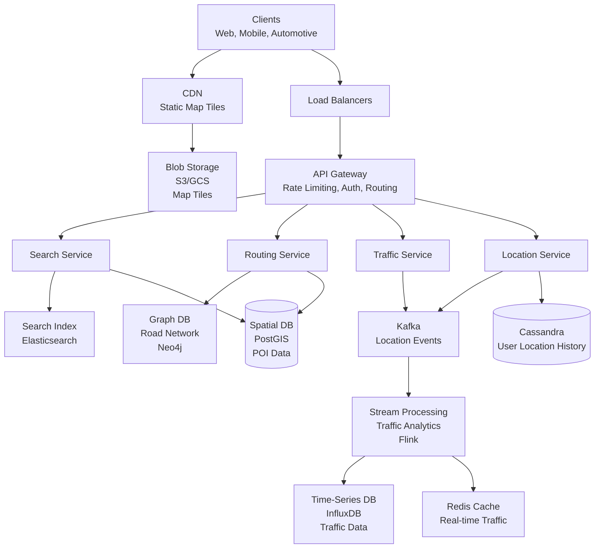
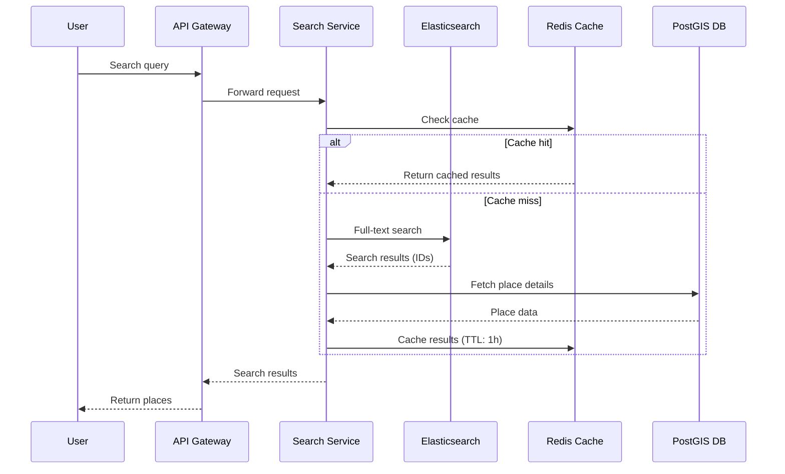
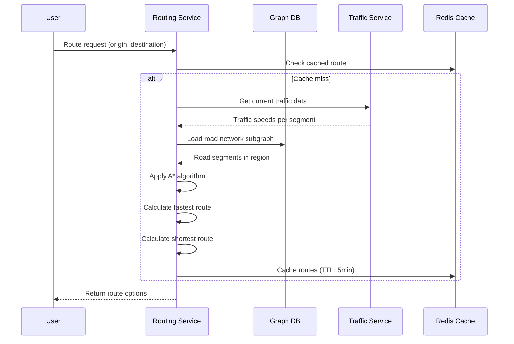
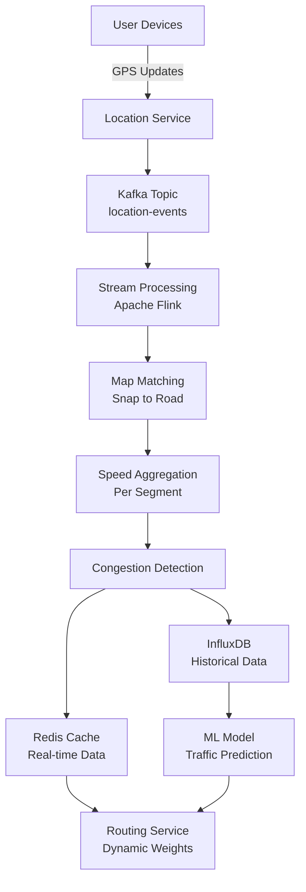
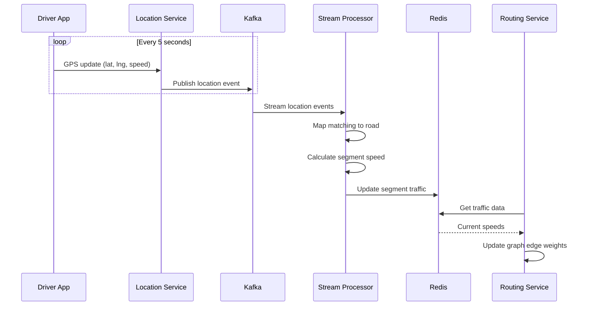

## Google Maps Sistem Dizaynı

**Problemin Təsviri:**

Google Maps kimi xəritə və naviqasiya servisi dizayn etmək lazımdır. Sistem aşağıdakı əsas komponentləri dəstəkləməlidir:
- Lokasiya axtarışı və geocoding
- Marşrut planlaması və naviqasiya
- Real-time trafik məlumatları

**Functional Requirements:**

**Əsas Funksiyalar:**
1. **Lokasiya Axtarışı və Geocoding**
   - Ünvan, məkan adı, və ya koordinatlar üzrə axtarış
   - Geocoding (ünvan → koordinat) və reverse geocoding (koordinat → ünvan)
   - Yaxınlıqdakı məkanların axtarışı
   - Autocomplete və search suggestions

2. **Marşrut Planlaması və Naviqasiya**
   - Başlanğıc və təyinat nöqtələri əsasında marşrut hesablama
   - Ən qısa və ən sürətli marşrut variantları
   - Turn-by-turn naviqasiya göstərişləri
   - Alternativ marşrut təklifləri
   - Multi-stop marşrut dəstəyi

3. **Real-time Trafik Məlumatları**
   - Canlı trafik vəziyyətinin göstərilməsi
   - Trafik sıxlığı və ya qəza əsasında marşrut yeniləməsi
   - ETA (Estimated Time of Arrival) hesablama
   - İstifadəçi lokasiya məlumatlarının toplanması

### Non-Functional Requirements

**Performance:**
- Xəritə yükləmə latency < 500ms
- Marşrut hesablama < 2 saniyə
- Real-time lokasiya update latency < 1s
- 99.99% uptime availability

**Scalability:**
- Milyardlarla location point
- 100+ milyon daily active user (DAU)
- Petabyte səviyyəsində xəritə data
- Qlobal coğrafi əhatə

### Capacity Estimation

**Fərziyyələr:**
- 100 milyon daily active user (DAU)
- Hər user gündə orta 5 axtarış
- Hər user gündə orta 30 dəqiqə xəritə istifadəsi
- Hər 5 saniyədə bir location update
- Read:Write ratio = 1000:1

**Storage:**
- Xəritə tiles: ~100 PB (müxtəlif zoom level-lər)
- Road network data: ~500 GB
- POI (Points of Interest) data: ~1 TB
- User location history: ~10 PB/il
- Traffic data (time-series): ~50 TB/il

**Bandwidth:**
- Location updates: 100M user × 6 update/dəqiqə = 600M update/dəqiqə = 10M update/saniyə
- Hər update ~200 bytes: 10M × 200B = 2 GB/s
- Xəritə tile requests: ~50,000 request/saniyə
- Tile orta ölçü: 50 KB → 50K × 50KB = 2.5 GB/s
- Total ingress bandwidth: ~2 GB/s
- Total egress bandwidth: ~4.5 GB/s

**QPS (Queries Per Second):**
- Search requests: ~6,000 QPS
- Route requests: ~10,000 QPS
- Tile requests: ~50,000 QPS
- Location updates: ~10,000,000 write/saniyə
- Peak traffic: 2-3x average

### High-Level System Architecture



### Əsas Komponentlərin Dizaynı

#### 1. Search Service (Lokasiya Axtarışı)

**Məsuliyyətlər:**
- Ünvan, məkan, və POI axtarışı
- Geocoding və reverse geocoding
- Autocomplete suggestions
- Nearby search

**Database Schema (PostGIS/PostgreSQL):**

```sql
places:
  - place_id (PK, UUID)
  - name
  - address
  - location (POINT geometry)
  - category (restaurant/hospital/school/etc)
  - rating (decimal)
  - phone
  - website
  - opening_hours
  - created_at
  - updated_at

addresses:
  - address_id (PK, UUID)
  - street_number
  - street_name
  - city
  - state
  - country
  - postal_code
  - location (POINT geometry)
  - formatted_address
```

**Elasticsearch Schema:**

```json
{
  "place_id": "uuid",
  "name": "string",
  "address": "string",
  "location": {
    "lat": 40.7128,
    "lon": -74.0060
  },
  "category": "restaurant",
  "tags": ["italian", "pizza", "fine-dining"],
  "rating": 4.5,
  "popularity_score": 95
}
```

**API Endpoints:**
```
GET  /api/v1/search?q={query}&lat={lat}&lng={lng}&radius={radius}
     Returns: list of places matching search query

GET  /api/v1/geocode?address={address}
     Returns: coordinates for given address

GET  /api/v1/reverse-geocode?lat={lat}&lng={lng}
     Returns: address for given coordinates

GET  /api/v1/autocomplete?input={partial_text}&location={lat,lng}
     Returns: search suggestions

GET  /api/v1/places/{place_id}
     Returns: detailed place information

GET  /api/v1/nearby?lat={lat}&lng={lng}&type={category}&radius={radius}
     Returns: nearby places of specified type
```

**Search Flow:**



**Geocoding Strategy:**
1. **Text Parsing:**
   - Parse ünvan komponentləri (street, city, state, postal_code)
   - Normalize text (lowercase, remove punctuation)
   
2. **Index Search:**
   - Elasticsearch-də fuzzy match
   - Location-based relevance scoring
   - Category və popularity weighting

3. **Reverse Geocoding:**
   - PostGIS spatial query: `ST_Distance(location, point)`
   - Nearest road segment tapılması
   - Address interpolation

#### 2. Routing Service (Marşrut Planlaması)

**Məsuliyyətlər:**
- Optimal marşrut hesablama
- Alternativ marşrut təklifləri
- Real-time trafik əsasında yenidən marşrut
- Turn-by-turn naviqasiya göstərişləri

**Graph Database Schema (Neo4j):**

```
Nodes:
  - Intersection:
      - node_id
      - location (lat, lng)
      - type (traffic_light/stop_sign/roundabout)

Relationships:
  - ROAD_SEGMENT:
      - segment_id
      - length_meters
      - speed_limit_kmh
      - road_type (highway/arterial/residential)
      - one_way (boolean)
      - toll (boolean)
      - current_traffic_speed_kmh
      - current_travel_time_seconds
```

**API Endpoints:**
```
POST /api/v1/route/calculate
     Body: {
       origin: { lat, lng },
       destination: { lat, lng },
       waypoints: [{ lat, lng }, ...],
       mode: "driving|walking|bicycling|transit",
       avoid: ["tolls", "highways"],
       departure_time: timestamp
     }
     Returns: {
       routes: [
         {
           type: "fastest",
           distance_meters: number,
           duration_seconds: number,
           steps: [{
             instruction: "Turn right onto Main St",
             distance_meters: number,
             duration_seconds: number,
             polyline: encoded_string
           }, ...],
           polyline: encoded_overall_route
         },
         {
           type: "shortest",
           ...
         }
       ]
     }

GET  /api/v1/route/{route_id}/reroute
     Query params: current_location={lat,lng}
     Returns: updated route if deviation detected

POST /api/v1/route/matrix
     Body: {
       origins: [{lat, lng}, ...],
       destinations: [{lat, lng}, ...]
     }
     Returns: distance/time matrix between all pairs
```

**Routing Algorithms:**

**1. Dijkstra's Algorithm (Əsas):**
- Ən qısa marşrut üçün
- Edge weight = distance

**2. A* Algorithm (Optimized):**
- Heuristic ilə təkmilləşdirilmiş Dijkstra
- Heuristic: haversine distance to destination
- Daha sürətli convergence

**3. Contraction Hierarchies:**
- Pre-processing: road network-ü hierarchy-ə ayırma
- Query-time: çox sürətli marşrut hesablama
- Əsas yollarda "shortcut" edge-lər yaradılır

**4. Dynamic Re-routing:**
- Real-time trafik data ilə edge weight update
- Aktiv naviqasiya zamanı hər 2 dəqiqədə yenidən hesablama
- Current location və destination arasında optimal path

**Routing Flow:**



**Optimizations:**

1. **Bidirectional Search:**
   - Eyni vaxtda origin və destination-dan search başlayır
   - Ortada kəsişdikdə optimal path tapılır
   - 2x daha sürətli

2. **Route Caching:**
   - Popular origin-destination pair-lər cache-lənir
   - Geohash-based cache key
   - TTL: 5 dəqiqə (trafik dəyişikliyinə görə)

3. **Tile-based Graph Loading:**
   - Bütün road network yox, yalnız lazımi region yüklənir
   - Tile boundaries-də edge connection-lar saxlanır

#### 3. Traffic Service (Real-time Trafik)

**Məsuliyyətlər:**
- İstifadəçi lokasiya məlumatlarının toplanması
- Trafik vəziyyətinin real-time analizi
- Yol seqmentləri üzrə sürət hesablama
- Trafik anomaliyalarının aşkarlanması

**Database Schema:**

**Cassandra (User Location History):**
```
user_locations:
  - partition key: (user_id, date)
  - clustering key: timestamp DESC
  - location (lat, lng)
  - speed_kmh
  - heading_degrees
  - accuracy_meters
```

**InfluxDB (Time-Series Traffic Data):**
```
traffic_measurements:
  - measurement: road_segment_speed
  - tags:
      - segment_id
      - road_type
      - city
  - fields:
      - avg_speed_kmh
      - vehicle_count
      - congestion_level (0-5)
  - timestamp
```

**Redis (Real-time Traffic Cache):**
```
Key: traffic:segment:{segment_id}
Value: {
  "speed_kmh": 45,
  "congestion": "moderate",
  "updated_at": timestamp
}
TTL: 60 seconds
```

**API Endpoints:**
```
POST /api/v1/location/update
     Body: {
       user_id: "uuid",
       location: { lat, lng },
       speed: number,
       heading: number,
       timestamp: iso8601
     }

GET  /api/v1/traffic/segments?bbox={north,south,east,west}
     Returns: traffic conditions for all segments in bounding box

GET  /api/v1/traffic/segment/{segment_id}
     Returns: current traffic for specific segment

WS   ws://location/stream
     WebSocket for real-time location updates
```

**Traffic Analysis Pipeline:**



**Traffic Processing Flow:**

1. **Location Collection:**
   - Mobile app-lər hər 5 saniyədə GPS update göndərir
   - WebSocket və ya HTTP POST
   - Batch update (çoxsaylı nöqtə)

2. **Map Matching:**
   - Raw GPS koordinatlarını yol seqmentlərinə "snap" etmək
   - Hidden Markov Model istifadə edilir
   - GPS accuracy noise-ni aradan qaldırır

3. **Speed Calculation:**
   - Hər segment üçün orta sürət hesablama
   - 1 dəqiqəlik sliding window
   - Outlier-lərin filterləşdirilməsi

4. **Congestion Level:**
   ```
   congestion_ratio = average_speed / speed_limit
   
   if congestion_ratio > 0.8: level = 0 (free flow)
   elif congestion_ratio > 0.6: level = 1 (light)
   elif congestion_ratio > 0.4: level = 2 (moderate)
   elif congestion_ratio > 0.2: level = 3 (heavy)
   else: level = 4 (severe)
   ```

5. **Anomaly Detection:**
   - Sudden speed drop (qəza, yol bağlanması)
   - ML model: isolation forest
   - Alert generation

**Traffic Data Flow:**



### Database Sharding Strategy

**Spatial Sharding (Geo-based):**
- Xəritə tiles və road network region əsasında shard edilir
- Geohash prefix-ə görə partitioning
- Məs: geohash "dr5r" prefix-i NY region-u

**User Location Sharding:**
- `user_id` əsasında consistent hashing
- Hər shard 10M user handle edir

**Traffic Data Sharding:**
- Time-based partitioning (gün/həftə)
- Region-based partitioning (city, country)
- Hot regions replicate edilir

**Road Graph Sharding:**
- Tile-based sharding
- Major highways cross-shard edge-lər saxlanır
- Junction nodes replicate edilir

### Caching Strategy

**Multi-Level Cache:**

1. **Client-side Cache:**
   - Viewed map tiles (disk cache)
   - Recent search results
   - Saved places və addresses
   - Downloaded offline maps

2. **CDN Cache:**
   - Static map tiles
   - Popular zoom levels
   - TTL: 30 gün

3. **Redis Cache:**
   - Real-time traffic (TTL: 60s)
   - Search results (TTL: 1h)
   - Popular routes (TTL: 5min)
   - Place details (TTL: 24h)
   - Geocoding results (TTL: 7 gün)

4. **Application Cache:**
   - Graph DB subgraph (in-memory)
   - Frequently accessed road segments

**Cache Invalidation:**
- Real-time traffic: automatic expiry (TTL)
- Map tiles: version-based cache key
- Place data: event-driven invalidation
- Routes: traffic update trigger

### Map Tile System

**Tile Pyramid:**
- Zoom level 0: bütün dünya 1 tile
- Zoom level 20: street-level detail
- Tile format: 256×256 pixel PNG
- Coordinate system: Web Mercator (EPSG:3857)

**Tile Addressing:**
```
URL pattern: /tiles/{z}/{x}/{y}.png
z = zoom level (0-20)
x = tile column (0 to 2^z - 1)
y = tile row (0 to 2^z - 1)
```

**Pre-rendering:**
- Static tiles pre-rendered və S3-də saxlanılır
- Vector tiles real-time render edilir
- Dynamic overlay (traffic, POI) client-side

### Monitoring və Observability

**Key Metrics:**

**Performance:**
- Search latency (p50, p95, p99)
- Route calculation time
- Map tile load time
- Location update latency

**Traffic:**
- QPS per endpoint
- Bandwidth usage
- WebSocket connection count

**Accuracy:**
- Map matching accuracy
- Route ETA vs actual time
- Traffic prediction accuracy

**Availability:**
- Service uptime per region
- Database replication lag
- Cache hit rate

**Alerts:**
- Search latency > 1s
- Route calculation > 5s
- Traffic service lag > 10s
- Cache hit rate < 80%
- Abnormal location update spike

### Security Considerations

**API Security:**
- API key authentication
- Rate limiting per user/IP
- JWT token for authenticated endpoints
- HTTPS/TLS encryption

**Location Privacy:**
- User location anonymization
- Aggregate data only for traffic analysis
- GDPR compliance (data retention, deletion)
- Opt-in for location sharing

**Data Protection:**
- Location data encryption at rest
- PII (Personally Identifiable Information) masking
- Secure WebSocket connections (WSS)
- Access control (RBAC)

**Anti-abuse:**
- DDoS protection (CloudFlare, AWS Shield)
- Bot detection
- Unusual location pattern detection
- Fake GPS data filtering

### Scalability və Fault Tolerance

**Horizontal Scaling:**
- Stateless services (easy scale-out)
- Load balancer auto-scaling
- Database read replicas
- Kafka partition increase

**Geographic Distribution:**
- Multi-region deployment
- Edge computing for tile serving
- Regional routing service instances
- Data locality (GDPR compliance)

**Failure Handling:**

**Service Failures:**
- Circuit breaker pattern
- Fallback to cached data
- Graceful degradation (e.g., static map mode)
- Automatic service restart

**Database Failures:**
- Master-replica failover
- Read replica promotion
- Point-in-time recovery
- Cross-region replication

**Traffic Service Outage:**
- Fallback to historical average speed
- Use last known traffic data
- Static routing (distance-based)

**Data Loss Prevention:**
- 3x replication for critical data
- Continuous backup
- WAL (Write-Ahead Logging)
- Multi-region replication

### Əlavə Təkmilləşdirmələr

Sistemə əlavə edilə biləcək feature-lər:
- **Street View:** 360° panoramic görüntülər
- **Indoor Maps:** Mall, airport, metro stansiyaları
- **Public Transit Integration:** Avtobus, metro, qatar marşrutları
- **Parking Availability:** Real-time park yeri məlumatı
- **EV Charging Stations:** Elektrik avtomobil şarj nöqtələri
- **AR Navigation:** Augmented reality ilə göstərişlər
- **Offline Maps:** İnternetdən asılı olmayan naviqasiya
- **Crowd-sourced Updates:** İstifadəçilərdən yol bağlanması, qəza məlumatları
- **Business Listings:** Restaurant rezervasiya, review-lər
- **Location Sharing:** Dostlarla real-time location sharing
- **Speed Limit Warnings:** Sürət limiti xəbərdarlıqları
- **Traffic Prediction:** ML əsaslı gələcək trafik proqnozu
- **Multi-modal Routing:** Maşın + park + walk marşrutları
- **Accessibility Features:** Wheelchair-friendly marşrutlar
