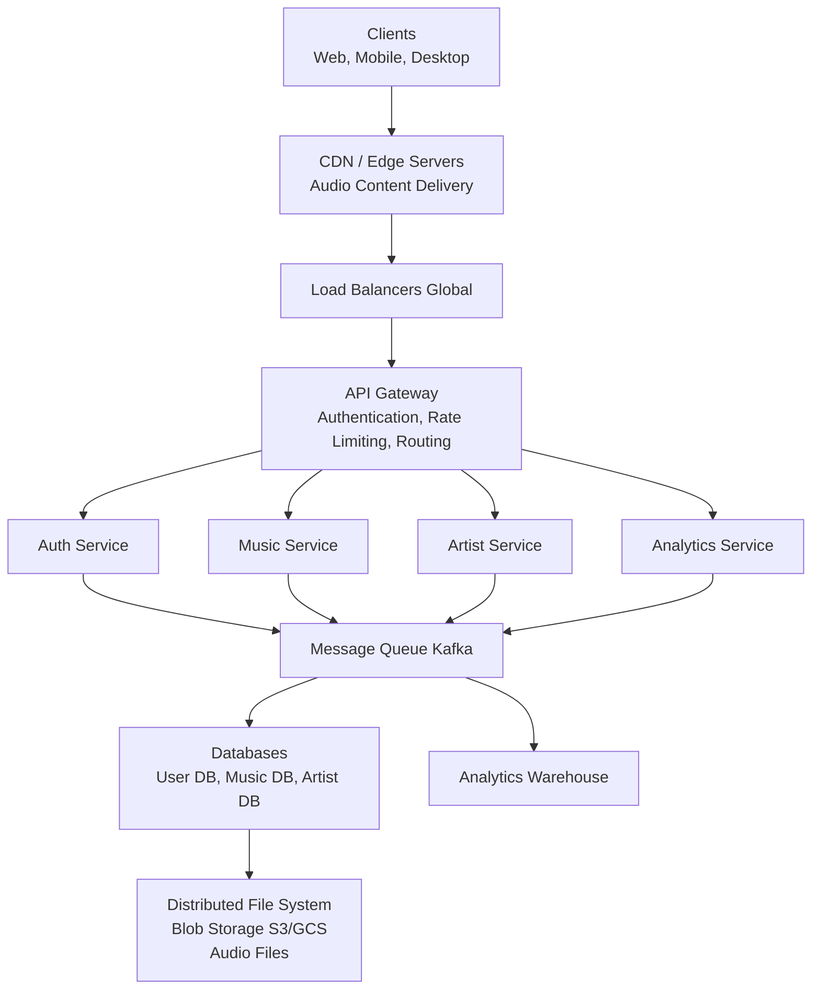
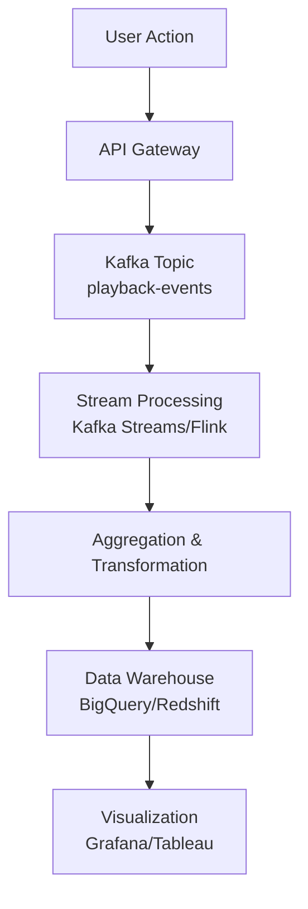

### Spotify Sistem dizaynı

**Problemin Təsviri:**

Spotify kimi musiqi streaming servisi dizayn etmək lazımdır. Sistem aşağıdakı əsas komponentləri dəstəkləməlidir:
- User authentication və authorization
- Musiqi və artist idarəetməsi/yükləmə
- Real-time musiqi streaming
- Statistika

**Functional Requirements:**

**Əsas Funksiyalar:**
1. **User Management və Authentication**
   - User qeydiyyatı və authentication
   - Profile idarəetməsi
   - Free və premium tier idarəetməsi
2. **Musiqi və Artist İdarəetməsi**
   - Artist profil idarəetməsi
   - Musiqi content yükləmə və idarəetmə
   - Album və mahnı metadata idarəetməsi
   - Content versiyalaşdırma
3. **Music Streaming**
   - Real-time audio streaming
   - Müxtəlif keyfiyyət səviyyələri (low, medium, high)
   - Adaptive bitrate streaming
   - Multi-device dəstəyi
4. **Analytics və Statistika**
   - Real-time streaming analytics
   - Artist üçün statistika (play count, listeners)
   - User engagement metrics
   - Revenue tracking

### Non-Functional Requirements

**Performance:**
- Streaming başlamaq üçün aşağı latency (< 200ms)
- Yüksək throughput (milyonlarla concurrent stream)
- 99.99% uptime availability

**Scalability:**
- Milyardlarla mahnı dəstəyi
- Milyonlarla concurrent user
- Petabyte səviyyəsində data
- Qlobal user base

**Capacity Estimation:**
**Fərziyyələr (Assumptions)**
- 500 milyon active user
- 100 milyon daily active user (DAU)
- Hər user gündə orta hesabla 20 mahnı dinləyir
- Orta mahnı ölçüsü: 5 MB (compressed)
- Kataloqda 100 milyon mahnı
- Read:Write ratio = 1000:1

**Music Content Storage:**
- Total mahnılar: 100 milyon
- Hər mahnı üçün müxtəlif keyfiyyətlər:
  - Low quality (96kbps): 2 MB
  - Medium quality (160kbps): 3.5 MB
  - High quality (320kbps): 7 MB
  - Total hər mahnı: ~12.5 MB
- Total music storage: 100M × 12.5 MB = 1.25 PB
- 3x replication ilə: 3.75 PB

**User Data Storage:**
- 500M user × 1 KB = 500 GB
- Preferences və history: ~5 TB

**Metadata Storage:**
- Mahnı metadata: 100M × 5 KB = 500 GB
- Album metadata: 10M × 10 KB = 100 GB
- Artist metadata: 5M × 10 KB = 50 GB

**Total Storage:** ~4 PB

**Bandwidth Təxmini:**

**Gündəlik Streaming:**
- 100M DAU × 20 mahnı/gün = 2 milyard play/gün
- Orta bitrate: 160 kbps (2 MB/dəqiqə)
- Orta mahnı: 3 dəqiqə = 6 MB
- Gündəlik bandwidth: 2B × 6 MB = 12 PB/gün
- Saniyədə bandwidth: ~139 GB/s

**Queries Per Second (QPS):**
- Mahnı stream: ~23,000 stream/saniyə
- API calls: ~10,000 QPS
- Peak traffic: ~70,000 stream/saniyə

### High-Level System Architecture

**Əsas Komponentlər:**



**Əsas Komponentlərin Dizaynı:**

### User Authentication Service

**Məsuliyyətlər:**
- User authentication (OAuth2, JWT)
- Session management
- Subscription tier validation
- Role-based access control (RBAC)

**Database Schema (PostgreSQL):**
<details>
<summary>Koda bax</summary>

```sql
users:
  - user_id (PK)
  - email
  - username
  - password_hash
  - subscription_type (free/premium)
  - country
  - created_at
  - last_login

user_sessions:
  - session_id (PK)
  - user_id (FK)
  - device_id
  - refresh_token
  - expires_at
  - created_at
```

</details>

**API Endpoints:**
```
POST /api/v1/auth/register
POST /api/v1/auth/login
POST /api/v1/auth/logout
POST /api/v1/auth/refresh-token
GET  /api/v1/users/{user_id}
PUT  /api/v1/users/{user_id}
PUT  /api/v1/users/{user_id}/preferences
```

**Security Tədbirləri:**
- Password hashing (bcrypt)
- Rate limiting authentication endpoint-lərində
- Multi-factor authentication (MFA)
- JWT token-lərin müntəzəm rotation-u
- Redis ilə session management

**Flow:**
1. User credentials göndərir
2. Service password-u verify edir
3. JWT access token və refresh token yaradır
4. Session Redis-də saxlanır
5. Token client-ə qaytarılır
6. Sonrakı request-lər JWT ilə authenticate olunur

### Music və Artist Management Service

**Məsuliyyətlər:**
- Artist profil idarəetməsi
- Content upload və processing
- Metadata idarəetməsi
- Multiple audio format generation
- Content versioning

**Database Schema (NoSQL - MongoDB/Cassandra):**

<details>
<summary>Artists Collection - Koda bax</summary>

```json
{
  "artist_id": "uuid",
  "name": "string",
  "bio": "text",
  "genres": ["array"],
  "image_url": "string",
  "verified": "boolean",
  "created_at": "timestamp"
}
```

</details>

<details>
<summary>Songs Collection - Koda bax</summary>

```json
{
  "song_id": "uuid",
  "title": "string",
  "artist_ids": ["array"],
  "album_id": "uuid",
  "duration": "number (seconds)",
  "genre": "string",
  "release_date": "date",
  "audio_files": {
    "low": "s3://path/96kbps.mp3",
    "medium": "s3://path/160kbps.mp3",
    "high": "s3://path/320kbps.mp3"
  },
  "metadata": {
    "bitrate": "number",
    "sample_rate": "number",
    "codec": "string"
  },
  "created_at": "timestamp",
  "updated_at": "timestamp"
}
```

</details>

**API Endpoints:**

<details>
<summary>Koda bax</summary>

```
POST   /api/v1/artists
GET    /api/v1/artists/{artist_id}
PUT    /api/v1/artists/{artist_id}
DELETE /api/v1/artists/{artist_id}

POST   /api/v1/songs/upload
GET    /api/v1/songs/{song_id}
PUT    /api/v1/songs/{song_id}
DELETE /api/v1/songs/{song_id}
GET    /api/v1/artists/{artist_id}/songs

POST   /api/v1/albums
GET    /api/v1/albums/{album_id}
PUT    /api/v1/albums/{album_id}
```

</details>

**Upload Flow:**
1. Artist audio file yükləyir (original quality)
2. File S3/GCS-ə upload olunur
3. Background job müxtəlif keyfiyyət versiyaları yaradır:
   - 96kbps (low quality)
   - 160kbps (medium quality)
   - 320kbps (high quality)
4. Hər versiya CDN-ə push olunur
5. Metadata database-ə yazılır
6. Search index update olunur (Elasticsearch)
7. Artist-ə notification göndərilir

**Content Processing Pipeline:**
- Audio transcoding (FFmpeg)
- Metadata extraction
- Quality validation
- DRM encryption
- CDN distribution

###  Music Streaming Service

**Məsuliyyətlər:**
- Audio stream request-lərini idarə etmək
- User preference və network-ə görə keyfiyyət seçmək
- Playback metrics track etmək
- DRM protection implement etmək

**Flow:**
1. Client mahnı stream request göndərir
2. Service user authentication və subscription verify edir
3. Cache-də audio file URL-i yoxlayır
4. İstənilən keyfiyyət üçün CDN URL qaytarır
5. Client birbaşa CDN-dən stream edir
6. Service playback event-i asynchronous log edir

**Adaptive Bitrate Streaming:**
- HLS (HTTP Live Streaming) və ya DASH protocol
- Audio müxtəlif chunk-lara bölünür (2-10 saniyə)
- Client network condition-a görə quality dəyişir
- Aşağı quality ilə başlayıb yüksəlir

**API Endpoints:**

<details>
<summary>Koda bax</summary>

```
GET  /api/v1/stream/{song_id}
     Query params: quality (low/medium/high)
     Returns: CDN signed URL

POST /api/v1/playback/start
     Body: { song_id, device_id, quality }

POST /api/v1/playback/pause
POST /api/v1/playback/resume
POST /api/v1/playback/skip
POST /api/v1/playback/seek
```

</details>

**Caching Strategy:**
- Redis-də popular mahnıların metadata-sı
- CDN-də audio file-lar edge location-larda
- Client-side cache recently played mahnılar üçün

**DRM Implementation:**
- Encrypted audio stream-lər
- License validation playback-dan əvvəl
- Platform-specific DRM:
  - Widevine (Android, Chrome)
  - FairPlay (Apple devices)
  - PlayReady (Microsoft)

###  Analytics Service

**Məsuliyyətlər:**
- Real-time playback event-lərini track etmək
- User engagement metrics
- Artist statistikaları
- Revenue analytics

**Metrics Tracking:**
- Play count (hər mahnı, artist, album)
- Monthly listeners (artist üçün)
- Skip rate
- Listening duration
- Geographic distribution
- Device type distribution
- Peak listening times

**Data Pipeline:**



**Event Schema:**

<details>
<summary>Koda bax</summary>

```json
{
  "event_id": "uuid",
  "event_type": "play|pause|skip|complete",
  "user_id": "uuid",
  "song_id": "uuid",
  "artist_id": "uuid",
  "timestamp": "iso8601",
  "duration_played": "seconds",
  "device_type": "mobile|web|desktop",
  "location": "country_code",
  "quality": "low|medium|high",
  "session_id": "uuid"
}
```

</details>

**Real-time Analytics:**
- Redis-də real-time counter-lar
- Windowed aggregation (1 minute, 5 minute, 1 hour)
- Hot data Redis-də, historical data warehouse-də

**Artist Analytics Dashboard:**
- Monthly listeners count
- Top songs by play count
- Geographic breakdown
- Demographics (age, gender)
- Listening trends (time series)
- Revenue reports (subscription və ad revenue)

**API Endpoints:**

<details>
<summary>Koda bax</summary>

```
GET /api/v1/analytics/artist/{artist_id}/overview
GET /api/v1/analytics/artist/{artist_id}/listeners
GET /api/v1/analytics/artist/{artist_id}/top-songs
GET /api/v1/analytics/artist/{artist_id}/geography
GET /api/v1/analytics/artist/{artist_id}/revenue
GET /api/v1/analytics/song/{song_id}/stats

POST /api/v1/events/playback
     Body: playback event data
```

</details>

**Batch Processing:**
- Gündəlik aggregation job-ları
- Həftəlik və aylıq report generation
- Historical trend analysis
- Anomaly detection


### Database Sharding
**User Data Sharding:**
- user_id-yə görə shard (consistent hashing)
- Hər shard user-lərin subset-ini handle edir

**Music Catalog Sharding:**
- song_id və ya artist_id-yə görə shard
- Popular content müxtəlif shard-larda replicate olunur

### Data Flow Nümunələri

**Music Upload Flow:**

1. Artist web interface-dən audio file upload edir
2. File API Gateway vasitəsilə Upload Service-ə gedir
3. Original file S3-ə temporary bucket-ə yazılır
4. Upload Service Kafka-ya job message göndərir
5. Processing Worker:
   - File-ı download edir
   - Multiple quality versiyaları yaradır (FFmpeg)
   - Metadata extract edir
   - DRM encryption tətbiq edir
   - Final files-ları S3-ə yazır
   - Database-də song record yaradır
   - Elasticsearch-ə indexləyir
   - CDN-ə push edir
6. Artist-ə completion notification göndərilir

**Music Streaming Flow:**

1. User mobile app-dən mahnı play edir
2. Request API Gateway-ə gedir
3. Authentication Service JWT verify edir
4. Music Streaming Service:
   - User subscription tier yoxlayır
   - Redis cache-də song metadata axtarır
   - Appropriate audio quality seçir
   - CDN signed URL generate edir
   - URL client-ə qaytarır
5. Client CDN-dən birbaşa stream edir
6. Playback event Kafka-ya yazılır
7. Analytics Service event-i process edir:
   - Play count increment edir
   - Artist statistics update edir
   - Real-time dashboard-ı yeniləyir

### Əlavə Təkmilləşdirmələr
Aşağıdakı feature-lər sistemdə əlavə funksionallıq kimi implement edilə bilər:
- **Playlist Management:** User-lər playlist yarada, edit edə və share edə bilər
- **Search Service:** Elasticsearch ilə full-text search mahnı, artist və album üçün
- **Recommendation Engine:** Machine learning əsaslı personalized music recommendations
- **Social Features:** Follow/unfollow, music sharing, listening activity
- **Offline Mode:** Premium user-lər üçün download və offline playback
- **Podcast Support:** Podcast episode management və streaming
- **Lyrics Synchronization:** Time-stamped lyrics real-time göstərilməsi
- **Collaborative Playlists:** Multi-user playlist editing real-time
- **Voice Integration:** Voice commands və voice search (Alexa, Google Assistant)
- **Real-time Notifications:** WebSocket vasitəsilə new release, friend activity notifications

