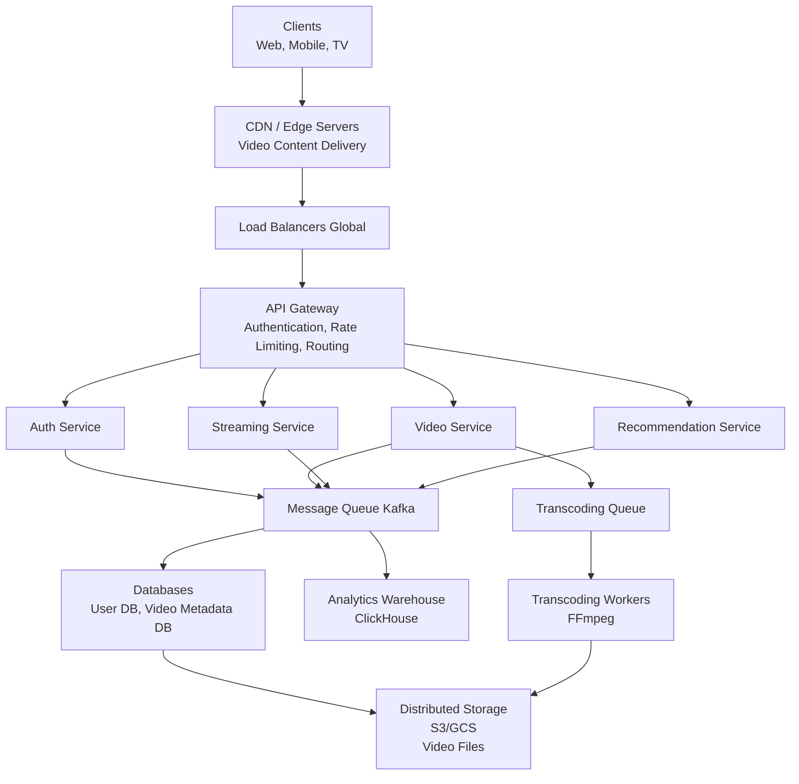
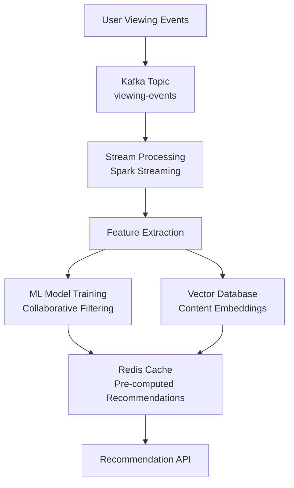
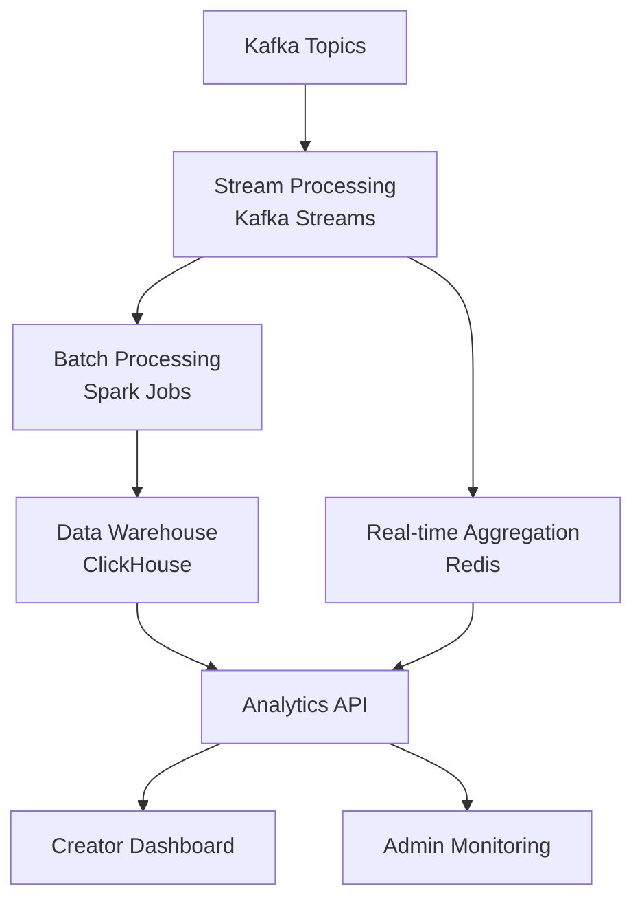

### Video Axın Platforması Sistem dizaynı

**Problemin Təsviri:**

YouTube və ya Netflix kimi video axın platforması dizayn etmək lazımdır. Sistem aşağıdakı əsas komponentləri dəstəkləməlidir:
- Video yükləmə və transkodlama
- Yüksək keyfiyyətli video axını
- Tövsiyə sistemi və məzmun kəşfi

**Functional Requirements:**

**Əsas Funksiyalar:**
1. **Video Yükləmə və Transkodlama**
   - İstifadəçilər müxtəlif formatda video yükləyə bilər
   - Sistem videoları çoxlu keyfiyyətə transcode edir (360p, 720p, 1080p, 4K)
   - Thumbnail və metadata generasiyası
   - Upload status tracking

2. **Adaptiv Video Axını**
   - Real-time video streaming HLS/DASH protokolu ilə
   - Adaptive bitrate streaming (şəbəkə vəziyyətinə görə)
   - CDN inteqrasiyası qlobal content delivery üçün
   - Multi-device dəstəyi

3. **Tövsiyə Sistemi**
   - Collaborative filtering əsaslı tövsiyələr
   - Content-based recommendations
   - Real-time trend tracking
   - Personalized content discovery

### Non-Functional Requirements

**Performance:**
- Video başlamaq üçün aşağı latency (< 2 saniyə)
- Minimal buffering (< 500ms)
- Yüksək throughput (milyonlarla concurrent stream)
- 99.9% uptime availability

**Scalability:**
- Milyardlarla video dəstəyi
- Milyonlarla concurrent user
- Petabyte səviyyəsində storage
- Qlobal user base

**Capacity Estimation:**
**Fərziyyələr (Assumptions)**
- 100 milyon daily active user (DAU)
- Hər user gündə orta hesabla 5 video izləyir
- Orta video ölçüsü: 100 MB (compressed)
- Gündəlik 10,000 yeni video upload
- Read:Write ratio = 1000:1

**Storage Təxmini:**
- Hər video üçün müxtəlif keyfiyyətlər:
  - 360p: 50 MB
  - 720p: 150 MB
  - 1080p: 300 MB
  - 4K: 800 MB
  - Total hər video: ~1.3 GB
- Gündəlik upload: 10,000 × 1.3 GB = 13 TB/gün
- İllik storage: ~4.7 PB
- 3x replication ilə: ~14 PB

**Bandwidth Təxmini:**
- 100M DAU × 5 video/gün = 500 milyon video view/gün
- Orta video: 10 dəqiqə = 150 MB (720p)
- Gündəlik bandwidth: 500M × 150 MB = 75 PB/gün
- Saniyədə bandwidth: ~868 GB/s

**Queries Per Second (QPS):**
- Video stream requests: ~5,800 stream/saniyə
- API calls: ~20,000 QPS
- Peak traffic: ~30,000 stream/saniyə

### High-Level System Architecture

**Əsas Komponentlər:**




**Əsas Komponentlərin Dizaynı:**

### Video Upload və Management Service

**Məsuliyyətlər:**
- Video upload idarəetməsi
- Metadata management
- Transcoding job coordination
- Content moderation

**Database Schema (NoSQL - MongoDB/Cassandra):**

<details>
<summary>Videos Collection - Koda bax</summary>

```json
{
  "video_id": "uuid",
  "user_id": "uuid",
  "title": "string",
  "description": "text",
  "thumbnail_url": "string",
  "duration": "number (seconds)",
  "category": "string",
  "tags": ["array"],
  "status": "processing|active|failed",
  "privacy": "public|private|unlisted",
  "upload_date": "timestamp",
  "view_count": "number",
  "like_count": "number",
  "video_assets": {
    "360p": "s3://path/360p.m3u8",
    "720p": "s3://path/720p.m3u8",
    "1080p": "s3://path/1080p.m3u8",
    "4k": "s3://path/4k.m3u8"
  },
  "metadata": {
    "codec": "string",
    "bitrate": "number",
    "fps": "number"
  },
  "created_at": "timestamp",
  "updated_at": "timestamp"
}
```

</details>

<details>
<summary>Users Collection - Koda bax</summary>

```json
{
  "user_id": "uuid",
  "username": "string",
  "email": "string",
  "password_hash": "string",
  "profile_image": "string",
  "subscriber_count": "number",
  "created_at": "timestamp"
}
```

</details>

**API Endpoints:**

<details>
<summary>Koda bax</summary>

```
POST   /api/v1/videos/upload
GET    /api/v1/videos/{video_id}
PUT    /api/v1/videos/{video_id}
DELETE /api/v1/videos/{video_id}
GET    /api/v1/videos/user/{user_id}
POST   /api/v1/videos/{video_id}/thumbnail

GET    /api/v1/users/{user_id}
PUT    /api/v1/users/{user_id}
```

</details>

**Upload Flow:**
1. User upload request göndərir
2. Service signed URL qaytarır (direct S3 upload)
3. Client multipart upload ilə file yükləyir
4. Upload complete olduqda, service notify olunur
5. Video metadata database-ə yazılır
6. Transcoding job queue-ya əlavə edilir
7. Background worker-lər videoları process edir:
   - Multiple quality versiyaları yaradır (360p, 720p, 1080p, 4K)
   - HLS/DASH segment-ləri generasiya edir
   - Thumbnail-lar yaradır
   - Metadata extract edir
8. Processed video-lar CDN-ə push olunur
9. Video status "active" olaraq update olunur
10. User-ə notification göndərilir

**Transcoding Pipeline:**
- FFmpeg ilə paralel transcoding
- Priority queue (premium users prioritize edilir)
- Chunk-based processing (resume capability)
- Quality validation
- Progress tracking

### Streaming Service

**Məsuliyyətlər:**
- Video stream request-lərini idarə etmək
- CDN URL generation
- Playback tracking
- Quality adaptation logic

**Flow:**
1. Client video play request göndərir
2. Service user authentication verify edir
3. Video availability və access rights yoxlanır
4. Redis cache-də video metadata axtarılır
5. İstifadəçi network condition-a əsasən optimal quality seçilir
6. CDN signed URL qaytarılır
7. Client CDN-dən birbaşa stream edir
8. Playback event-lər asynchronous log edilir

**Adaptive Bitrate Streaming:**
- HLS (HTTP Live Streaming) protokolu
- Video segment-lərə bölünür (2-10 saniyə chunk-lar)
- Client öz network speed-inə görə quality adjust edir
- Smooth transition quality level-ləri arasında

**API Endpoints:**

<details>
<summary>Koda bax</summary>

```
GET  /api/v1/stream/{video_id}
     Query params: quality (360p|720p|1080p|4k)
     Returns: CDN signed URL və manifest

POST /api/v1/playback/start
     Body: { video_id, device_id, quality }

POST /api/v1/playback/pause
POST /api/v1/playback/resume
POST /api/v1/playback/complete
POST /api/v1/playback/seek
     Body: { video_id, position }
```

</details>

**Caching Strategy:**
- Redis-də popular video metadata
- CDN-də video segment-lər edge location-larda
- Client-side progressive download
- Predictive prefetching (növbəti segment-lər)

### Recommendation Service

**Məsuliyyətlər:**
- Personalized video recommendations
- Trending content detection
- Search ranking optimization
- Content discovery

**Recommendation Algorithms:**

**1. Collaborative Filtering:**
- User-video interaction matrix
- "Users who watched X also watched Y"
- Matrix factorization techniques
- Similar user behavior patterns

**2. Content-Based Filtering:**
- Video metadata similarity (tags, category, title)
- Visual similarity (thumbnail analysis)
- Audio fingerprinting
- Duration və content type matching

**3. Real-time Trending:**
- Recent view count spikes
- Engagement rate (like/view ratio)
- Share və comment activity
- Time-decay factor (yeni content prioritize)

**Data Pipeline:**



**Event Schema:**

<details>
<summary>Koda bax</summary>

```json
{
  "event_id": "uuid",
  "event_type": "view|like|share|comment|watch_complete",
  "user_id": "uuid",
  "video_id": "uuid",
  "timestamp": "iso8601",
  "watch_duration": "seconds",
  "device_type": "mobile|web|tv",
  "location": "country_code",
  "session_id": "uuid"
}
```

</details>

**API Endpoints:**

<details>
<summary>Koda bax</summary>

```
GET /api/v1/recommendations/personalized
    Query params: user_id, limit
    Returns: personalized video list

GET /api/v1/recommendations/trending
    Query params: category, region, limit
    Returns: trending videos

GET /api/v1/recommendations/similar/{video_id}
    Query params: limit
    Returns: similar videos

GET /api/v1/search
    Query params: query, filters, sort
    Returns: search results
```

</details>

**Recommendation Cache:**
- User üçün top 100 recommendation Redis-də pre-compute edilir
- Hər 1 saatda update olunur
- Real-time event-lərə görə incremental update
- Cold start problem üçün popular content göstərilir

### Analytics Service

**Məsuliyyətlər:**
- Real-time playback analytics
- Content performance metrics
- User engagement tracking
- Creator analytics dashboard

**Metrics Tracking:**
- View count və unique viewers
- Watch time (total və average)
- Engagement rate (like, comment, share)
- Audience retention (harda drop-off olur)
- Geographic distribution
- Device type distribution
- Traffic sources

**Data Warehouse:**



**API Endpoints:**

<details>
<summary>Koda bax</summary>

```
GET /api/v1/analytics/video/{video_id}/overview
GET /api/v1/analytics/video/{video_id}/viewers
GET /api/v1/analytics/video/{video_id}/retention
GET /api/v1/analytics/video/{video_id}/geography
GET /api/v1/analytics/user/{user_id}/channel-stats

POST /api/v1/events/track
     Body: event data
```

</details>

**Real-time Analytics:**
- Redis-də windowed counters (1 min, 5 min, 1 hour)
- Concurrent viewer count
- Live trending detection
- Anomaly detection (viral content)

### Database Schema

**Relational DB (PostgreSQL) - Critical Data:**

<details>
<summary>SQL Schema - Koda bax</summary>

```sql
users:
  - user_id (PK, UUID)
  - username (UNIQUE)
  - email (UNIQUE)
  - password_hash
  - created_at
  - updated_at

videos:
  - video_id (PK, UUID)
  - user_id (FK)
  - title
  - description
  - status (processing|active|failed)
  - privacy (public|private|unlisted)
  - view_count (indexed)
  - like_count
  - duration_seconds
  - created_at (indexed)
  - updated_at

video_versions:
  - version_id (PK, UUID)
  - video_id (FK, indexed)
  - quality (360p|720p|1080p|4k)
  - url (S3/CDN path)
  - file_size_bytes
  - codec
  - created_at

view_history:
  - view_id (PK, UUID)
  - user_id (FK, indexed)
  - video_id (FK, indexed)
  - watch_duration_seconds
  - completed (boolean)
  - device_type
  - viewed_at (indexed)
```

</details>

**NoSQL DB (Cassandra) - High-write Data:**

<details>
<summary>Cassandra Tables - Koda bax</summary>

```
playback_events:
  - partition key: (user_id, date)
  - clustering key: timestamp
  - video_id
  - event_type
  - position_seconds
  - quality
  - device_type

user_interactions:
  - partition key: user_id
  - clustering key: timestamp
  - video_id
  - interaction_type (like|comment|share)
  - metadata
```

</details>

### Database Sharding

**User Data Sharding:**
- user_id-yə görə consistent hashing
- Hər shard 10M user handle edir

**Video Data Sharding:**
- video_id-yə görə shard
- Popular video-lar multiple shard-larda replicate

**Analytics Sharding:**
- Time-based partitioning (gün/həftə)
- Region-based sharding compliance üçün

### Scalability və Performance

**Upload Scalability:**
- Direct-to-S3 upload signed URL ilə
- Multipart upload large file-lar üçün
- Resume capability chunk-based upload ilə
- Parallel transcoding workers (horizontal scaling)

**Streaming Scalability:**
- CDN edge caching (CloudFront, Cloudflare)
- Origin shield intermediate caching layer
- Geo-distributed storage
- Predictive content placement

**Cache Strategy:**
- L1 Cache: Client-side (browser/app)
- L2 Cache: CDN edge servers
- L3 Cache: Redis (metadata, hot data)
- L4 Cache: Origin shield

**Database Optimization:**
- Read replicas SQL database üçün
- Materialized views analytics üçün
- Denormalization hot path-larda
- Index optimization query pattern-lərə görə

### Fault Tolerance və Reliability

**Redundancy:**
- Multi-region deployment
- 3x replication video files üçün
- Database backup və point-in-time recovery
- CDN multi-provider setup

**Failure Handling:**
- Circuit breaker pattern service-lər arasında
- Retry logic exponential backoff ilə
- Dead-letter queue failed job-lar üçün
- Graceful degradation (quality reduction)

**Monitoring:**
- Transcoding queue depth
- CDN hit rate və latency
- Database query performance
- API response time və error rate
- User-facing metrics (buffering ratio, startup time)

### Əlavə Təkmilləşdirmələr

Aşağıdakı feature-lər sistemdə əlavə funksionallıq kimi implement edilə bilər:
- **Live Streaming:** Real-time video broadcasting RTMP/WebRTC ilə
- **Comments və Social Features:** User interaction və community building
- **Playlist Management:** Video collection və auto-play
- **Subtitle Support:** Multi-language subtitle upload və synchronization
- **Content Moderation:** AI-based inappropriate content detection
- **Monetization:** Ad insertion, premium subscriptions, creator revenue sharing
- **Offline Download:** Mobile app-lərdə offline viewing (premium)
- **Watch Party:** Synchronized viewing multiple users üçün
- **Video Editing:** Basic trim, crop, filters web interface-dən
- **Analytics API:** Third-party integration üçün public API
