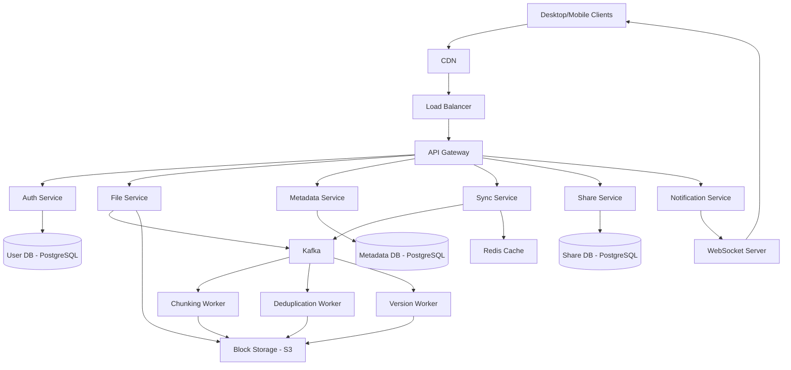
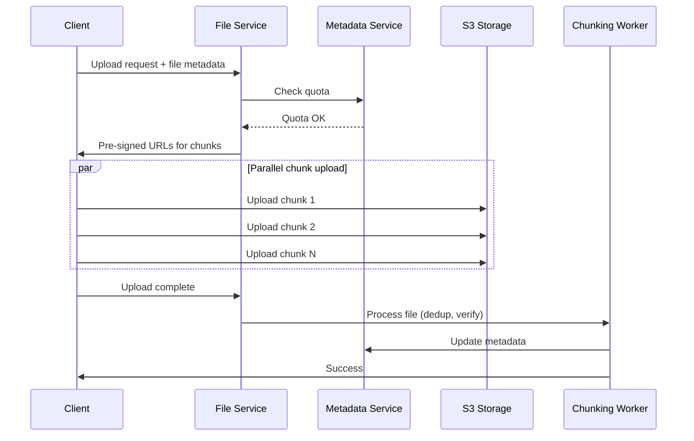
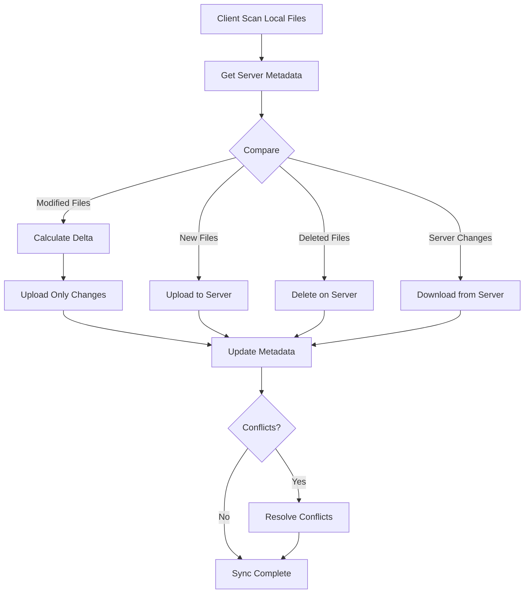
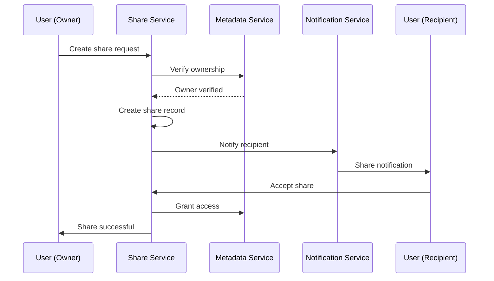

## Dropbox Sistem Dizaynı

**Problemin Təsviri:**

Dropbox kimi bulud əsaslı fayl saxlama və sinxronizasiya servisi dizayn etmək lazımdır. Sistem aşağıdakı əsas komponentləri dəstəkləməlidir:
- Fayl yükləmə və sinxronizasiya
- Faylların paylaşılması
- Versiya tarixçəsi və bərpası

**Functional Requirements:**

**Əsas Funksiyalar:**
1. **Fayl Yükləmə və Sinxronizasiya**
   - Fayl və qovluq yükləmə/yükləmə
   - Avtomatik sinxronizasiya bütün cihazlarda
   - Delta sync (yalnız dəyişən hissələr)
   - Chunked upload (böyük fayllar üçün)
   - Deduplication (eyni məzmunun təkrar saxlanmaması)

2. **Fayl Paylaşımı**
   - Fayl və qovluqların paylaşılması
   - İcazə idarəetməsi (view, edit, comment)
   - Public link yaratma
   - Paylaşım vaxtının müəyyənləşdirilməsi
   - Team və workspace dəstəyi

3. **Versiya İdarəetməsi**
   - Fayl versiyalarının saxlanması
   - Əvvəlki versiyaya qayıdış
   - Silinmiş faylların bərpası
   - Version retention policy
   - Conflict resolution

### Non-Functional Requirements

**Performance:**
- File upload latency < 1s (kiçik fayllar)
- Sync latency < 5s
- 99.99% uptime availability
- Low network bandwidth istifadəsi

**Scalability:**
- Milyonlarla user
- Petabyte səviyyəsində data
- Milyardlarla fayl
- Geniş coğrafi əhatə

### Capacity Estimation

**Fərziyyələr:**
- 500 milyon registered user
- 100 milyon daily active user (DAU)
- Hər user orta 10 GB data
- Orta fayl ölçüsü: 2 MB
- Hər user gündə 5 fayl upload edir
- Read:Write ratio = 10:1

**Storage:**
- Total user data: 500M × 10 GB = 5 PB
- Metadata: 500M user × 5,000 file/user × 1 KB = 2.5 TB
- Version history: ~15% əlavə = 750 TB
- 3x replication: 3 × 5 PB = 15 PB
- **Total Storage:** ~18 PB

**Daily Traffic:**
- Uploads: 100M DAU × 5 file × 2 MB = 1 PB/gün
- Downloads: 100M DAU × 50 file × 2 MB = 10 PB/gün
- **Total daily bandwidth:** ~11 PB/gün

**QPS (Queries Per Second):**
- File operations: ~100,000 QPS
- Metadata queries: ~200,000 QPS
- Sync requests: ~500,000 QPS
- Peak traffic: ~1.5M QPS

### High-Level System Architecture



### Əsas Komponentlərin Dizaynı

#### 1. Authentication Service

**Məsuliyyətlər:**
- İstifadəçi authentication və authorization
- Session management
- Device tracking
- Access token generation

**Database Schema (PostgreSQL):**

```sql
users:
  - user_id (PK, UUID)
  - email (UK)
  - username
  - password_hash
  - full_name
  - storage_quota (bigint)
  - storage_used (bigint)
  - account_type (free/premium/business)
  - status (active/suspended)
  - created_at
  - updated_at

devices:
  - device_id (PK, UUID)
  - user_id (FK → users)
  - device_name
  - device_type (desktop/mobile/web)
  - os_type
  - last_sync_at
  - is_active
  - created_at

sessions:
  - session_id (PK, UUID)
  - user_id (FK → users)
  - device_id (FK → devices)
  - access_token
  - refresh_token
  - expires_at
  - created_at
```

**API Endpoints:**
```
POST /api/v1/auth/register
POST /api/v1/auth/login
POST /api/v1/auth/logout
POST /api/v1/auth/refresh
GET  /api/v1/users/{user_id}
PUT  /api/v1/users/{user_id}
GET  /api/v1/users/{user_id}/storage
```

#### 2. File Service

**Məsuliyyətlər:**
- Fayl yükləmə və yükləmə prosesi
- Chunking və deduplication
- S3 ilə əlaqə
- File integrity yoxlama

**Chunking Strategy:**

1. **Fixed-size Chunking:**
   - Hər chunk 4 MB
   - Paralel upload
   - Resume capability

2. **Content-Defined Chunking:**
   - Rabin fingerprinting alqoritmi
   - Natural breakpoint-lərdə bölünür
   - Daha yaxşı deduplication

3. **Deduplication:**
   - SHA-256 hash hesablama
   - Hash collision detection
   - Storage space azaltma

**Upload Flow:**



**Database Schema:**

```sql
files:
  - file_id (PK, UUID)
  - user_id (FK → users)
  - parent_id (FK → files, nullable)
  - name
  - mime_type
  - size (bigint)
  - is_folder (boolean)
  - is_deleted (boolean)
  - deleted_at
  - created_at
  - updated_at

file_chunks:
  - chunk_id (PK, UUID)
  - file_id (FK → files)
  - chunk_index (int)
  - chunk_hash (SHA-256)
  - chunk_size
  - storage_key (S3 key)
  - created_at

file_versions:
  - version_id (PK, UUID)
  - file_id (FK → files)
  - version_number
  - size
  - modified_by (FK → users)
  - created_at
```

**İndekslər:**
- `files(user_id, parent_id, is_deleted)`
- `files(name, user_id)`
- `file_chunks(file_id, chunk_index)`
- `file_versions(file_id, created_at DESC)`

**API Endpoints:**
```
POST /api/v1/files/upload/init
POST /api/v1/files/upload/chunk
POST /api/v1/files/upload/complete
GET  /api/v1/files/{file_id}
GET  /api/v1/files/{file_id}/download
DELETE /api/v1/files/{file_id}
POST /api/v1/files/{file_id}/restore
GET  /api/v1/files/list
POST /api/v1/folders/create
```

#### 3. Sync Service

**Məsuliyyətlər:**
- Device-lar arasında sinxronizasiya
- Delta sync mexanizmi
- Conflict resolution
- Real-time notification

**Sync Protocol:**

1. **Polling Approach:**
   - Client hər 30 saniyədə server-ə sorğu göndərir
   - Server dəyişiklikləri qaytarır
   - Asan implement, lakin latency var

2. **Long-Polling:**
   - Client request göndərir və gözləyir
   - Dəyişiklik olduqda server cavab qaytarır
   - Daha az latency

3. **WebSocket:**
   - Persistent connection
   - Real-time bidirectional communication
   - Ən az latency

**Sync Algorithm:**

```
1. Client lokal file tree-ni scan edir
2. Server-dəki metadata ilə müqayisə edir
3. Delta hesablayır:
   - New files → upload
   - Modified files → upload changes
   - Deleted files → delete
   - Server changes → download
4. Conflict detection:
   - Same file modified on both sides
   - Resolution strategy (last-write-wins, manual)
```

**Delta Sync Flow:**



**Database Schema:**

```sql
sync_events:
  - event_id (PK, UUID)
  - user_id (FK → users)
  - device_id (FK → devices)
  - file_id (FK → files)
  - event_type (upload/download/delete/modify)
  - timestamp
  - status (pending/completed/failed)

sync_cursors:
  - cursor_id (PK)
  - user_id (FK → users)
  - device_id (FK → devices)
  - last_sync_timestamp
  - last_event_id
```

**API Endpoints:**
```
GET  /api/v1/sync/delta
     Query: cursor, device_id
     Returns: list of changes since cursor

POST /api/v1/sync/commit
     Body: list of local changes

GET  /api/v1/sync/status
     Returns: sync status for device

POST /api/v1/sync/resolve-conflict
     Body: file_id, resolution_strategy
```

#### 4. Share Service

**Məsuliyyətlər:**
- Fayl və qovluq paylaşımı
- İcazə idarəetməsi
- Public link generation
- Access control

**Permission Types:**
- **Viewer:** Yalnız görüntüləmə
- **Editor:** Dəyişiklik edə bilər
- **Commenter:** Şərh yaza bilər
- **Owner:** Tam nəzarət

**Database Schema:**

```sql
shares:
  - share_id (PK, UUID)
  - file_id (FK → files)
  - shared_by (FK → users)
  - shared_with (FK → users, nullable)
  - permission (viewer/editor/commenter/owner)
  - is_public (boolean)
  - public_token (UUID, nullable)
  - expires_at (nullable)
  - created_at

share_links:
  - link_id (PK, UUID)
  - share_id (FK → shares)
  - token (UUID, UK)
  - password_hash (nullable)
  - max_downloads (int, nullable)
  - download_count (int)
  - expires_at (nullable)
  - created_at

share_activities:
  - activity_id (PK, UUID)
  - share_id (FK → shares)
  - user_id (FK → users)
  - action (view/download/edit)
  - timestamp
```

**İndekslər:**
- `shares(file_id, shared_with)`
- `shares(shared_by, created_at DESC)`
- `share_links(token)`

**API Endpoints:**
```
POST /api/v1/share/create
     Body: { file_id, shared_with, permission }

POST /api/v1/share/public-link
     Body: { file_id, expires_at, password }
     Returns: public_url

GET  /api/v1/share/{share_id}
DELETE /api/v1/share/{share_id}
PUT  /api/v1/share/{share_id}/permission
GET  /api/v1/share/list
GET  /api/v1/share/link/{token}
```

**Share Flow:**



#### 5. Metadata Service

**Məsuliyyətlər:**
- File və folder metadata idarəsi
- Tree structure idarəsi
- Search functionality
- Quota management

**Tree Structure:**

Nested Set Model istifadə edilir:
- Hər node-un `left` və `right` dəyərləri var
- Subtree query-ləri effektiv

```sql
file_tree:
  - node_id (PK, UUID)
  - user_id (FK → users)
  - file_id (FK → files)
  - lft (int)
  - rgt (int)
  - depth (int)
```

**Search Implementation:**

Elasticsearch istifadə edilir:
- File name search
- Content search (text files)
- Tag-based search
- Full-text search

**API Endpoints:**
```
GET  /api/v1/metadata/{file_id}
GET  /api/v1/metadata/tree
     Query: parent_id, depth
     
POST /api/v1/metadata/search
     Body: { query, filters }
     
GET  /api/v1/metadata/quota
     Returns: { used, total, percentage }
```

### Database Sharding Strategy

**User-based Sharding:**
- Shard key: `user_id`
- Consistent hashing
- 32 shard (başlanğıc)
- Hər user-in bütün data-sı eyni shard-da

**Advantages:**
- User isolation
- Asan query (cross-shard yox)
- Scalability

**File Storage Sharding:**
- Chunk hash-ə görə distribute
- Content-based distribution
- Hot data replication

### Caching Strategy

**Multi-Level Cache:**

1. **Client-side:**
   - Recently accessed files
   - File tree structure
   - User preferences
   - TTL: unlimited (invalidate on change)

2. **Redis Cache:**
   - Metadata (TTL: 5 min)
   - User sessions (TTL: 24h)
   - Share permissions (TTL: 1h)
   - File tree (TTL: 10 min)

3. **CDN:**
   - Public shared files
   - Static assets
   - Popular downloads

**Cache Invalidation:**
- Write-through strategy
- Pub/Sub for real-time invalidation
- Version-based cache keys

### Failure Handling

**Upload Failures:**
- Chunked upload with retry
- Resume from last successful chunk
- Exponential backoff
- Client-side queue

**Sync Failures:**
- Retry with backoff
- Conflict detection və resolution
- Offline mode support
- Queue failed operations

**Storage Failures:**
- 3x replication
- Cross-region replication
- Automated failover
- Data integrity checks

**Network Failures:**
- Client-side buffering
- Graceful degradation
- Offline mode
- Background sync

### Monitoring və Observability

**Key Metrics:**
- Upload success rate
- Download latency
- Sync latency
- Storage utilization
- Active users per region
- Cache hit rate
- API latency (p50, p95, p99)
- Error rates

**Alerts:**
- Upload failure rate > 5%
- Sync latency > 10s
- Storage utilization > 80%
- API error rate > 1%

### Security Considerations

- **Encryption at rest:** AES-256
- **Encryption in transit:** TLS 1.3
- **Access control:** ACL per file/folder
- **Virus scanning:** ClamAV integration
- **Audit logging:** All file operations
- **Data privacy:** GDPR compliance
- **Rate limiting:** Per user/IP
- **DDoS protection:** CloudFlare

### Əlavə Təkmilləşdirmələr

Sistemə əlavə edilə biləcək feature-lər:
- **Selective Sync:** Seçilmiş qovluqların sinxronizasiyası
- **Smart Sync:** Cloud-only files (local space qənaəti)
- **File Recovery:** Trash bin və version rollback
- **Team Workspaces:** Kollektiv işləmə mühiti
- **File Commenting:** Real-time collaboration
- **Activity Feed:** Fayl dəyişikliklərinin izlənməsi
- **Third-party Integration:** API for external apps
- **Mobile Photo Backup:** Avtomatik foto yükləmə
- **OCR Support:** Scan edilmiş sənədlərdə axtarış
- **Video Streaming:** Direct video playback
