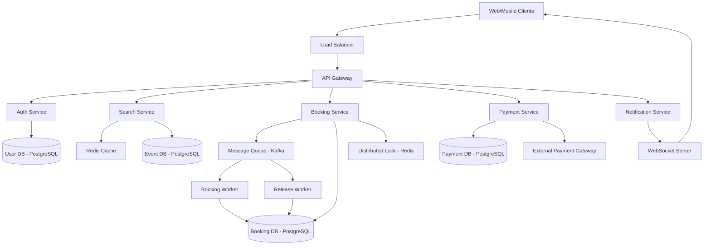
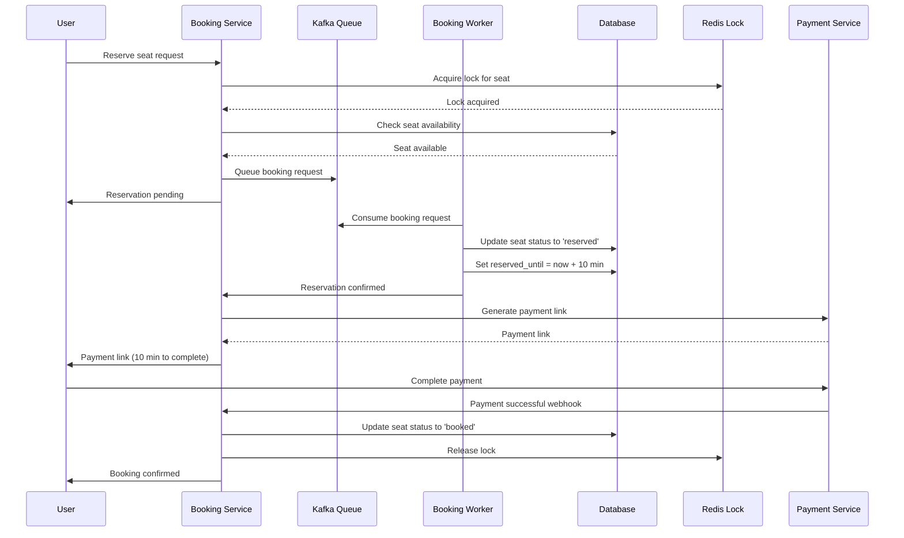
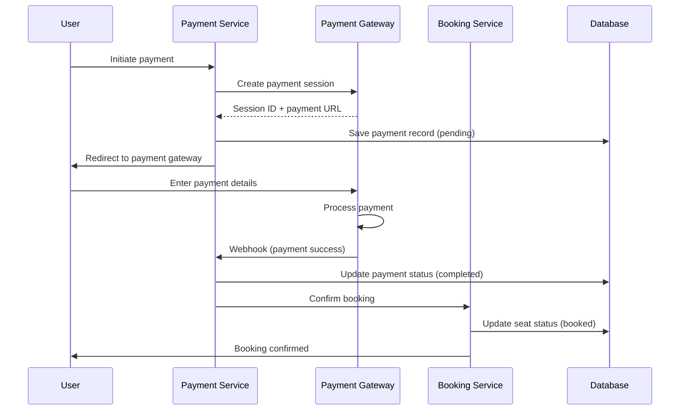
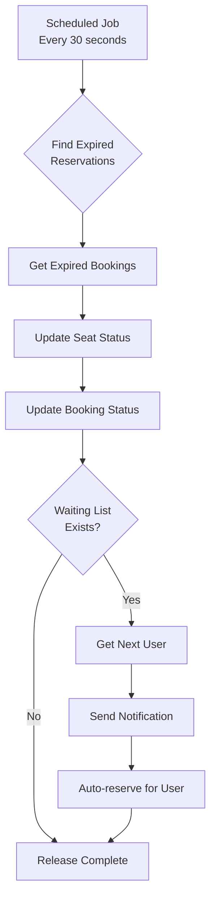

## Bilet Satış Sistemi Dizaynı

**Problemin Təsviri:**

Ticketmaster kimi bilet satış və rezervasiya sistemi dizayn etmək lazımdır. Sistem aşağıdakı əsas komponentləri dəstəkləməlidir:
- Tədbir və oturacaq axtarışı
- Oturacaq rezervasiyası və ödəniş
- Double booking-in qarşısının alınması

**Functional Requirements:**

**Əsas Funksiyalar:**
1. **Tədbir və Oturacaq Axtarışı**
   - Tədbir axtarışı (location, date, category)
   - Oturacaq xəritəsinin görüntülənməsi
   - Real-time oturacaq availability
   - Filter və sorting
   - Tədbir detalları

2. **Rezervasiya və Ödəniş**
   - Oturacaq rezervasiyası
   - Temporary hold (5-15 dəqiqə)
   - Payment processing
   - Booking confirmation
   - Double booking prevention
   - Waiting list mexanizmi

3. **Ləğvetmə və Geri Qaytarma**
   - Rezervasiya ləğvi
   - Refund processing
   - Oturacağın release edilməsi
   - Waiting list-dən növbəti user-ə bildiriş

### Non-Functional Requirements

**Performance:**
- Search latency < 200ms
- Booking latency < 1s
- 99.99% uptime availability
- Peak load handling (concert release)

**Scalability:**
- 10 milyon DAU
- 100,000 concurrent users (peak)
- 20,000 concurrent booking attempts
- Read:Write ratio = 5:1

**Consistency:**
- Strong consistency for seat booking
- No double booking
- ACID transactions for payment

### Capacity Estimation

**Fərziyyələr:**
- 10 milyon daily active user (DAU)
- 100,000 peak concurrent users
- 20,000 concurrent booking attempts
- Orta tədbir: 10,000 oturacaq
- 1,000 aktiv tədbir hər vaxt
- Hər user gündə 5 write request
- Read:Write ratio = 5:1

**Storage:**
- User data: 10M × 1 KB = 10 GB
- Event data: 1,000 event × 100 KB = 100 MB
- Seat data: 1,000 event × 10,000 seat × 500 bytes = 5 GB
- Booking data: 1M booking/gün × 2 KB × 365 gün = 730 GB/il
- **Total Storage:** ~1 TB/il

**QPS (Queries Per Second):**
- Read requests: 10M × 5 × 5 / 86400 = ~2,900 QPS
- Write requests: 10M × 5 / 86400 = ~580 QPS
- Peak QPS: ~20,000 QPS (concert release)

**Bandwidth:**
- Average: ~5 GB/gün
- Peak: ~50 GB/saat

### High-Level System Architecture



### Əsas Komponentlərin Dizaynı

#### 1. Search Service

**Məsuliyyətlər:**
- Tədbir axtarışı
- Oturacaq availability yoxlama
- Filter və sort
- Cache management

**Database Schema (PostgreSQL):**

```sql
events:
  - event_id (PK, UUID)
  - title
  - description
  - venue_id (FK → venues)
  - category
  - start_time
  - end_time
  - total_seats
  - available_seats
  - status (upcoming/ongoing/completed/cancelled)
  - created_at

venues:
  - venue_id (PK, UUID)
  - name
  - address
  - city
  - country
  - capacity
  - seating_layout (JSON)

seats:
  - seat_id (PK, UUID)
  - event_id (FK → events)
  - section
  - row
  - seat_number
  - price (decimal)
  - status (available/reserved/booked)
  - reserved_by (FK → users, nullable)
  - reserved_until (timestamp, nullable)
  - created_at
  - updated_at
```

**İndekslər:**
- `events(start_time, status, city)`
- `events(category, start_time)`
- `seats(event_id, status)`
- `seats(event_id, section, row)`

**API Endpoints:**
```
GET  /api/v1/events/search
     Query: city, date, category, limit, offset
     
GET  /api/v1/events/{event_id}
GET  /api/v1/events/{event_id}/seats
     Query: section, status
     
GET  /api/v1/events/{event_id}/availability
     Returns: available seats count per section
```

**Caching Strategy:**

```
Key: event:{event_id}
Value: event metadata
TTL: 1 hour

Key: seats:{event_id}
Value: seat availability map
TTL: 30 seconds

Key: event:list:{city}:{date}
Value: paginated event list
TTL: 5 minutes
```

#### 2. Booking Service

**Məsuliyyətlər:**
- Oturacaq rezervasiyası
- Double booking prevention
- Temporary hold management
- Booking confirmation

**Double Booking Prevention:**

1. **Distributed Lock (Redis):**
   ```
   SETNX seat:lock:{seat_id} {user_id}
   EXPIRE seat:lock:{seat_id} 10
   ```

2. **Optimistic Locking:**
   ```sql
   UPDATE seats
   SET status = 'reserved',
       reserved_by = {user_id},
       reserved_until = NOW() + INTERVAL '10 minutes',
       version = version + 1
   WHERE seat_id = {seat_id}
     AND status = 'available'
     AND version = {expected_version}
   ```

3. **Queue-based Processing:**
   - FIFO queue with Kafka
   - Sequential processing
   - First-come-first-served

**Booking Flow:**



**Database Schema:**

```sql
bookings:
  - booking_id (PK, UUID)
  - user_id (FK → users)
  - event_id (FK → events)
  - seat_id (FK → seats)
  - status (pending/reserved/confirmed/cancelled/expired)
  - reservation_time
  - reservation_expires_at
  - confirmation_time
  - total_amount (decimal)
  - created_at
  - updated_at

booking_history:
  - history_id (PK, UUID)
  - booking_id (FK → bookings)
  - status_from
  - status_to
  - changed_at
  - changed_by

waiting_list:
  - waiting_id (PK, UUID)
  - user_id (FK → users)
  - event_id (FK → events)
  - section (nullable)
  - max_price (decimal, nullable)
  - joined_at
  - notified (boolean)
```

**İndekslər:**
- `bookings(user_id, created_at DESC)`
- `bookings(event_id, status)`
- `bookings(reservation_expires_at, status)`
- `waiting_list(event_id, joined_at)`

**API Endpoints:**
```
POST /api/v1/bookings/reserve
     Body: { event_id, seat_id }
     Returns: { booking_id, expires_at, payment_url }

POST /api/v1/bookings/{booking_id}/confirm
GET  /api/v1/bookings/{booking_id}
POST /api/v1/bookings/{booking_id}/cancel
GET  /api/v1/bookings/my-bookings

POST /api/v1/waiting-list/join
     Body: { event_id, section, max_price }
DELETE /api/v1/waiting-list/{waiting_id}
```

#### 3. Payment Service

**Məsuliyyətlər:**
- Payment processing
- Payment gateway integration
- Transaction management
- Refund handling

**Database Schema:**

```sql
payments:
  - payment_id (PK, UUID)
  - booking_id (FK → bookings)
  - amount (decimal)
  - currency
  - payment_method (credit_card/debit_card/wallet)
  - status (pending/completed/failed/refunded)
  - payment_gateway (stripe/paypal)
  - gateway_transaction_id
  - created_at
  - completed_at

refunds:
  - refund_id (PK, UUID)
  - payment_id (FK → payments)
  - amount (decimal)
  - reason
  - status (pending/completed/failed)
  - gateway_refund_id
  - created_at
  - completed_at
```

**Payment Flow:**



**API Endpoints:**
```
POST /api/v1/payments/create
     Body: { booking_id, amount, payment_method }
     Returns: { payment_id, payment_url }

GET  /api/v1/payments/{payment_id}
POST /api/v1/payments/webhook
POST /api/v1/payments/{payment_id}/refund
```

#### 4. Release Worker

**Məsuliyyətlər:**
- Expired rezervasiyaların release edilməsi
- Waiting list notification
- Automatic cleanup

**Release Algorithm:**

```
1. Scan bookings with status = 'reserved' və reserved_until < NOW()
2. Hər expired booking üçün:
   a. Update seat status: 'reserved' → 'available'
   b. Update booking status: 'reserved' → 'expired'
   c. Check waiting list for the event
   d. If waiting list exists:
      - Get next user from queue
      - Send notification
      - Auto-reserve for 10 minutes
3. Release distributed lock
```

**Release Flow:**



**Scheduled Job:**
```
Cron: */30 * * * * (hər 30 saniyə)
Query: SELECT * FROM bookings 
       WHERE status = 'reserved' 
       AND reserved_until < NOW()
       LIMIT 1000
```

#### 5. Notification Service

**Məsuliyyətlər:**
- Real-time bildirişlər
- Waiting list notifications
- Booking confirmations
- Email və SMS

**Notification Types:**
- **Seat Reserved:** "Oturacaq rezerv edildi, 10 dəqiqə içində ödəniş edin"
- **Payment Reminder:** "5 dəqiqə qalıb, ödənişi tamamlayın"
- **Booking Confirmed:** "Bilet uğurla alındı"
- **Reservation Expired:** "Rezervasiya vaxtı bitdi"
- **Waiting List Alert:** "Oturacaq boşaldı, indi rezerv edə bilərsiniz"

**WebSocket Implementation:**

```
Connection: wss://api.ticketmaster.com/notifications
Authentication: Bearer JWT

Events:
- seat.reserved
- payment.pending
- booking.confirmed
- reservation.expired
- waitlist.available
```

**API Endpoints:**
```
POST /api/v1/notifications/send
     Body: { user_id, type, message, channel }

GET  /api/v1/notifications/user/{user_id}
PUT  /api/v1/notifications/{notification_id}/read
```

### Concurrency Handling Strategies

**1. Pessimistic Locking:**
```sql
BEGIN TRANSACTION;
SELECT * FROM seats 
WHERE seat_id = {seat_id} 
FOR UPDATE;

-- Critical section: check və update
UPDATE seats SET status = 'reserved' WHERE seat_id = {seat_id};
COMMIT;
```

**2. Optimistic Locking:**
```sql
UPDATE seats
SET status = 'reserved', version = version + 1
WHERE seat_id = {seat_id}
  AND status = 'available'
  AND version = {expected_version};

-- Check affected rows
IF @@ROWCOUNT = 0
  RAISERROR ('Concurrent modification detected', 16, 1);
```

**3. Distributed Lock (Redis):**
```python
lock_key = f"seat:lock:{seat_id}"
acquired = redis.set(lock_key, user_id, nx=True, ex=10)

if acquired:
    try:
        # Critical section
        reserve_seat(seat_id, user_id)
    finally:
        redis.delete(lock_key)
```

### Database Sharding Strategy

**Event-based Sharding:**
- Shard key: `event_id`
- Hər shard bir qrup event-ləri idarə edir
- Hot event-lər replicate olunur

**Geographic Sharding:**
- Shard key: `city` və ya `region`
- Location-based data locality
- Reduced latency

**Time-based Partitioning:**
- Partition key: `start_time`
- Historical data archive
- Active events hot storage

### Caching Strategy

**Multi-Level Cache:**

1. **CDN Cache:**
   - Static assets (images, CSS, JS)
   - Event images və posters
   - TTL: 24 hours

2. **Redis Cache:**
   - Seat availability map (TTL: 30s)
   - Event metadata (TTL: 1h)
   - User sessions (TTL: 24h)
   - Search results (TTL: 5min)

3. **Application Cache:**
   - Venue layouts
   - Configuration data

**Cache Invalidation:**
- Write-through for critical data
- Event-driven invalidation (Kafka)
- TTL-based expiration

### Failure Handling

**Booking Failures:**
- Retry with exponential backoff
- Idempotency key per request
- Transaction rollback
- User notification

**Payment Failures:**
- Retry webhook delivery (3 attempts)
- Manual reconciliation queue
- Grace period for payment
- Automatic refund on error

**System Failures:**
- Database replication (master-slave)
- Service redundancy (multiple instances)
- Circuit breaker pattern
- Graceful degradation

### Monitoring və Observability

**Key Metrics:**
- Booking success rate
- Payment completion rate
- Average booking time
- Seat availability accuracy
- Lock contention rate
- Queue processing latency
- Cache hit rate

**Alerts:**
- Booking success rate < 95%
- Payment failure rate > 5%
- Lock timeout > 5s
- Queue backlog > 10,000

### Security Considerations

- **Rate limiting:** Per user/IP
- **CAPTCHA:** Prevent bots
- **JWT authentication:** Secure API access
- **PCI DSS compliance:** Payment data security
- **HTTPS/TLS:** Encrypted communication
- **SQL injection prevention:** Parameterized queries
- **CSRF protection:** Token validation

### Əlavə Təkmilləşdirmələr

Sistemə əlavə edilə biləcək feature-lər:
- **Dynamic Pricing:** Demand-based pricing
- **Group Booking:** Multiple seats single transaction
- **Season Tickets:** Subscription model
- **Seat Hold:** Extended hold for premium users
- **Virtual Queue:** Fair access during high demand
- **Mobile Tickets:** QR code generation
- **Resale Platform:** Secondary market
- **Loyalty Program:** Points və rewards
- **Multi-language Support:** i18n
- **Analytics Dashboard:** Real-time booking statistics
