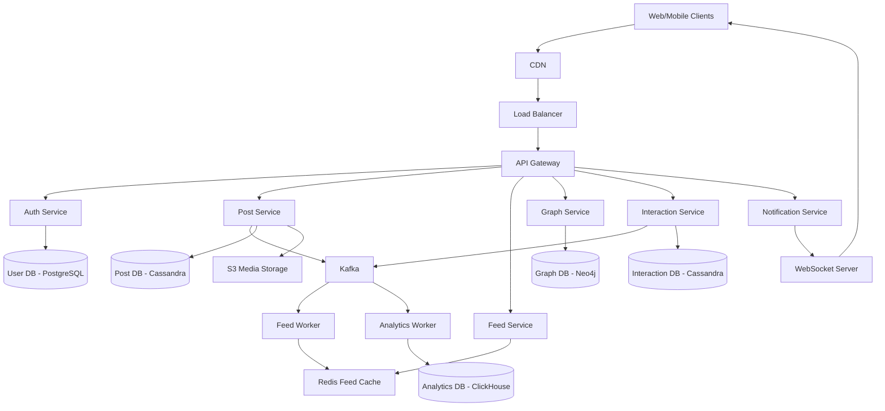
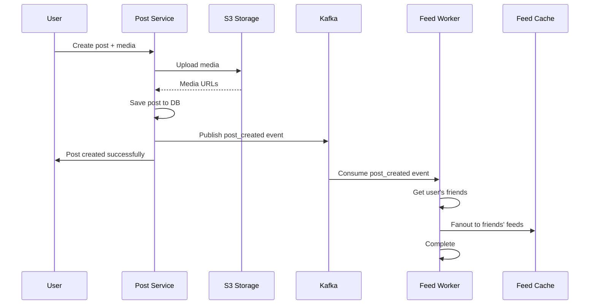
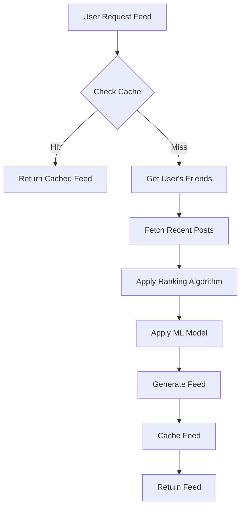
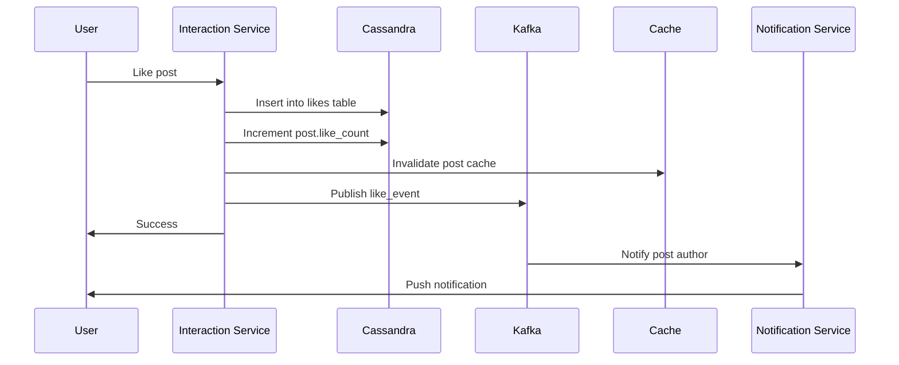

## Facebook News Feed Sistem Dizaynı

**Problemin Təsviri:**

Facebook kimi sosial şəbəkə news feed sistemi dizayn etmək lazımdır. Sistem aşağıdakı əsas komponentləri dəstəkləməlidir:
- Post yaratma və paylaşma
- Şəxsiləşdirilmiş news feed generasiyası
- İstifadəçi qarşılıqlı əlaqəsi (like, comment, share)

**Functional Requirements:**

**Əsas Funksiyalar:**
1. **Post Yaratma və Paylaşma**
   - Text, image, video, link paylaşma
   - Privacy settings (public, friends, custom)
   - Media upload və processing
   - Post editing və deletion
   - Tagging users və locations

2. **News Feed Generasiyası**
   - Personalized feed creation
   - Real-time feed updates
   - Content ranking və sorting
   - Infinite scroll pagination
   - Pull-to-refresh mechanism

3. **İstifadəçi Qarşılıqlı Əlaqəsi**
   - Like/Unlike posts
   - Comment və reply
   - Share/Repost
   - Reaction types (like, love, haha, wow, sad, angry)
   - Real-time notifications

### Non-Functional Requirements

**Performance:**
- Feed generation latency < 2s
- Real-time updates < 1s
- 99.99% uptime availability
- Media delivery via CDN

**Scalability:**
- Milyardlarla user
- Milyonlarla concurrent users
- Saniyədə milyonlarla post
- Petabyte səviyyəsində media storage

### Capacity Estimation

**Fərziyyələr:**
- 3 milyard registered user
- 2 milyard daily active user (DAU)
- Hər user gündə 5 post görüntüləyir
- Hər user gündə 1 post yaradır
- Orta post ölçüsü: 1 KB (text + metadata)
- 50% post-larda media var (orta 2 MB)
- Read:Write ratio = 100:1

**Storage:**
- Post data: 2B × 1 post/gün × 1 KB × 365 gün = 730 TB/il
- Media data: 2B × 0.5 × 1 post/gün × 2 MB × 365 gün = 730 PB/il
- User connections: 2B user × 200 friend × 100 bytes = 40 TB
- **Total Storage:** ~730 PB/il

**QPS (Queries Per Second):**
- Feed requests: 2B DAU × 5 view/gün / 86400 = ~115,000 QPS
- Post creation: 2B DAU × 1 post/gün / 86400 = ~23,000 QPS
- Interactions: ~500,000 QPS
- Peak QPS: ~2M QPS

**Bandwidth:**
- Read bandwidth: 115K QPS × 100 KB (feed page) = ~11 GB/s
- Write bandwidth: 23K QPS × 2 MB (with media) = ~46 GB/s
- **Total bandwidth:** ~57 GB/s

### High-Level System Architecture



### Əsas Komponentlərin Dizaynı

#### 1. Post Service

**Məsuliyyətlər:**
- Post yaratma və saxlama
- Media upload və processing
- Post editing və deletion
- Privacy control

**Database Schema (Cassandra):**

```sql
posts:
  - post_id (PK, UUID)
  - user_id (UUID)
  - content (text)
  - media_urls (list<string>)
  - post_type (text/image/video/link)
  - privacy (public/friends/custom)
  - location (text, nullable)
  - tagged_users (list<UUID>)
  - like_count (counter)
  - comment_count (counter)
  - share_count (counter)
  - created_at (timestamp)
  - updated_at (timestamp)

user_posts:
  - user_id (PK)
  - created_at (CK, DESC)
  - post_id (UUID)

user_timeline:
  - user_id (PK)
  - post_id (CK, DESC)
  - author_id (UUID)
  - created_at (timestamp)
```

**Partition Strategy:**
- `posts`: partition by `post_id`
- `user_posts`: partition by `user_id`, clustering by `created_at`
- `user_timeline`: partition by `user_id`, clustering by `post_id`

**API Endpoints:**
```
POST /api/v1/posts/create
     Body: { content, media_urls, privacy, location, tagged_users }
     Returns: { post_id }

GET  /api/v1/posts/{post_id}
PUT  /api/v1/posts/{post_id}
DELETE /api/v1/posts/{post_id}

GET  /api/v1/posts/user/{user_id}
     Query: limit, offset
     Returns: user's posts
```

**Post Creation Flow:**



#### 2. Feed Service

**Məsuliyyətlər:**
- Feed generation
- Content ranking
- Pagination
- Real-time updates

**Feed Generation Strategies:**

**1. Fanout-on-Write (Push Model):**
- Post yaradıldıqda bütün dostların feed-inə yazılır
- **Pros:** Fast read (feed cache-dən oxunur)
- **Cons:** Slow write (çox dostlu user-lər üçün)
- **Use case:** Normal users (< 5,000 friends)

**2. Fanout-on-Read (Pull Model):**
- Feed sorğusu zamanı dostların son post-ları çəkilir
- **Pros:** Fast write
- **Cons:** Slow read (hər dəfə hesablanır)
- **Use case:** Celebrity users (> 100,000 followers)

**3. Hybrid Approach (Facebook istifadə edir):**
- Normal users: Fanout-on-Write
- Celebrities: Fanout-on-Read
- Active users: Pre-compute və cache

**Feed Cache Structure (Redis):**

```
Key: feed:{user_id}
Type: Sorted Set
Score: ranking_score
Value: post_id
Size: Top 500 posts
TTL: 7 days

ZADD feed:{user_id} {score} {post_id}
ZRANGE feed:{user_id} 0 19 WITHSCORES
```

**Ranking Algorithm:**

```
ranking_score = (recency_weight × recency_score) + 
                (engagement_weight × engagement_score) + 
                (affinity_weight × affinity_score)

Where:
- recency_weight = 0.5
- engagement_weight = 0.3
- affinity_weight = 0.2

recency_score = 1 / (hours_since_post + 1)
engagement_score = (likes × 1) + (comments × 3) + (shares × 5)
affinity_score = interaction_frequency_with_author / total_interactions
```

**Machine Learning Enhancement:**
```
ML model predicts: P(user_engages_with_post)
Features:
- User demographics
- Historical engagement patterns
- Post content type
- Author relationship strength
- Time of day
- Device type
```

**Feed Generation Flow:**



**API Endpoints:**
```
GET /api/v1/feed
    Query: user_id, limit=20, cursor
    Returns: { posts: [], next_cursor }

GET /api/v1/feed/refresh
    Query: user_id, since_post_id
    Returns: { new_posts: [] }
```

#### 3. Graph Service

**Məsuliyyətlər:**
- User connections idarəsi
- Friend suggestions
- Graph traversal
- Connection strength calculation

**Database Schema (Neo4j):**

```cypher
// User node
(:User {
  user_id: UUID,
  username: string,
  created_at: timestamp
})

// Relationship
(:User)-[:FRIEND_WITH {
  since: timestamp,
  interaction_count: int,
  last_interaction: timestamp
}]->(:User)

(:User)-[:FOLLOWS]->(:User)
```

**Redis Cache for Hot Data:**

```
Key: friends:{user_id}
Type: Set
Value: list of friend_ids
TTL: 1 hour

Key: connection_strength:{user_id}:{friend_id}
Type: String
Value: strength_score (0-1)
TTL: 1 hour
```

**API Endpoints:**
```
GET  /api/v1/graph/friends/{user_id}
     Returns: list of friends

GET  /api/v1/graph/connection-strength/{user_id}/{friend_id}
     Returns: { strength: 0.85 }

POST /api/v1/graph/friend-request
DELETE /api/v1/graph/unfriend
```

#### 4. Interaction Service

**Məsuliyyətlər:**
- Like/Unlike
- Comment/Reply
- Share
- Reaction tracking
- Real-time counter updates

**Database Schema (Cassandra):**

```sql
likes:
  - post_id (PK)
  - user_id (CK)
  - created_at (timestamp)

comments:
  - comment_id (PK, UUID)
  - post_id (UUID)
  - user_id (UUID)
  - parent_comment_id (UUID, nullable)
  - content (text)
  - like_count (counter)
  - created_at (timestamp)

post_comments:
  - post_id (PK)
  - created_at (CK, DESC)
  - comment_id (UUID)

shares:
  - share_id (PK, UUID)
  - post_id (UUID)
  - user_id (UUID)
  - original_user_id (UUID)
  - created_at (timestamp)
```

**Counter Management:**

```
posts table has counters:
- like_count (counter)
- comment_count (counter)
- share_count (counter)

UPDATE posts 
SET like_count = like_count + 1 
WHERE post_id = ?
```

**Like Flow:**



**API Endpoints:**
```
POST /api/v1/interactions/like
     Body: { post_id }

DELETE /api/v1/interactions/unlike
       Body: { post_id }

POST /api/v1/interactions/comment
     Body: { post_id, content, parent_comment_id }

GET  /api/v1/interactions/comments/{post_id}
     Query: limit, offset

POST /api/v1/interactions/share
     Body: { post_id, content }
```

#### 5. Notification Service

**Məsuliyyətlər:**
- Real-time notifications
- Push notifications
- Email notifications
- Notification aggregation

**Notification Types:**
- Like: "X liked your post"
- Comment: "X commented on your post"
- Share: "X shared your post"
- Tag: "X tagged you in a post"
- Friend request: "X sent you a friend request"

**Database Schema (Cassandra):**

```sql
notifications:
  - notification_id (PK, UUID)
  - user_id (UUID)
  - type (like/comment/share/tag/friend_request)
  - actor_id (UUID)
  - target_id (UUID)
  - is_read (boolean)
  - created_at (timestamp)

user_notifications:
  - user_id (PK)
  - created_at (CK, DESC)
  - notification_id (UUID)
```

**WebSocket Implementation:**

```
Connection: wss://api.facebook.com/notifications
Authentication: Bearer JWT

Events sent to client:
- notification.new
- post.liked
- post.commented
- friend.request
```

**Notification Aggregation:**
```
Instead of:
- "John liked your post"
- "Jane liked your post"
- "Mike liked your post"

Aggregate to:
- "John, Jane and 1 other liked your post"
```

**API Endpoints:**
```
GET  /api/v1/notifications
     Query: user_id, limit, offset

PUT  /api/v1/notifications/{notification_id}/read
POST /api/v1/notifications/mark-all-read
GET  /api/v1/notifications/unread-count
```

### Database Sharding Strategy

**User-based Sharding:**
- Shard key: `user_id`
- Hər shard-da user-in:
  - Posts
  - Friends
  - Feed cache
  - Interactions

**Advantages:**
- User isolation
- No cross-shard queries
- Easy horizontal scaling

**Hot User Problem:**
- Celebrity users replicate across shards
- Separate cluster for hot users
- Read replicas for popular content

### Caching Strategy

**Multi-Level Cache:**

1. **CDN Cache:**
   - Static media (images, videos)
   - TTL: 30 days
   - Cloudflare / CloudFront

2. **Redis Cache:**
   - Feed cache (TTL: 7 days)
   - User connections (TTL: 1 hour)
   - Post metadata (TTL: 1 hour)
   - Trending posts (TTL: 5 min)

3. **Application Cache:**
   - User session
   - Configuration

**Cache Invalidation:**
- Write-through for critical data
- Event-driven invalidation (Kafka)
- TTL-based expiration
- Lazy invalidation for non-critical

### Feed Worker Implementation

**Fanout-on-Write Worker:**

```python
def handle_post_created(event):
    post_id = event['post_id']
    user_id = event['user_id']
    
    # Get user's friends
    friends = graph_service.get_friends(user_id)
    
    # Calculate ranking score
    score = calculate_ranking_score(post)
    
    # Fanout to each friend's feed
    for friend_id in friends:
        redis.zadd(f"feed:{friend_id}", {post_id: score})
        
        # Keep only top 500 posts
        redis.zremrangebyrank(f"feed:{friend_id}", 0, -501)
    
    # Set TTL
    for friend_id in friends:
        redis.expire(f"feed:{friend_id}", 7 * 24 * 3600)
```

**Batch Processing:**
- Group friends into batches of 1000
- Parallel processing with Kafka partitions
- Rate limiting for celebrity users

### Real-time Updates

**WebSocket Server:**
```
Architecture:
- Clustered WebSocket servers
- Redis Pub/Sub for message distribution
- Sticky sessions for connection affinity

Flow:
1. User connects to WebSocket server
2. Server subscribes to Redis channel: feed_updates:{user_id}
3. When new post created, publish to channel
4. WebSocket server pushes to client
```

**Polling Fallback:**
```
For clients without WebSocket:
- Long polling with 30s timeout
- Incremental updates since last poll
```

### Failure Handling

**Post Creation Failures:**
- Retry with exponential backoff
- Dead letter queue for failed events
- Manual intervention for persistent failures

**Feed Generation Failures:**
- Fallback to basic timeline (chronological)
- Serve cached feed even if stale
- Graceful degradation without ML ranking

**Database Failures:**
- Read replicas for failover
- Multi-region replication
- Eventual consistency acceptable

### Monitoring və Observability

**Key Metrics:**
- Feed generation latency (p50, p95, p99)
- Post creation success rate
- Cache hit rate
- WebSocket connection count
- Notification delivery latency
- Engagement rate (CTR, likes, comments)

**Alerts:**
- Feed latency > 3s
- Cache hit rate < 80%
- Post creation failure > 1%
- WebSocket disconnections spike

### Security Considerations

- **Privacy controls:** Enforce post visibility
- **Content moderation:** AI-based harmful content detection
- **Rate limiting:** Prevent spam posts
- **CSRF protection:** Token validation
- **XSS prevention:** Content sanitization
- **DDoS protection:** CloudFlare
- **Authentication:** JWT with refresh tokens

### Əlavə Təkmilləşdirmələr

Sistemə əlavə edilə biləcək feature-lər:
- **Stories:** Temporary 24-hour posts
- **Live Video:** Real-time streaming
- **Reactions:** Beyond likes (love, haha, wow, sad, angry)
- **Polls:** Interactive posts
- **Events:** Event creation və RSVP
- **Groups:** Community management
- **Marketplace:** Buy/sell functionality
- **Dating:** Dating profile integration
- **Ads:** Sponsored posts in feed
- **Content Recommendations:** ML-based suggestions
- **Trending Topics:** Hashtag tracking
- **Memories:** "On this day" feature
