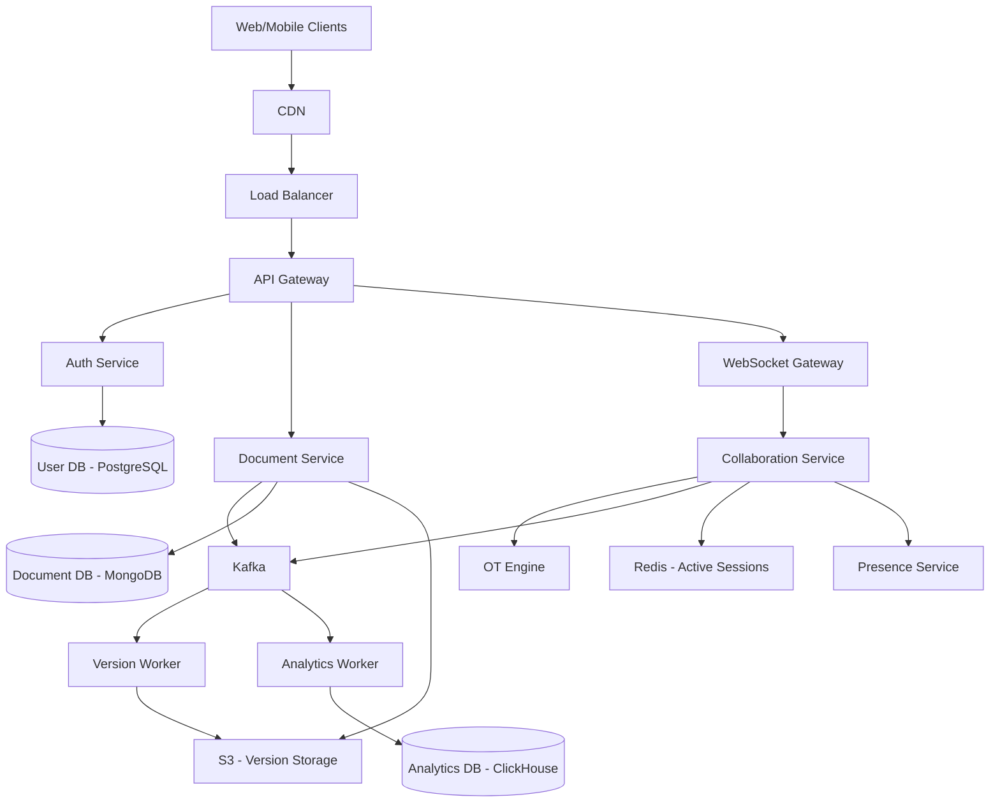
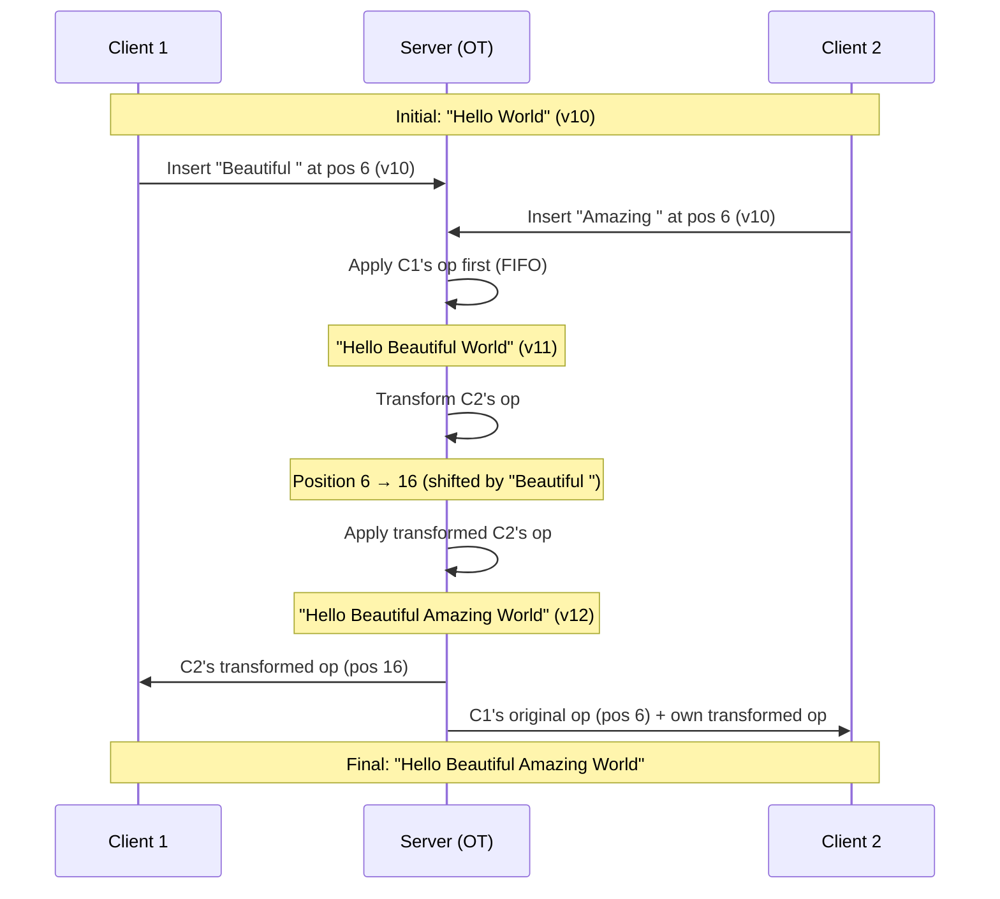
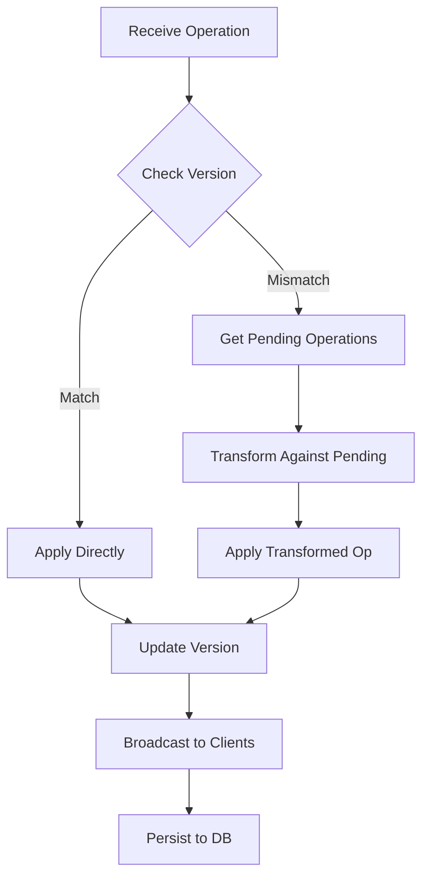
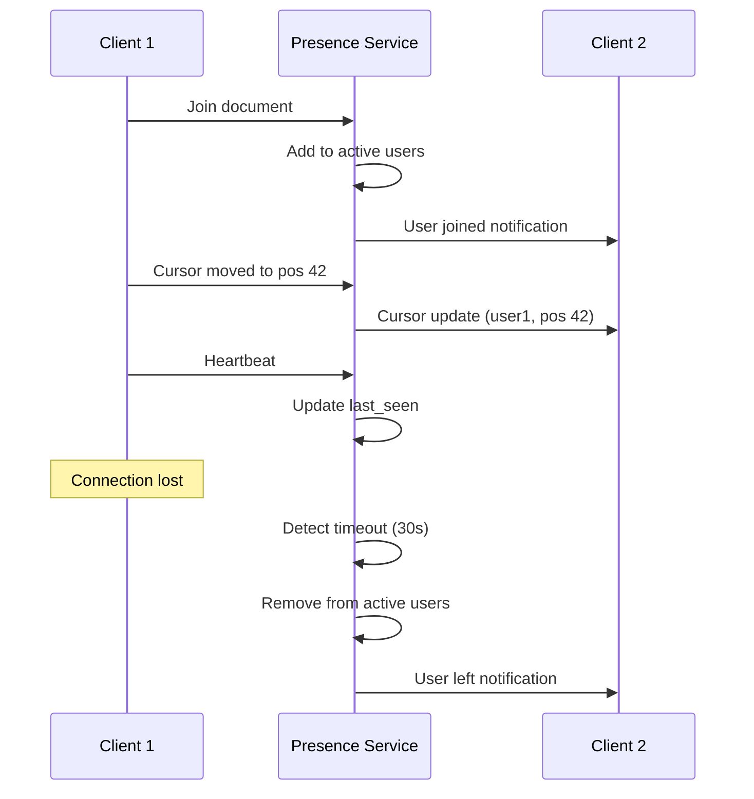
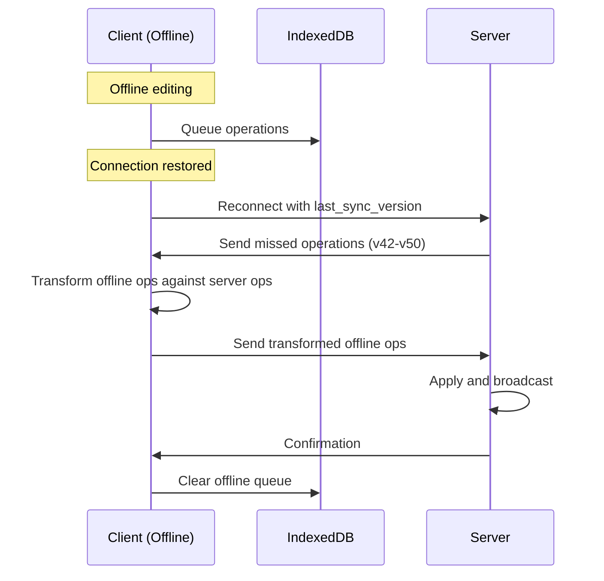

## Google Docs Sistem Dizaynı

**Problemin Təsviri:**

Google Docs kimi real-time collaborative document editing sistemi dizayn etmək lazımdır. Sistem aşağıdakı əsas komponentləri dəstəkləməlidir:
- Real-time çoxistifadəçili redaktə
- Sənəd saxlama və əldə etmə
- Konflikt həlli (Operational Transformation)

**Functional Requirements:**

**Əsas Funksiyalar:**
1. **Real-time Kollaborativ Redaktə**
   - Çoxsaylı user eyni sənədi eyni vaxtda redaktə edə bilər
   - Dəyişikliklər real-time sinxronlaşır
   - Cursor və selection tracking
   - Presence awareness (kim online)
   - Character-level locking (optional)

2. **Sənəd Saxlama və Əldə Etmə**
   - Sənəd yaratma, yükləmə, silmə
   - Sənəd metadata idarəsi
   - Cloud storage integration
   - Auto-save mechanism
   - Fast document retrieval

3. **Konflikt Həlli**
   - Operational Transformation (OT)
   - CRDT (Conflict-free Replicated Data Types)
   - Concurrent edit resolution
   - Convergence guarantee
   - Undo/Redo support

### Non-Functional Requirements

**Performance:**
- Edit operation latency < 100ms
- Real-time sync latency < 200ms
- 99.99% uptime availability
- Support 100 concurrent editors per document

**Scalability:**
- Milyonlarla sənəd
- Milyonlarla concurrent users
- Large documents (100+ MB)
- Global distribution

### Capacity Estimation

**Fərziyyələr:**
- 100 milyon registered user
- 10 milyon daily active user (DAU)
- Hər user orta 10 sənəd
- Orta sənəd ölçüsü: 100 KB
- 1% sənədlər concurrent edit olunur
- Average 5 concurrent editors per active document
- Edit frequency: 1 edit/second per active user

**Storage:**
- Total documents: 100M user × 10 doc = 1B documents
- Document content: 1B × 100 KB = 100 TB
- Version history: +50% = 50 TB
- Metadata: 1B × 1 KB = 1 TB
- **Total Storage:** ~151 TB

**Concurrent Editing:**
- Active documents: 1% × 1B = 10M documents
- Concurrent editors: 10M × 5 = 50M concurrent connections
- Operations per second: 50M × 1 edit/s = 50M ops/s

**Bandwidth:**
- Per operation: ~1 KB (operation + metadata)
- Total: 50M ops/s × 1 KB = ~50 GB/s

### High-Level System Architecture



### Əsas Komponentlərin Dizaynı

#### 1. Document Service

**Məsuliyyətlər:**
- Document CRUD operations
- Metadata management
- Access control
- Auto-save coordination

**Database Schema (MongoDB):**

```javascript
documents: {
  _id: ObjectId,
  doc_id: String (unique, indexed),
  owner_id: String,
  title: String,
  content: Object, // Current document state
  version: Number,
  created_at: Date,
  updated_at: Date,
  last_modified_by: String
}

document_permissions: {
  _id: ObjectId,
  doc_id: String (indexed),
  user_id: String (indexed),
  role: String, // owner, editor, commenter, viewer
  granted_by: String,
  granted_at: Date,
  expires_at: Date (nullable)
}

document_metadata: {
  _id: ObjectId,
  doc_id: String (unique),
  file_type: String, // text, spreadsheet, presentation
  size_bytes: Number,
  word_count: Number,
  page_count: Number,
  last_access: Date
}
```

**Document Content Structure:**

```javascript
{
  doc_id: "abc123",
  version: 42,
  content: {
    paragraphs: [
      {
        id: "p1",
        elements: [
          {
            type: "text",
            text: "Hello ",
            style: { bold: false, italic: false }
          },
          {
            type: "text",
            text: "World",
            style: { bold: true, italic: false }
          }
        ]
      }
    ]
  }
}
```

**API Endpoints:**
```
POST /api/v1/documents/create
     Body: { title, content }
     Returns: { doc_id }

GET  /api/v1/documents/{doc_id}
PUT  /api/v1/documents/{doc_id}
DELETE /api/v1/documents/{doc_id}

GET  /api/v1/documents/my-documents
POST /api/v1/documents/{doc_id}/share
GET  /api/v1/documents/{doc_id}/permissions
```

#### 2. Collaboration Service

**Məsuliyyətlər:**
- WebSocket connection management
- Operation broadcasting
- OT transformation
- Session management

**WebSocket Protocol:**

```javascript
// Client connects
ws://api.docs.com/collaborate/{doc_id}?token={jwt}

// Client sends operation
{
  type: "operation",
  doc_id: "abc123",
  operation: {
    type: "insert",
    position: 10,
    text: "Hello",
    author_id: "user123"
  },
  client_version: 42,
  operation_id: "op-xyz"
}

// Server broadcasts to all clients
{
  type: "operation",
  doc_id: "abc123",
  operation: {
    type: "insert",
    position: 10,
    text: "Hello",
    author_id: "user123"
  },
  server_version: 43,
  operation_id: "op-xyz"
}
```

**Operation Types:**

```javascript
// Insert operation
{
  type: "insert",
  position: 10,
  text: "Hello",
  author_id: "user123"
}

// Delete operation
{
  type: "delete",
  position: 5,
  length: 3,
  author_id: "user123"
}

// Retain operation (for formatting)
{
  type: "retain",
  position: 0,
  length: 5,
  attributes: { bold: true }
}
```

**Redis Session Storage:**

```
Key: session:{doc_id}:{user_id}
Value: {
  user_id: "user123",
  username: "John Doe",
  cursor_position: 42,
  selection_range: { start: 10, end: 20 },
  last_activity: timestamp
}
TTL: 30 seconds (refresh on activity)

Key: active_users:{doc_id}
Type: Set
Value: [user_id1, user_id2, ...]
```

#### 3. Operational Transformation (OT) Engine

**Məsuliyyətlər:**
- Transform concurrent operations
- Maintain convergence
- Handle all operation types
- Preserve user intention

**OT Transformation Rules:**

```
Transform(op1, op2):
  // Insert vs Insert
  if op1.type == "insert" && op2.type == "insert":
    if op1.position < op2.position:
      return (op1, op2)
    else if op1.position > op2.position:
      return (op1.shift(op2.length), op2)
    else:  // same position
      // Tie-breaking by author_id
      if op1.author_id < op2.author_id:
        return (op1, op2.shift(op1.length))
      else:
        return (op1.shift(op2.length), op2)
  
  // Insert vs Delete
  if op1.type == "insert" && op2.type == "delete":
    if op1.position <= op2.position:
      return (op1, op2.shift(op1.length))
    else if op1.position >= op2.position + op2.length:
      return (op1.shift(-op2.length), op2)
    else:  // insert inside delete range
      return (op1.shift(-op2.length), op2)
  
  // Delete vs Delete
  if op1.type == "delete" && op2.type == "delete":
    // Handle overlapping deletes
    ...
```

**OT Example:**



**Conflict Resolution Flow:**



#### 4. Presence Service

**Məsuliyyətlər:**
- Track active users
- Cursor position tracking
- User selection tracking
- Active user list

**Presence Data:**

```javascript
{
  doc_id: "abc123",
  users: [
    {
      user_id: "user1",
      name: "John Doe",
      avatar_url: "...",
      cursor: { position: 42 },
      selection: { start: 10, end: 20 },
      color: "#FF5733",
      last_seen: timestamp
    }
  ]
}
```

**Cursor Broadcast:**

```javascript
// Client sends cursor update
{
  type: "cursor",
  doc_id: "abc123",
  cursor: { position: 42 },
  selection: { start: 10, end: 20 }
}

// Server broadcasts to other clients
{
  type: "cursor_update",
  user_id: "user1",
  name: "John Doe",
  cursor: { position: 42 },
  selection: { start: 10, end: 20 },
  color: "#FF5733"
}
```

**Presence Flow:**



#### 5. Version Service

**Məsuliyyətlər:**
- Version history storage
- Snapshot creation
- Version retrieval
- Restore functionality

**Versioning Strategy:**

1. **Auto-save Frequency:**
   - Every 10 seconds
   - Or every 100 operations
   - Or on manual save

2. **Snapshot Strategy:**
   - Full snapshot every 100 versions
   - Delta storage between snapshots
   - Compress old versions

3. **Version Metadata:**

```javascript
{
  version_id: "v123",
  doc_id: "abc123",
  version_number: 42,
  author_id: "user123",
  timestamp: Date,
  snapshot_url: "s3://bucket/doc123/v42.json",
  is_snapshot: true,
  parent_version: 41,
  operations: [...]  // Delta since last snapshot
}
```

**Version Storage (S3):**

```
Bucket: document-versions
Key structure: {doc_id}/v{version_number}.json

Example:
s3://document-versions/abc123/v100.json  (snapshot)
s3://document-versions/abc123/v101.json  (delta)
s3://document-versions/abc123/v102.json  (delta)
s3://document-versions/abc123/v200.json  (snapshot)
```

**Version Retrieval:**

```
1. Find nearest snapshot <= requested version
2. Load snapshot
3. Apply operations from snapshot to requested version
4. Return reconstructed document
```

**API Endpoints:**
```
GET  /api/v1/documents/{doc_id}/versions
GET  /api/v1/documents/{doc_id}/versions/{version_id}
POST /api/v1/documents/{doc_id}/restore/{version_id}
GET  /api/v1/documents/{doc_id}/compare/{v1}/{v2}
```

#### 6. Comments Service

**Məsuliyyətlər:**
- Comment creation və management
- Reply threads
- Resolve/unresolve
- Mention notifications

**Database Schema:**

```javascript
comments: {
  _id: ObjectId,
  comment_id: String,
  doc_id: String (indexed),
  user_id: String,
  content: String,
  position: {
    start: Number,
    end: Number
  },
  thread_id: String (nullable),
  parent_comment_id: String (nullable),
  is_resolved: Boolean,
  created_at: Date,
  updated_at: Date
}
```

**Comment Anchoring:**

```javascript
// Anchor to specific text range
{
  comment_id: "c123",
  doc_id: "abc123",
  anchor: {
    paragraph_id: "p5",
    start_offset: 10,
    end_offset: 25,
    text_snapshot: "selected text"
  }
}
```

### Database Sharding Strategy

**Document-based Sharding:**
- Shard key: `doc_id`
- Hər shard bir qrup sənədləri idarə edir
- Active documents hot storage-də
- Old documents cold storage-ə migrate

**Benefits:**
- All operations for a document on same shard
- No cross-shard transactions
- Easy horizontal scaling

### Caching Strategy

**Multi-Level Cache:**

1. **Client-side:**
   - Document content
   - Recent operations
   - User preferences

2. **Redis Cache:**
   - Active document sessions (TTL: 5 min)
   - User presence (TTL: 30 sec)
   - Document metadata (TTL: 1 hour)
   - Operation queue (temporary)

3. **CDN:**
   - Static assets
   - Document templates

**Cache Invalidation:**
- On document edit: invalidate content cache
- On permission change: invalidate access cache
- On user activity: refresh presence cache

### Offline Support

**Offline Editing:**

```javascript
// IndexedDB storage
{
  doc_id: "abc123",
  offline_operations: [
    {
      op_id: "op1",
      type: "insert",
      position: 10,
      text: "offline edit",
      timestamp: Date
    }
  ],
  last_sync_version: 42
}
```

**Sync Flow:**



### Conflict Resolution Algorithms

**1. Operational Transformation (OT):**
- Server-centric approach
- Transform operations to maintain consistency
- Suitable for text documents

**2. CRDT (Alternative):**
- Decentralized approach
- Each character has unique ID
- Deterministic merge without coordination
- Suitable for offline-first applications

**Comparison:**

| Feature | OT | CRDT |
|---------|-----|------|
| Coordination | Server required | Decentralized |
| Complexity | Moderate | High |
| Latency | Lower | Higher |
| Offline support | Limited | Excellent |
| Memory usage | Lower | Higher |

### Failure Handling

**WebSocket Disconnection:**
- Auto-reconnect with exponential backoff
- Resume from last known version
- Replay missed operations
- Queue local operations during downtime

**Server Failure:**
- Multiple collaboration servers
- Session stickiness with fallback
- Replicate operation log
- Graceful degradation

**Data Loss Prevention:**
- Persist every operation before ACK
- Operation log replication
- Regular snapshots
- Point-in-time recovery

### Monitoring və Observability

**Key Metrics:**
- Operation latency (p50, p95, p99)
- WebSocket connection count
- Active document count
- Concurrent editors per document
- OT transformation time
- Cache hit rate
- Sync latency

**Alerts:**
- Operation latency > 200ms
- WebSocket disconnection rate > 5%
- Version save failure > 1%
- Transformation errors

### Security Considerations

- **Encryption at rest:** Document content encrypted
- **Encryption in transit:** TLS for all connections
- **Access control:** Role-based permissions
- **Audit logging:** All document access logged
- **Rate limiting:** Per user operation limit
- **XSS prevention:** Sanitize user input
- **CSRF protection:** Token validation

### Əlavə Təkmilləşdirmələr

Sistemə əlavə edilə biləcək feature-lər:
- **Suggestions Mode:** Track changes feature
- **Smart Compose:** AI-powered text suggestions
- **Voice Typing:** Speech-to-text integration
- **Document Templates:** Pre-built templates
- **Export/Import:** Multiple format support (PDF, DOCX, etc.)
- **Spell Check:** Real-time grammar checking
- **Translation:** Multi-language support
- **Add-ons:** Third-party integrations
- **Markdown Support:** Write in markdown
- **LaTeX Support:** Mathematical equations
- **Drawing Tools:** Embedded diagrams
- **Table of Contents:** Auto-generated navigation
