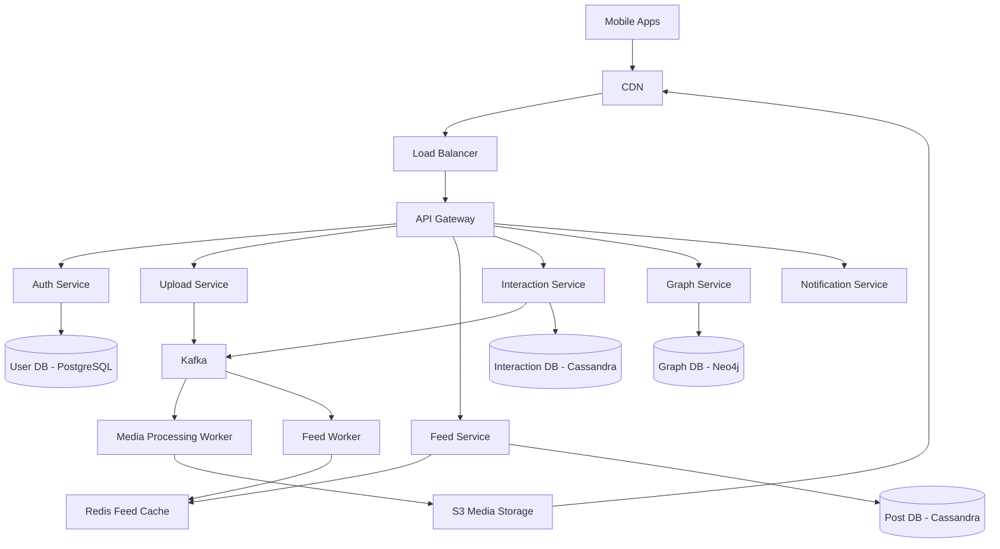
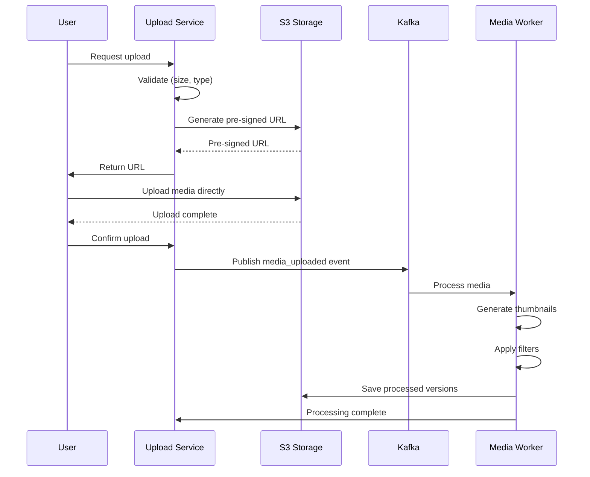
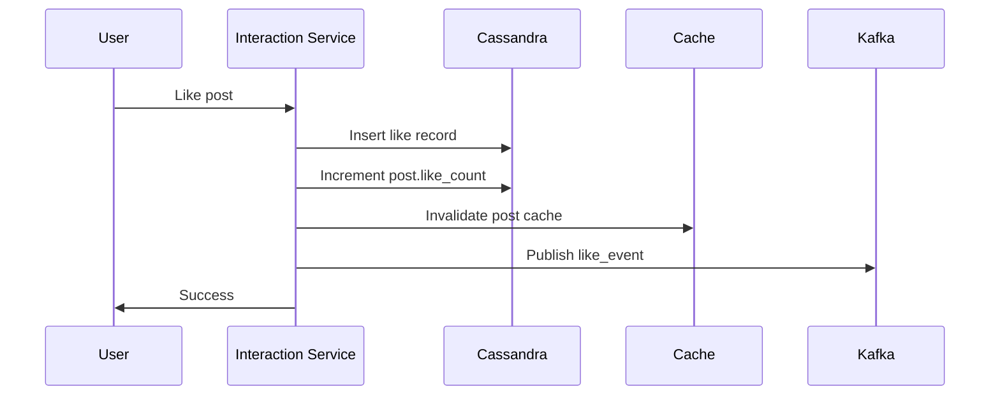
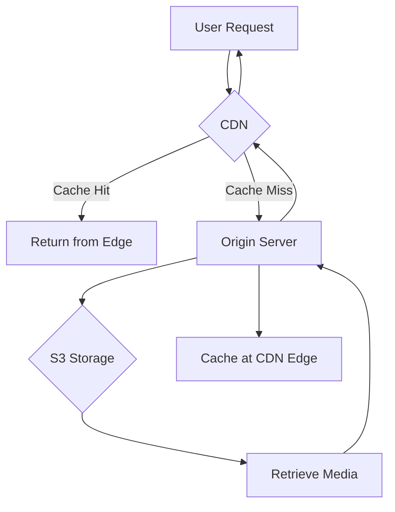
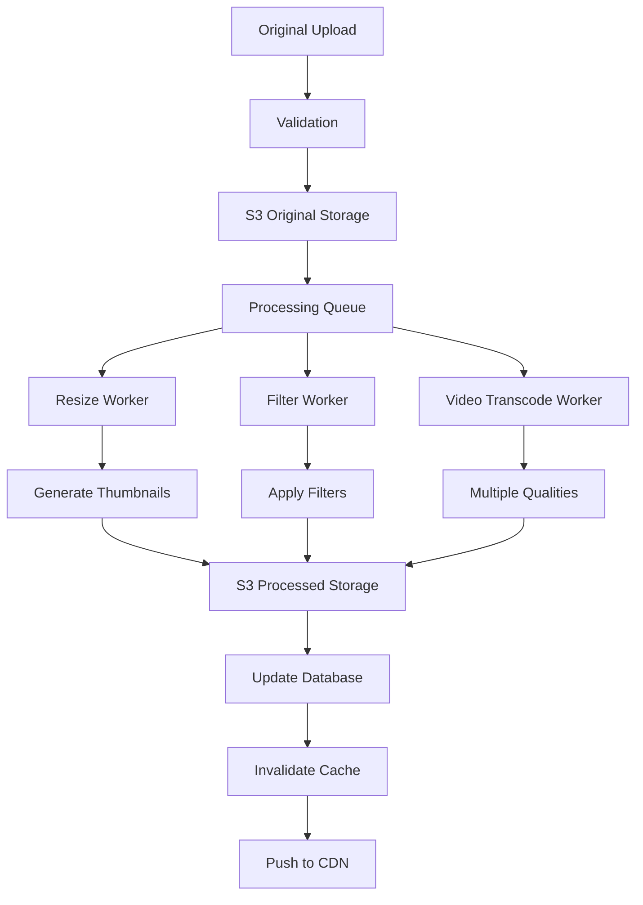

## Instagram Sistem Dizaynı

**Problemin Təsviri:**

Instagram kimi foto və video paylaşım platforması dizayn etmək lazımdır. Sistem aşağıdakı əsas komponentləri dəstəkləməlidir:
- Foto və video yükləmə və saxlama
- Feed generasiyası və content delivery
- İstifadəçi qarşılıqlı əlaqəsi (like, comment, follow)

**Functional Requirements:**

**Əsas Funksiyalar:**
1. **Foto/Video Yükləmə və Saxlama**
   - Foto və video upload
   - Image processing (resize, crop, filter)
   - Video transcoding
   - Media storage və CDN integration
   - Caption və hashtag dəstəyi

2. **Feed Generasiyası**
   - Personalized feed
   - Chronological və algorithmic ranking
   - Stories feature
   - Explore page
   - Infinite scroll

3. **İstifadəçi Qarşılıqlı Əlaqəsi**
   - Like/Unlike
   - Comment/Reply
   - Follow/Unfollow
   - Direct messaging
   - Notifications

### Non-Functional Requirements

**Performance:**
- Image upload latency < 2s
- Feed load time < 1s
- 99.99% uptime availability
- CDN for fast media delivery

**Scalability:**
- 2 milyard users
- 500 milyon DAU
- 100 milyon photos/day
- Petabyte səviyyəsində media storage

### Capacity Estimation

**Fərziyyələr:**
- 2 milyard registered users
- 500 milyon daily active users (DAU)
- Hər user gündə 2 foto upload edir
- Hər user gündə 20 foto görür
- Orta foto ölçüsü: 2 MB (original)
- Orta video ölçüsü: 20 MB
- 80% foto, 20% video
- Read:Write ratio = 100:1

**Storage:**
- Daily uploads: 500M × 2 = 1B photos/day
- Daily storage: 1B × 2 MB × 0.8 + 1B × 0.2 × 20 MB = 1.6 PB + 4 PB = 5.6 PB/day
- Thumbnails (3 sizes): 3 × 1B × 100 KB × 0.8 = 240 TB/day
- **Total daily storage:** ~5.9 PB/day
- **Yearly storage:** ~2.1 EB/year

**Bandwidth:**
- Upload: 5.9 PB / 86400s = ~68 GB/s
- Download (100x): ~6.8 TB/s
- **Peak bandwidth:** ~10 TB/s

**QPS:**
- Feed requests: 500M × 20 view / 86400s = ~115,000 QPS
- Photo uploads: 500M × 2 upload / 86400s = ~11,600 QPS
- Interactions: ~500,000 QPS
- **Total QPS:** ~630,000 QPS

### High-Level System Architecture



### Əsas Komponentlərin Dizaynı

#### 1. Upload Service

**Məsuliyyətlər:**
- Media upload handling
- Pre-signed URL generation
- Upload validation
- Metadata extraction

**Upload Flow:**



**Database Schema (Cassandra):**

```sql
posts:
  - post_id (PK, UUID)
  - user_id (UUID)
  - media_type (photo/video)
  - media_url (original)
  - thumbnail_urls (list<string>)
  - caption (text)
  - hashtags (list<string>)
  - location (text)
  - like_count (counter)
  - comment_count (counter)
  - created_at (timestamp)

user_posts:
  - user_id (PK)
  - created_at (CK, DESC)
  - post_id (UUID)
```

**Image Processing:**

```
1. Original upload (2 MB) → S3
2. Generate versions:
   - Thumbnail: 150x150 (~10 KB)
   - Small: 320x320 (~50 KB)
   - Medium: 640x640 (~200 KB)
   - Large: 1080x1080 (~500 KB)
3. Apply filters (optional)
4. Save to S3 with CDN distribution
5. Update database with URLs
```

**API Endpoints:**
```
POST /api/v1/posts/upload/init
     Returns: { upload_id, pre_signed_url }

POST /api/v1/posts/create
     Body: { media_url, caption, hashtags, location }
     Returns: { post_id }

GET  /api/v1/posts/{post_id}
DELETE /api/v1/posts/{post_id}
```

#### 2. Feed Service

**Məsuliyyətlər:**
- Feed generation
- Content ranking
- Pagination
- Cache management

**Feed Generation Strategies:**

**1. Fan-out on Write:**
```python
def publish_post(user_id, post_id):
    # Get user's followers
    followers = get_followers(user_id)
    
    # Fanout to each follower's feed
    for follower_id in followers:
        redis.zadd(f"feed:{follower_id}", {
            post_id: timestamp
        })
        
    # Keep only recent 500 posts
    redis.zremrangebyrank(f"feed:{follower_id}", 0, -501)
```

**2. Fan-out on Read (for celebrities):**
```python
def get_feed(user_id):
    # Get users this person follows
    following = get_following(user_id)
    
    # Fetch recent posts from each
    posts = []
    for followed_id in following:
        posts.extend(get_recent_posts(followed_id, limit=10))
    
    # Sort and rank
    return rank_posts(posts, user_id)
```

**Ranking Algorithm:**

```
score = recency_score × 0.4 + 
        engagement_score × 0.3 + 
        relationship_score × 0.2 + 
        content_type_score × 0.1

recency_score = 1 / (hours_since_post + 1)
engagement_score = (likes × 1 + comments × 2 + shares × 3)
relationship_score = interaction_frequency
content_type_score = user_preference(photo/video)
```

**Feed Cache (Redis):**

```
Key: feed:{user_id}
Type: Sorted Set
Score: ranking_score
Value: post_id
Size: 500 posts
TTL: 24 hours

Commands:
ZADD feed:{user_id} {score} {post_id}
ZRANGE feed:{user_id} 0 19 WITHSCORES
```

**API Endpoints:**
```
GET /api/v1/feed
    Query: limit=20, cursor
    Returns: { posts: [], next_cursor }

GET /api/v1/feed/explore
GET /api/v1/feed/stories
```

#### 3. Interaction Service

**Məsuliyyətlər:**
- Like/Unlike
- Comment/Reply
- Follow/Unfollow
- Counter management

**Database Schema (Cassandra):**

```sql
likes:
  - post_id (PK)
  - user_id (CK)
  - created_at (timestamp)

comments:
  - comment_id (PK, UUID)
  - post_id (UUID)
  - user_id (UUID)
  - parent_comment_id (UUID, nullable)
  - content (text)
  - like_count (counter)
  - created_at (timestamp)

post_comments:
  - post_id (PK)
  - created_at (CK, DESC)
  - comment_id (UUID)
```

**Like Flow:**



**API Endpoints:**
```
POST /api/v1/posts/{post_id}/like
DELETE /api/v1/posts/{post_id}/unlike

POST /api/v1/posts/{post_id}/comment
     Body: { content, parent_comment_id }

GET /api/v1/posts/{post_id}/comments
    Query: limit, offset
```

#### 4. Graph Service

**Məsuliyyətlər:**
- Follow/Unfollow relationships
- Follower/Following lists
- Friend suggestions
- Connection strength

**Database Schema (Neo4j):**

```cypher
(:User {
  user_id: UUID,
  username: string
})

(:User)-[:FOLLOWS {
  since: timestamp,
  interaction_count: int
}]->(:User)
```

**Redis Cache:**

```
Key: followers:{user_id}
Type: Set
Value: follower_ids
TTL: 1 hour

Key: following:{user_id}
Type: Set
Value: following_ids
TTL: 1 hour
```

**API Endpoints:**
```
POST /api/v1/users/{user_id}/follow
DELETE /api/v1/users/{user_id}/unfollow

GET /api/v1/users/{user_id}/followers
GET /api/v1/users/{user_id}/following
GET /api/v1/users/{user_id}/suggestions
```

#### 5. Stories Service

**Məsuliyyətlər:**
- 24-hour temporary content
- Story creation və viewing
- View tracking
- Auto-deletion

**Database Schema:**

```sql
stories:
  - story_id (PK, UUID)
  - user_id (UUID)
  - media_url (string)
  - created_at (timestamp)
  - expires_at (timestamp)
  - view_count (counter)

story_views:
  - story_id (PK)
  - user_id (CK)
  - viewed_at (timestamp)
```

**Auto-deletion Worker:**

```python
def cleanup_expired_stories():
    # Run every hour
    expired = db.query("""
        SELECT story_id, media_url 
        FROM stories 
        WHERE expires_at < NOW()
        LIMIT 1000
    """)
    
    for story in expired:
        # Delete from S3
        s3.delete(story.media_url)
        
        # Delete from DB
        db.delete(story.story_id)
```

**API Endpoints:**
```
POST /api/v1/stories/create
GET /api/v1/stories/feed
POST /api/v1/stories/{story_id}/view
```

#### 6. Search Service

**Məsuliyyətlər:**
- User search
- Hashtag search
- Location search
- Content search

**Elasticsearch Implementation:**

```javascript
// Index structure
{
  users: {
    user_id: string,
    username: string,
    full_name: string,
    follower_count: number
  },
  
  hashtags: {
    hashtag: string,
    post_count: number,
    trending_score: number
  },
  
  posts: {
    post_id: string,
    caption: text,
    hashtags: array,
    location: string,
    user_id: string
  }
}
```

**API Endpoints:**
```
GET /api/v1/search/users?q={query}
GET /api/v1/search/hashtags?q={query}
GET /api/v1/search/posts?q={query}
```

### Database Sharding Strategy

**User-based Sharding:**
- Shard key: `user_id`
- User posts on same shard
- Follower/Following on same shard

**Media Sharding:**
- Distribute across S3 buckets by `post_id`
- CDN caching for hot content

### Caching Strategy

**Multi-Level Cache:**

1. **CDN Cache:**
   - Media files (images, videos)
   - TTL: 30 days
   - CloudFront / Fastly

2. **Redis Cache:**
   - Feed cache (TTL: 24h)
   - Post metadata (TTL: 1h)
   - User profiles (TTL: 1h)
   - Trending hashtags (TTL: 5min)

3. **Application Cache:**
   - User session
   - Configuration

### CDN Architecture



**CDN Strategy:**
- Global edge locations
- Origin S3 buckets per region
- Cache popular content
- Invalidation on delete/update

### Media Processing Pipeline



### Failure Handling

**Upload Failures:**
- Retry with exponential backoff
- Chunked upload for large files
- Resume capability
- Client-side queue

**Media Processing Failures:**
- Dead letter queue
- Manual review queue
- Fallback to original
- Alert on high failure rate

**Feed Generation Failures:**
- Fallback to chronological feed
- Serve cached feed if stale
- Graceful degradation

### Monitoring və Observability

**Key Metrics:**
- Upload success rate
- Media processing time
- Feed generation latency
- CDN cache hit rate
- API latency (p50, p95, p99)
- Storage utilization
- Bandwidth usage

**Alerts:**
- Upload failure rate > 1%
- Processing queue backlog > 10,000
- Feed latency > 2s
- CDN cache hit rate < 90%

### Security Considerations

- **Media scanning:** Detect inappropriate content
- **DMCA compliance:** Copyright protection
- **Privacy controls:** Private accounts
- **Rate limiting:** Prevent spam
- **Authentication:** OAuth 2.0
- **Encryption:** TLS for all traffic
- **Content moderation:** AI-based filtering

### Əlavə Təkmilləşdirmələr

Sistemə əlavə edilə biləcək feature-lər:
- **Reels:** Short-form video content
- **Live Streaming:** Real-time broadcasts
- **Shopping:** Product tagging və purchase
- **AR Filters:** Face filters və effects
- **Collaborative Posts:** Multi-user posts
- **Collections:** Save posts to collections
- **Insights:** Analytics for creators
- **Ads Platform:** Sponsored content
- **IGTV:** Long-form video
- **Guides:** Curated content collections
