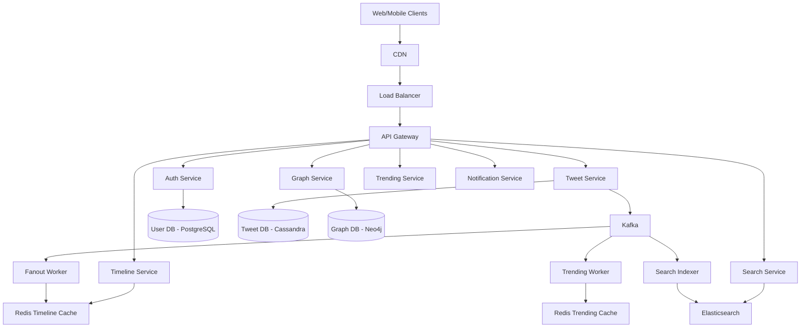
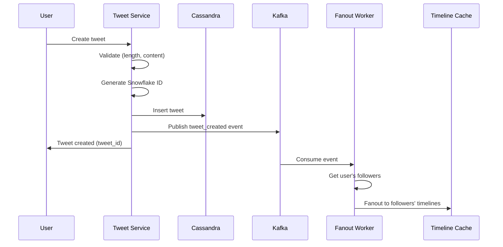
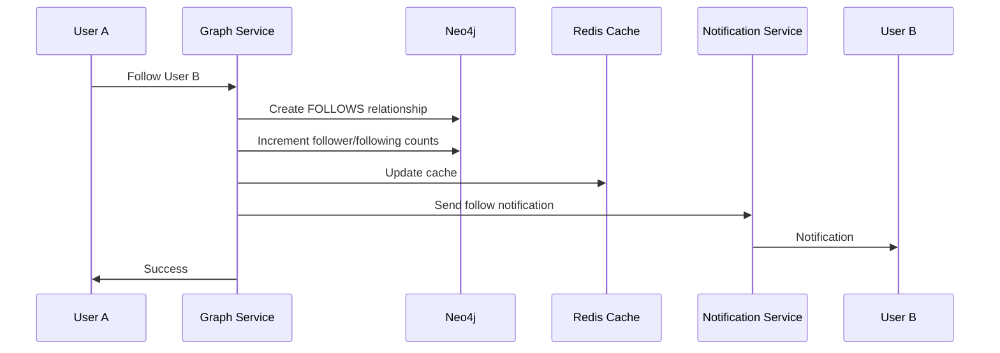

## Twitter Sistem Dizaynı

**Problemin Təsviri:**

Twitter kimi microblogging və real-time sosial media platforması dizayn etmək lazımdır. Sistem aşağıdakı əsas komponentləri dəstəkləməlidir:
- Tweet yaratma və timeline
- Follow sistemi və feed generasiyası
- Trending topics və axtarış

**Functional Requirements:**

**Əsas Funksiyalar:**
1. **Tweet Yaratma və Timeline**
   - 280 simvol məhdudiyyəti ilə tweet
   - Media attachments (şəkil, video, GIF)
   - Retweet, quote tweet
   - Thread (tweet zənciri)
   - Tweet deletion

2. **Follow Sistemi və Feed**
   - Follow/Unfollow users
   - Home timeline (following feed)
   - User timeline (user's tweets)
   - Mentions timeline
   - Real-time feed updates

3. **Trending və Axtarış**
   - Trending topics və hashtags
   - Tweet search
   - User search
   - Advanced search filters

### Non-Functional Requirements

**Performance:**
- Tweet post latency < 500ms
- Timeline load time < 1s
- 99.99% uptime availability
- Real-time feed updates < 2s

**Scalability:**
- 500 milyon users
- 200 milyon DAU
- 500 milyon tweets/day
- 100,000 tweets/second (peak)

### Capacity Estimation

**Fərziyyələr:**
- 500 milyon registered users
- 200 milyon daily active users (DAU)
- Hər user gündə 2.5 tweet yaradır
- Hər user gündə 50 tweet oxuyur
- Orta tweet ölçüsü: 300 bytes
- 10% tweet-lərdə media var
- Read:Write ratio = 20:1

**Storage:**
- Daily tweets: 200M × 2.5 = 500M tweets/day
- Tweet data: 500M × 300 bytes = 150 GB/day
- Media data: 500M × 0.1 × 1 MB = 50 TB/day
- **Total daily storage:** ~50 TB/day
- **Yearly storage:** ~18 PB/year

**QPS:**
- Tweet creation: 500M / 86400s = ~5,800 QPS
- Timeline reads: 200M × 50 / 86400s = ~115,000 QPS
- Peak tweet rate: ~100,000 QPS
- **Total QPS:** ~120,000 QPS

**Bandwidth:**
- Write: 5,800 QPS × 1 KB = ~6 MB/s
- Read: 115,000 QPS × 10 KB = ~1.15 GB/s
- **Total bandwidth:** ~1.2 GB/s

### High-Level System Architecture



### Əsas Komponentlərin Dizaynı

#### 1. Tweet Service

**Məsuliyyətlər:**
- Tweet creation
- Tweet deletion
- Retweet/Quote tweet
- Media upload handling

**Database Schema (Cassandra):**

```sql
tweets:
  - tweet_id (PK, Snowflake ID)
  - user_id (UUID)
  - content (text, max 280)
  - media_urls (list<string>)
  - retweet_count (counter)
  - like_count (counter)
  - reply_count (counter)
  - created_at (timestamp)
  - is_retweet (boolean)
  - original_tweet_id (UUID, nullable)
  - reply_to_tweet_id (UUID, nullable)

user_tweets:
  - user_id (PK)
  - created_at (CK, DESC)
  - tweet_id (Snowflake ID)
```

**Tweet Creation Flow:**



**Snowflake ID Generation:**

```
64-bit ID structure:
- 41 bits: timestamp (milliseconds)
- 10 bits: machine ID
- 12 bits: sequence number

Benefits:
- Time-sortable
- Unique across cluster
- No coordination needed
```

**API Endpoints:**
```
POST /api/v1/tweets/create
     Body: { content, media_urls, reply_to }
     Returns: { tweet_id }

DELETE /api/v1/tweets/{tweet_id}

POST /api/v1/tweets/{tweet_id}/retweet
POST /api/v1/tweets/{tweet_id}/like
POST /api/v1/tweets/{tweet_id}/reply
     Body: { content }
```

#### 2. Timeline Service

**Məsuliyyətlər:**
- Home timeline generation
- User timeline
- Timeline pagination
- Real-time updates

**Timeline Types:**

1. **Home Timeline:**
   - Tweets from followed users
   - Promoted tweets
   - Algorithmic ranking

2. **User Timeline:**
   - User's own tweets
   - Retweets
   - Chronological order

3. **Mentions Timeline:**
   - Tweets mentioning the user
   - Replies to user's tweets

**Fanout Strategies:**

**Fan-out on Write (for most users):**
```python
def fanout_tweet(tweet_id, user_id):
    # Get followers
    followers = get_followers(user_id)
    
    # Push to each follower's timeline
    for follower_id in followers:
        redis.zadd(f"timeline:{follower_id}", {
            tweet_id: timestamp
        })
        
    # Keep only recent 800 tweets
    redis.zremrangebyrank(f"timeline:{follower_id}", 0, -801)
```

**Fan-out on Read (for celebrities):**
```python
def get_home_timeline(user_id):
    # Get following list
    following = get_following(user_id)
    
    # Fetch recent tweets from each
    tweets = []
    for followed_id in following:
        if is_celebrity(followed_id):
            tweets.extend(get_recent_tweets(followed_id, limit=50))
    
    # Merge and sort
    return sorted(tweets, key=lambda t: t.created_at, reverse=True)
```

**Hybrid Approach:**
```
Normal users (< 1M followers): Fanout-on-Write
Celebrities (> 1M followers): Fanout-on-Read
Mixed timeline: Merge both results
```

**Timeline Cache (Redis):**

```
Key: timeline:home:{user_id}
Type: Sorted Set
Score: timestamp
Value: tweet_id
Size: 800 tweets
TTL: 24 hours

Key: timeline:user:{user_id}
Type: Sorted Set (user's own tweets)
```

**API Endpoints:**
```
GET /api/v1/timeline/home
    Query: count=20, max_id (cursor)
    Returns: { tweets: [], next_max_id }

GET /api/v1/timeline/user/{user_id}
    Query: count=20, max_id

GET /api/v1/timeline/mentions
    Query: count=20, max_id
```

#### 3. Graph Service

**Məsuliyyətlər:**
- Follow/Unfollow relationships
- Follower/Following counts
- Mutual follows detection
- Follow suggestions

**Database Schema (Neo4j):**

```cypher
(:User {
  user_id: UUID,
  username: string,
  display_name: string,
  follower_count: int,
  following_count: int
})

(:User)-[:FOLLOWS {
  since: timestamp
}]->(:User)
```

**Redis Cache:**

```
Key: followers:{user_id}
Type: Set
Value: follower_user_ids
TTL: 1 hour

Key: following:{user_id}
Type: Set
Value: following_user_ids
TTL: 1 hour

Key: follower_count:{user_id}
Type: String
Value: count
TTL: 10 minutes
```

**Follow Flow:**



**API Endpoints:**
```
POST /api/v1/users/{user_id}/follow
DELETE /api/v1/users/{user_id}/unfollow

GET /api/v1/users/{user_id}/followers
    Query: cursor, count
GET /api/v1/users/{user_id}/following
    Query: cursor, count

GET /api/v1/users/{user_id}/suggestions
```

#### 4. Search Service

**Məsuliyyətlər:**
- Tweet search
- User search
- Hashtag search
- Advanced filters

**Elasticsearch Implementation:**

```javascript
// Tweet index
{
  tweet_id: string,
  user_id: string,
  username: string,
  content: text,
  hashtags: array,
  mentions: array,
  created_at: date,
  like_count: integer,
  retweet_count: integer,
  language: string
}

// User index
{
  user_id: string,
  username: string,
  display_name: text,
  bio: text,
  follower_count: integer,
  verified: boolean
}
```

**Search Query DSL:**

```json
{
  "query": {
    "bool": {
      "must": [
        { "match": { "content": "search term" } }
      ],
      "filter": [
        { "term": { "language": "en" } },
        { "range": { "created_at": { "gte": "2024-01-01" } } }
      ]
    }
  },
  "sort": [
    { "created_at": "desc" }
  ]
}
```

**API Endpoints:**
```
GET /api/v1/search/tweets
    Query: q, lang, since, until, from_user

GET /api/v1/search/users
    Query: q

GET /api/v1/search/hashtags
    Query: q
```

#### 5. Trending Service

**Məsuliyyətlər:**
- Trending topics detection
- Trending hashtags
- Regional trends
- Trend scoring

**Trending Algorithm:**

```
trend_score = (tweet_count × recency_boost × velocity_boost) / decay_factor

Where:
- tweet_count: number of tweets with hashtag
- recency_boost: higher for recent activity
- velocity_boost: rate of increase in mentions
- decay_factor: reduces score over time
```

**Implementation:**

```python
def calculate_trending(hashtag, region):
    # Time windows: 1h, 6h, 24h
    count_1h = get_count(hashtag, hours=1)
    count_6h = get_count(hashtag, hours=6)
    count_24h = get_count(hashtag, hours=24)
    
    # Velocity (growth rate)
    velocity = (count_1h - count_6h) / 6
    
    # Recency boost
    recency = 1.0 / (hours_since_first_tweet + 1)
    
    # Score
    score = count_1h * velocity * recency
    
    return score
```

**Redis Trending Cache:**

```
Key: trending:{region}
Type: Sorted Set
Score: trend_score
Value: hashtag
Size: Top 50
TTL: 5 minutes

Key: hashtag_count:{hashtag}:{time_bucket}
Type: String
Value: count
TTL: 24 hours
```

**API Endpoints:**
```
GET /api/v1/trends/place
    Query: woeid (location ID)
    Returns: { trends: [{ name, tweet_volume, url }] }

GET /api/v1/trends/available
    Returns: list of locations with trends
```

#### 6. Notification Service

**Məsuliyyətlər:**
- Push notifications
- Email notifications
- In-app notifications
- Notification preferences

**Notification Types:**
- New follower
- Tweet liked
- Tweet retweeted
- Mentioned in tweet
- Reply to tweet
- Direct message

**Database Schema (Cassandra):**

```sql
notifications:
  - notification_id (PK, UUID)
  - user_id (UUID)
  - type (follow/like/retweet/mention/reply)
  - actor_id (UUID)
  - target_id (UUID)
  - is_read (boolean)
  - created_at (timestamp)

user_notifications:
  - user_id (PK)
  - created_at (CK, DESC)
  - notification_id (UUID)
```

**API Endpoints:**
```
GET /api/v1/notifications
    Query: count, since_id

PUT /api/v1/notifications/mark_read
    Body: { notification_ids }

GET /api/v1/notifications/unread_count
```

### Database Sharding Strategy

**User-based Sharding:**
- Shard key: `user_id`
- Tweets, timeline, followers on same shard
- Consistent hashing

**Tweet-based Sharding:**
- Shard key: `tweet_id` (time-based)
- Recent tweets on hot shards
- Old tweets archived

### Caching Strategy

**Multi-Level Cache:**

1. **CDN Cache:**
   - Media files
   - Static assets
   - TTL: 30 days

2. **Redis Cache:**
   - Timelines (TTL: 24h)
   - Trending hashtags (TTL: 5min)
   - User profiles (TTL: 1h)
   - Follower counts (TTL: 10min)

3. **Application Cache:**
   - User session
   - Configuration

### Real-time Updates

**WebSocket Implementation:**

```
Connection: wss://stream.twitter.com/v1/timeline
Authentication: Bearer JWT

Server pushes:
- New tweets in timeline
- New followers
- New notifications
- Trending topics update
```

**Event Stream:**

```javascript
{
  type: "new_tweet",
  tweet: {
    tweet_id: "...",
    user: {...},
    content: "...",
    created_at: "..."
  }
}
```

### Rate Limiting

**Per-User Limits:**
```
Tweet creation: 300 tweets / 3 hours
Follow: 400 / day
Retweet: 600 / day
Like: 1000 / day
API calls: 180 requests / 15 minutes
```

**Implementation (Token Bucket):**

```python
def check_rate_limit(user_id, action):
    key = f"rate_limit:{user_id}:{action}"
    
    # Get current token count
    tokens = redis.get(key) or MAX_TOKENS
    
    if tokens > 0:
        redis.decr(key)
        return True
    else:
        return False  # Rate limited
    
    # Refill tokens periodically
    redis.expire(key, REFILL_INTERVAL)
```

### Failure Handling

**Tweet Creation Failures:**
- Retry with exponential backoff
- Queue for later processing
- Idempotency key per tweet

**Timeline Fanout Failures:**
- Async processing with Kafka
- Dead letter queue
- Fallback to fanout-on-read

**Search Indexing Failures:**
- Retry queue
- Eventual consistency acceptable
- Manual reindex if needed

### Monitoring və Observability

**Key Metrics:**
- Tweet creation rate (TPS)
- Timeline load latency
- Search query latency
- Fanout worker lag
- Cache hit rate
- API error rate

**Alerts:**
- Tweet creation latency > 1s
- Timeline load time > 2s
- Fanout lag > 5 minutes
- Cache hit rate < 85%

### Security Considerations

- **Authentication:** OAuth 2.0
- **Rate limiting:** Prevent spam və abuse
- **Content moderation:** Filter harmful content
- **DDoS protection:** CloudFlare
- **Encryption:** TLS for all traffic
- **Privacy:** Tweet visibility controls
- **Abuse detection:** ML-based spam detection

### Əlavə Təkmilləşdirmələr

Sistemə əlavə edilə biləcək feature-lər:
- **Spaces:** Live audio conversations
- **Fleets:** Temporary stories (24h)
- **Communities:** Topic-based groups
- **Bookmarks:** Save tweets for later
- **Lists:** Curated timeline feeds
- **Moments:** Curated tweet collections
- **Polls:** Interactive voting
- **Twitter Blue:** Premium subscription
- **Ad Platform:** Promoted tweets
- **Analytics:** Tweet performance insights
- **Verification:** Blue checkmark system
- **Thread Reader:** Improved thread viewing
