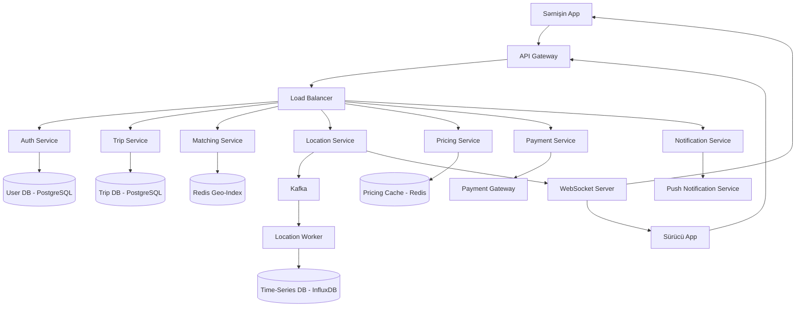
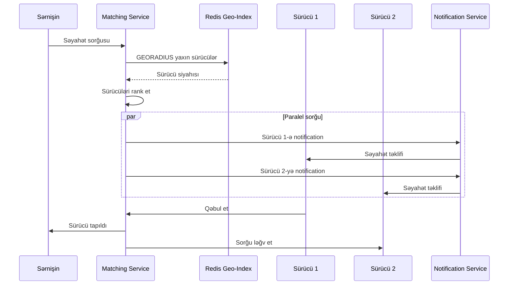
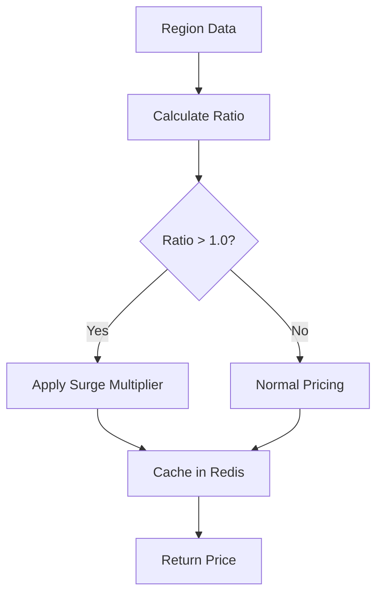
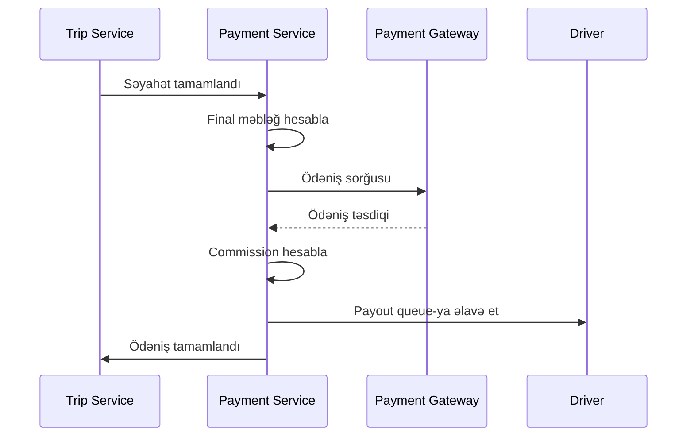

## Uber Sistem Dizaynı

**Problemin Təsviri:**

Uber kimi ride-sharing (taksi çağırma) servisi dizayn etmək lazımdır. Sistem aşağıdakı əsas komponentləri dəstəkləməlidir:
- Sürücü və sərnişin matching (uyğunlaşdırma)
- Real-time lokasiya izləmə
- Dinamik qiymətləndirmə (surge pricing)
- Ödəniş prosesləri

**Functional Requirements:**

**Əsas Funksiyalar:**
1. **İstifadəçi İdarəetməsi**
   - Sərnişin və sürücü qeydiyyatı
   - İstifadəçi profili və authentication
   - Sürücü verifikasiyası və sənədləri

2. **Səyahət Matching**
   - Sərnişin səyahət sorğusu (pickup və destination)
   - Yaxınlıqdakı mövcud sürücülərin tapılması
   - Sürücü-sərnişin uyğunlaşdırması
   - Çoxsaylı sürücüyə paralel sorğu

3. **Real-time Lokasiya İzləmə**
   - Sürücünün cari lokasiyasının izlənməsi
   - Sərnişinə real-time yeniləmələr
   - ETA (Estimated Time of Arrival) hesablama
   - Naviqasiya və marşrut göstərilməsi

4. **Dinamik Qiymətləndirmə**
   - Tələb və təklif əsaslı qiymət hesablama
   - Surge pricing mexanizmi
   - Region və vaxt əsaslı qiymət dəyişikliyi
   - Qiymət təxmini

5. **Ödəniş Sistemi**
   - Ödəniş metodlarının idarəsi
   - Avtomatik ödəniş prosesləri
   - Sürücüyə payout
   - Səyahət tarixçəsi və qəbzlər

### Non-Functional Requirements

**Performance:**
- Matching latency < 500ms
- Lokasiya update latency < 1s
- 99.99% uptime availability
- Real-time location tracking

**Scalability:**
- Milyonlarla concurrent user
- Geniş coğrafi əhatə
- Şəhər və region səviyyəsində sharding
- Horizontal scaling qabiliyyəti

### Capacity Estimation

**Fərziyyələr:**
- 50 milyon active user
- 10 milyon daily active user (DAU)
- 5 milyon active driver
- 2 milyon daily active driver
- Hər sərnişin gündə orta 2 səyahət
- Orta səyahət müddəti: 20 dəqiqə
- Sürücü lokasiya update: hər 5 saniyə

**Storage:**
- User data: 50M × 2KB = 100GB
- Driver data: 5M × 5KB = 25GB
- Trip history: 20M trip/gün × 2KB × 365 gün = ~15TB/il
- Location data (time-series): ~100TB/il

**Bandwidth:**
- Location updates: 2M driver × 12 update/dəqiqə = 24M update/dəqiqə = 400K update/saniyə
- Hər update ~500 bytes: 400K × 500B = 200MB/s

**QPS (Queries Per Second):**
- Trip requests: ~20,000 request/saniyə (peak)
- Location updates: ~400,000 update/saniyə
- Map/routing API: ~50,000 QPS

### High-Level System Architecture



### Əsas Komponentlərin Dizaynı

#### 1. Authentication Service

**Məsuliyyətlər:**
- İstifadəçi authentication (JWT)
- Session management
- Role-based access (sərnişin vs sürücü)
- Device tracking

**Database Schema (PostgreSQL):**

```sql
users:
  - user_id (PK, UUID)
  - phone_number (UK)
  - email
  - name
  - password_hash
  - user_type (rider/driver/both)
  - status (active/suspended)
  - created_at
  - updated_at

drivers:
  - driver_id (PK, UUID, FK → users)
  - license_number
  - vehicle_type
  - vehicle_model
  - license_plate
  - rating (decimal)
  - total_trips
  - status (available/busy/offline)
  - created_at

riders:
  - rider_id (PK, UUID, FK → users)
  - rating (decimal)
  - total_trips
  - default_payment_method_id
  - created_at
```

**API Endpoints:**
```
POST /api/v1/auth/register
POST /api/v1/auth/login
POST /api/v1/auth/logout
GET  /api/v1/users/{user_id}
PUT  /api/v1/users/{user_id}
```

#### 2. Trip Service

**Məsuliyyətlər:**
- Səyahət sorğularının idarəsi
- Səyahət statusunun izlənməsi
- Səyahət tarixçəsi
- Səyahət detallarının saxlanması

**Database Schema:**

```sql
trips:
  - trip_id (PK, UUID)
  - rider_id (FK → riders)
  - driver_id (FK → drivers)
  - status (requesting/accepted/in_progress/completed/cancelled)
  - pickup_lat
  - pickup_lng
  - dropoff_lat
  - dropoff_lng
  - pickup_address
  - dropoff_address
  - estimated_price
  - final_price
  - estimated_distance_km
  - estimated_duration_min
  - surge_multiplier
  - requested_at
  - accepted_at
  - started_at
  - completed_at
  - cancelled_at
  - cancelled_by
  - rider_rating
  - driver_rating
```

**İndekslər:**
- `trips(rider_id, requested_at DESC)`
- `trips(driver_id, requested_at DESC)`
- `trips(status, requested_at DESC)`

**API Endpoints:**
```
POST /api/v1/trips/request
POST /api/v1/trips/{trip_id}/accept
POST /api/v1/trips/{trip_id}/start
POST /api/v1/trips/{trip_id}/complete
POST /api/v1/trips/{trip_id}/cancel
GET  /api/v1/trips/{trip_id}
GET  /api/v1/trips/history
POST /api/v1/trips/{trip_id}/rate
```

#### 3. Matching Service

**Məsuliyyətlər:**
- Yaxın sürücülərin tapılması
- Optimal sürücü seçimi
- Çoxsaylı sürücüyə paralel sorğu
- Matching alqoritminin icrası

**Matching Alqoritmi:**

1. **Geo-spatial Search:**
   - Redis Geo-Index istifadə edilir
   - `GEORADIUS` komutu ilə radius əhatəsində sürücülər tapılır
   - İlkin radius: 5 km, genişləndirilə bilər

2. **Sürücü Filtrasiyası:**
   - Status: available
   - Vehicle type uyğunluğu
   - Rating threshold (məs. > 4.0)

3. **Ranking:**
   - Məsafə (ən yaxın)
   - Rating (ən yüksək)
   - ETA (ən qısa vaxt)
   - Acceptance rate

4. **Parallel Dispatch:**
   - Top 5 sürücüyə eyni vaxtda sorğu
   - İlk qəbul edən sürücü match olur
   - 30 saniyə timeout
   - Timeout olarsa, radius genişləndirilir və yenidən cəhd

**Redis Geo-Index:**
```
GEOADD drivers:available {lng} {lat} {driver_id}
GEORADIUS drivers:available {lng} {lat} 5 km WITHDIST
```

**Matching Flow:**



#### 4. Location Service

**Məsuliyyətlər:**
- Sürücü lokasiyalarının qəbulu
- Real-time lokasiya yayımı
- Lokasiya tarixçəsinin saxlanması
- Geo-index yeniləmələri

**Location Tracking Flow:**

1. **Sürücü lokasiya göndərir:**
   - Hər 5 saniyədə bir GPS koordinatları
   - WebSocket və ya HTTP POST
   - Batch update (çoxsaylı nöqtə)

2. **Location Service:**
   - Kafka-ya event yazır
   - Redis geo-index yeniləyir
   - WebSocket vasitəsilə sərnişinə broadcast edir

3. **Storage:**
   - Redis: aktiv sürücülərin cari lokasiyası (TTL: 30s)
   - Time-series DB: lokasiya tarixçəsi
   - S3: arxiv data (30+ gün)

**Kafka Event Schema:**

```json
{
  "driver_id": "uuid",
  "location": {
    "lat": 40.7128,
    "lng": -74.0060
  },
  "heading": 180,
  "speed": 45,
  "timestamp": "2025-10-30T17:53:00Z",
  "status": "available"
}
```

**WebSocket Protocol:**
```
// Sürücü update göndərir
{
  "type": "location_update",
  "driver_id": "...",
  "location": {...}
}

// Sərnişin real-time update alır
{
  "type": "driver_location",
  "trip_id": "...",
  "location": {...},
  "eta_minutes": 5
}
```

**Location Worker:**
- Kafka-dan event-ləri consume edir
- Time-series DB-yə yazır
- Aggregate metrics hesablayır

#### 5. Pricing Service

**Məsuliyyətlər:**
- Əsas qiymət hesablama
- Surge pricing tətbiqi
- Region-specific qiymətləndirmə
- Discount və promo kodlar

**Qiymət Hesablama Formulu:**

```
base_price = base_fare + (distance_km × per_km_rate) + (duration_min × per_minute_rate)
surge_multiplier = calculate_surge(region, time)
final_price = base_price × surge_multiplier × (1 - discount_rate)
```

**Surge Pricing Mexanizmi:**

1. **Supply/Demand Nisbəti:**
   ```
   surge_ratio = pending_requests / available_drivers
   ```

2. **Surge Multiplier:**
   - surge_ratio < 1.0: multiplier = 1.0x (normal)
   - surge_ratio 1.0-2.0: multiplier = 1.5x
   - surge_ratio 2.0-3.0: multiplier = 2.0x
   - surge_ratio > 3.0: multiplier = 3.0x (max)

3. **Region və Time Window:**
   - Şəhər geo-hash region-lara bölünür
   - Hər region üçün 1 dəqiqəlik window
   - Redis-də cache (30 saniyə TTL)

**Surge Calculation Flow:**



**Cache Strategy:**
```
Key: pricing:surge:{region_id}:{time_bucket}
Value: { multiplier: 1.5, updated_at: timestamp }
TTL: 30 seconds
```

**API Endpoints:**
```
POST /api/v1/pricing/estimate
     Body: { pickup_location, dropoff_location }
     Returns: { estimated_price, surge_multiplier, breakdown }

GET  /api/v1/pricing/surge/{region_id}
     Returns: { current_surge, active_drivers, pending_requests }
```

#### 6. Payment Service

**Məsuliyyətlər:**
- Ödəniş metodlarının idarəsi
- Səyahət ödənişlərinin prosesi
- Sürücüyə payout
- Refund idarəetməsi

**Database Schema:**

```sql
payment_methods:
  - payment_method_id (PK, UUID)
  - user_id (FK → users)
  - type (credit_card/debit_card/wallet)
  - last_four
  - token (encrypted)
  - is_default
  - status (active/expired)
  - created_at

payments:
  - payment_id (PK, UUID)
  - trip_id (FK → trips)
  - rider_id (FK → riders)
  - driver_id (FK → drivers)
  - amount
  - currency
  - status (pending/completed/failed/refunded)
  - payment_method_id
  - transaction_id
  - company_commission
  - driver_payout
  - processing_fee
  - created_at
  - completed_at
```

**Payment Flow:**



**Payout Strategy:**
- Weekly batch payout
- Minimum threshold (məs. $50)
- Async processing
- Retry mechanism (exponential backoff)

### Database Sharding Strategy

**User Sharding:**
- Shard key: `user_id`
- Consistent hashing
- 16 shard (başlanğıc)

**Trip Sharding:**
- Shard key: `rider_id`
- Time-based partitioning (hər ay)
- Hot data: son 30 gün SSD-də
- Cold data: 30+ gün HDD-də

**Location Sharding:**
- Geo-hash əsaslı sharding
- Region per shard
- Popular region-lar replicate olunur

### Caching Strategy

**Multi-Level Cache:**

1. **Client-side:**
   - User profile
   - Saved locations
   - Recent trips

2. **Redis Cache:**
   - Active driver locations (TTL: 30s)
   - Surge pricing (TTL: 30s)
   - User sessions (TTL: 24h)
   - Popular routes ETA (TTL: 5min)

3. **CDN:**
   - Static assets
   - Map tiles

### Failure Handling

**Matching Failures:**
- Timeout: 30 saniyə
- Retry: radius genişləndir (5km → 10km → 15km)
- Fallback: waiting queue

**Payment Failures:**
- Retry: 3 dəfə (exponential backoff)
- Alternative payment method
- Manual review queue

**Location Update Failures:**
- Client-side buffering
- Batch retry
- Last known location fallback

**Service Degradation:**
- Circuit breaker pattern
- Fallback to cached data
- Disable non-critical features

### Monitoring və Observability

**Key Metrics:**
- Matching success rate
- Average matching time
- ETA accuracy
- Surge pricing accuracy
- Payment success rate
- Location update latency
- Active drivers per region
- Completed trips per hour

**Alerts:**
- Matching time > 30s
- Payment failure rate > 5%
- Location service latency > 2s
- Available drivers < threshold

### Security Considerations

- JWT token authentication
- HTTPS/TLS encryption
- Payment data PCI-DSS compliance
- Location data privacy
- Rate limiting (DoS protection)
- Driver background check
- Fraud detection system

### Əlavə Təkmilləşdirmələr

Sistemə əlavə edilə biləcək feature-lər:
- **Ride Pooling:** Çoxsaylı sərnişin eyni istiqamətdə
- **Scheduled Rides:** Gələcək vaxt üçün səyahət bronlaşdırma
- **Favorite Drivers:** Sevimli sürücüləri yadda saxlama
- **Route Optimization:** Machine learning ilə optimal marşrut
- **Driver Incentives:** Bonus və promotion sistemi
- **Multi-stop Trips:** Bir neçə dayanacaq nöqtəsi
- **Accessibility Features:** Xüsusi ehtiyaclar üçün nəqliyyat
- **Corporate Accounts:** Şirkət hesabları və billing
