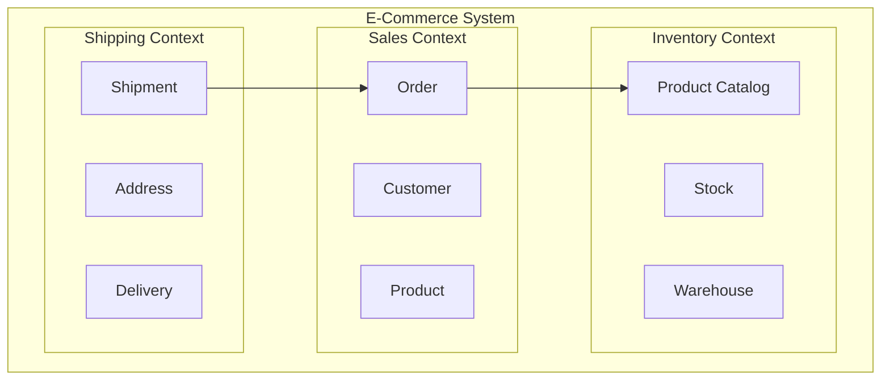
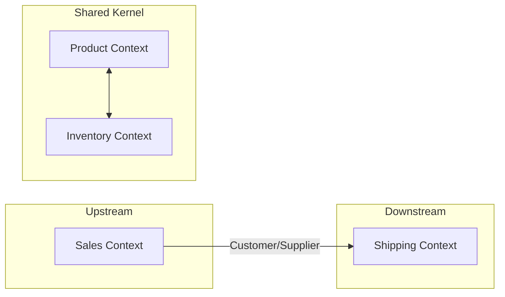
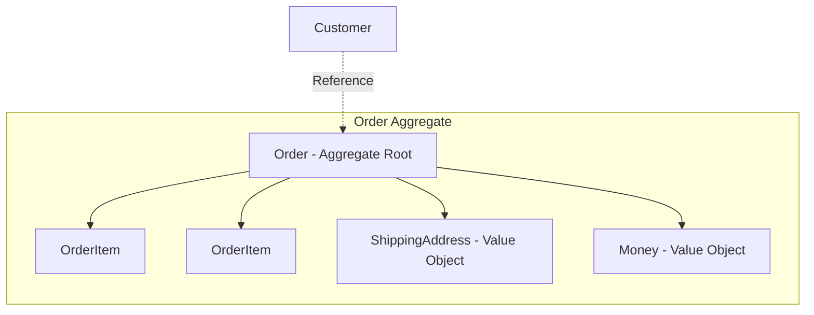
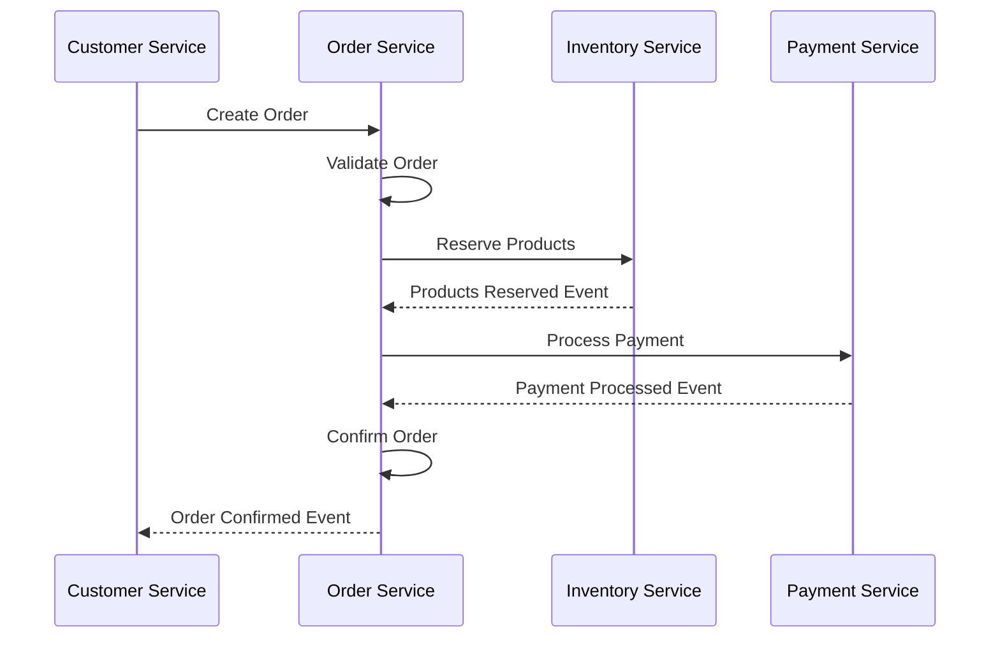

# Domain-Driven Design (DDD)

Domain-Driven Design (DDD), Eric Evans tərəfindən 2003-cü ildə təqdim edilmiş proqram təminatı dizayn yanaşmasıdır. Bu yanaşma mürəkkəb proqram təminatının dizaynında domain mütəxəssislərinin biliyindən istifadə edərək, real biznes problemlərini həll etməyə yönəlmişdir.

## DDD-nin Əsas Prinsipləri

### 1. Domain Focused
DDD, texniki detallar üzərində deyil, biznes domeni və onun qaydaları üzərində fokuslanır.

### 2. Domain Experts ilə Əməkdaşlıq
Proqramçılar və biznes mütəxəssisləri arasında sıx əməkdaşlıq vacibdir.

### 3. Model-Driven Design
Kod və domain modeli arasında sıx əlaqə olmalıdır.

## DDD-nin Əsas Anlayışları

### Domain (Domen)
Biznes probleminin həll edildiyi sahə. Məsələn, e-ticarət sistemində "Sifarişlər", "Ödənişlər", "Müştərilər" kimi domenlər ola bilər.

### Domain Model
Domain-in strukturunu və davranışını təmsil edən konseptual model.

### Ubiquitous Language
Domain mütəxəssisləri və proqramçıların eyni terminologiyadan istifadə etdiyi ortaq dil.

### Bounded Context
Domain model-in tətbiq olunduğu məhdud kontekst. Hər Bounded Context daxilində Ubiquitous Language tutarlı olmalıdır.



## Strategic Design

### Context Mapping
Müxtəlif Bounded Context-lər arasındaki əlaqələri müəyyən etmək.

#### Context Map Nümunələri:



### Partnership
İki komanda bir-birinin uğuru üçün məsuliyyət daşıyır.

### Shared Kernel
İki kontekst arasında paylaşılan kod və ya model hissələri.

### Customer/Supplier
Upstream kontekst downstream kontekstə xidmət göstərir.

### Conformist
Downstream kontekst upstream kontekstə uyğunlaşır.

### Anticorruption Layer
Xarici sistemlərdən gələn məlumatları öz domain modelinə çevirən qat.

## Tactical Design

### Entity
Unikal identity-si olan obyektlər.

```javascript
class Customer {
    constructor(customerId, name, email) {
        this.customerId = customerId; // Identity
        this.name = name;
        this.email = email;
    }
    
    changeEmail(newEmail) {
        if (this.isValidEmail(newEmail)) {
            this.email = newEmail;
        }
    }
    
    isValidEmail(email) {
        // Email validation logic
        return email.includes('@');
    }
}
```

### Value Object
Identity-si olmayan, yalnız dəyərləri ilə müəyyən olunan obyektlər.

```javascript
class Money {
    constructor(amount, currency) {
        this.amount = amount;
        this.currency = currency;
    }
    
    add(other) {
        if (this.currency !== other.currency) {
            throw new Error('Cannot add different currencies');
        }
        return new Money(this.amount + other.amount, this.currency);
    }
    
    equals(other) {
        return this.amount === other.amount && 
               this.currency === other.currency;
    }
}
```

### Aggregate
Bir qrup entity və value object-in birlikdə idarə edildiyi struktur.



### Aggregate Root
Aggregate-ə xaricdən girişin tək nöqtəsi.

### Repository
Aggregate-lərin saxlanması və əldə edilməsi üçün interfeys.

```javascript
class OrderRepository {
    async save(order) {
        // Save order to database
    }
    
    async findById(orderId) {
        // Find order by ID
    }
    
    async findByCustomerId(customerId) {
        // Find orders by customer
    }
}
```

### Domain Service
Entity və ya Value Object-lərə aid olmayan biznes məntiqini saxlayan servislər.

```javascript
class PricingService {
    calculateDiscount(customer, order) {
        if (customer.isVip()) {
            return order.total.multiply(0.1);
        }
        return new Money(0, order.total.currency);
    }
}
```

## DDD və Mikroservislər

### Bounded Context = Microservice
Hər Bounded Context ayrı mikroservis ola bilər.

### Aggregate Boundaries
Mikroservis sərhədlərini müəyyən etməkdə köməkçi olur.

### Event-Driven Communication
Domain Events vasitəsilə mikroservislər arasında kommunikasiya.



## DDD Tətbiqi Addımları

### 1. Domain Kəşf etmək
- Biznes mütəxəssisləri ilə event storming sessiyaları
- Domain-i anlayış və təhlil etmək
- Əsas businessprocess-ləri müəyyən etmək

### 2. Ubiquitous Language Yaratmaq
- Terminologiyanı razılaşdırmaq
- Sözlük hazırlamaq
- Kod və sənədlərdə eyni dili istifadə etmək

### 3. Bounded Context-ləri Müəyyən etmək
- Context Map çəkmək
- Kontekst sərhədlərini təyin etmək
- Kontekstlər arası əlaqələri müəyyən etmək

### 4. Tactical Design Elements Tətbiq etmek
- Entity və Value Object-ləri modelləşdirmək
- Aggregate-ləri dizayn etmək
- Repository və Service-ləri yaratmaq

### 5. Arquitektur Qərarlar Vermək
- Hər bounded context üçün texnologiya seçimi
- Məlumat bazası strategiyası
- Komunikasiya protokolları

## DDD-nin Faydaları

### Biznes və Texniki Komandalar Arasında Körpü
- Ortaq dil və anlayış
- Daha yaxşı əməkdaşlıq
- Biznes ehtiyaclarına uyğun həllər

### Mürəkkəbliyin İdarə Edilməsi
- Domain məntiqinin təşkili
- Kodun başa düşülən olması
- Texniki borcun azaldılması

### Mikroservis Sərhədlərinin Müəyyən Edilməsi
- Natural service boundaries
- Düzgün məlumat modelləşdirilməsi
- Servis autonomiyası

## Çətinliklər və Məhdudiyyətlər

### Learning Curve
DDD konseptlərini öyrənmək vaxt tələb edir.

### Over-Engineering Riski
Sadə problemlər üçün həddindən artıq mürəkkəb həllər.

### Domain Expert Dependency
Domain mütəxəssislərinin daimi iştirakı tələb olunur.

### Initial Investment
Başlanğıcda daha çox vaxt və səy tələb edir.

## Praktiki Tövsiyələr

### 1. Kiçik Başlamaq
Sadə domain-dən başlayaraq təcrübə qazanmaq.

### 2. Event Storming İstifadə Etmək
Domain-i kəşf etmək üçün fəal üsullar tətbiq etmək.

### 3. Ubiquitous Language-i Sənədləşdirmek
Terminologiyanı yazılı şəkildə saxlamaq.

### 4. Context Map-ləri Yeniləmek
Sistem inkişaf etdikcə context sərhədlərini yeniləmək.

### 5. Domain Logic-i Qorumaq
Domain məntiqini infrastructure layer-dən ayrı saxlamaq.

## Nəticə

Domain-Driven Design mikroservis arxitekturasında çox faydalı yanaşmadır. Bu, biznes domeninin dəqiq modelləşdirilməsi və mikroservis sərhədlərinin düzgün müəyyən edilməsi imkanı verir. DDD-nin düzgün tətbiqi sistemin uzunmüddətli inkişafı və saxlanması üçün möhkəm baza yaradır.