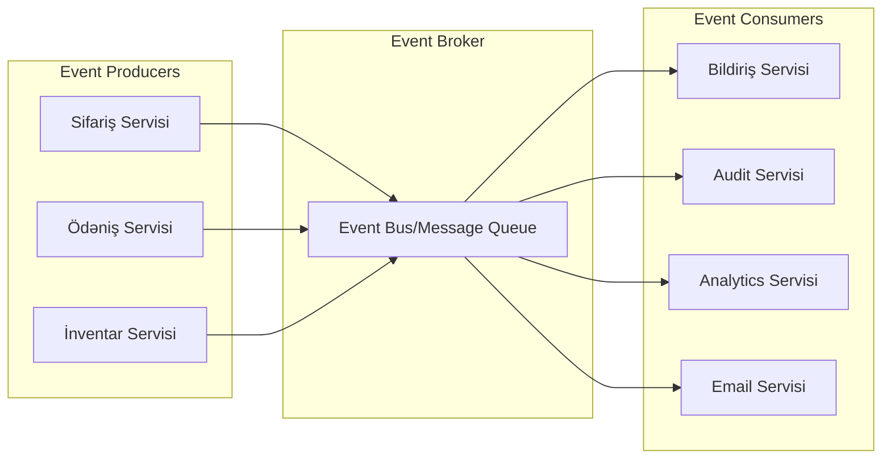
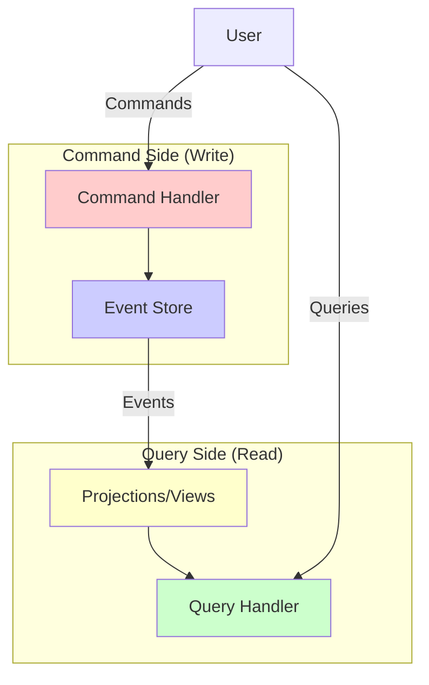

# Event-Driven Arxitektura
Hadisə Əsaslı Arxitektura (Event-Driven Architecture, EDA), sistemin komponentləri arasında ünsiyyətin hadisələr vasitəsilə həyata keçirildiyi bir proqram dizayn paradiqmasıdır. Bu arxitekturada, bir komponent (hadisə yaradıcısı) hadisə yaradır və digər komponentlər (hadisə istehlakçıları) bu hadisələrə reaksiya verir.

## Əsas Anlayışlar

### Hadisələr (Events)

Hadisə, sistemdə baş verən əhəmiyyətli bir dəyişikliyi təmsil edən bir məlumat paketidir. Hadisələr adətən:

- Keçmişdə baş vermiş bir şeyi təsvir edir (məsələn, "SifarişYaradıldı", "ÖdənişQəbulEdildi")
- İmmutabildir (dəyişdirilə bilməz)
- Zaman damğası və unikal identifikator daşıyır
- Hadisə ilə əlaqəli məlumatları özündə saxlayır

Nümunə:
```json
{
  "eventId": "e-12345",
  "eventType": "SifarişYaradıldı",
  "timestamp": "2023-07-08T12:30:45Z",
  "data": {
    "sifarişId": "ord-789",
    "müştəriId": "cust-456",
    "məbləğ": 150.75,
    "məhsullar": [
      {"id": "prod-101", "ad": "Laptop", "qiymət": 120.50, "miqdar": 1},
      {"id": "prod-205", "ad": "Mouse", "qiymət": 30.25, "miqdar": 1}
    ]
  }
}
```

### Hadisə Yaradıcıları və İstehlakçıları (Producers and Consumers)

- **Hadisə Yaradıcısı (Producer)**: Hadisələri yaradan və yayan komponentdir. Yaradıcı, hadisəni yaratdıqdan sonra onun nə olacağı ilə maraqlanmır.
- **Hadisə İstehlakçısı (Consumer)**: Hadisələri qəbul edən və onlara reaksiya verən komponentdir. Bir hadisənin birdən çox istehlakçısı ola bilər.

Bu ayrılma, komponentlər arasında zəif əlaqəni (loose coupling) təmin edir - yaradıcılar istehlakçıları tanımır və əksinə.

### Hadisə Brokeri (Event Broker)

Hadisə brokeri, yaradıcılar və istehlakçılar arasında vasitəçi rolunu oynayır. Populyar hadisə brokerlərinə aşağıdakılar daxildir:

- Apache Kafka
- RabbitMQ
- Amazon SNS/SQS
- Azure Event Hub
- Google Pub/Sub



## Hadisə Mənbəyi (Event Sourcing)

Hadisə mənbəyi, sistemin vəziyyətini dəyişikliklərin ardıcıl jurnalı kimi saxlayan bir yanaşmadır. Əsas prinsiplər:

1. **Dəyişikliklər hadisə kimi saxlanılır**: Sistemin vəziyyətini dəyişdirən hər əməliyyat bir hadisə kimi qeyd olunur
2. **Hadisələr immutabildir**: Bir dəfə yazıldıqdan sonra hadisələr dəyişdirilmir
3. **Cari vəziyyət hadisələrdən yenidən qurulur**: Sistemin cari vəziyyəti bütün hadisələri ardıcıl tətbiq etməklə əldə edilir

### Üstünlükləri:

- **Tam audit izi**: Sistemdə baş verən hər dəyişiklik qeyd olunur
- **Temporal sorğular**: Sistemin keçmiş vəziyyətini yenidən qurmaq mümkündür
- **Debugging imkanları**: Problemləri araşdırmaq üçün tam tarixçə mövcuddur
- **Hadisə yenidən oynatma (Event Replay)**: Sistemin vəziyyətini yenidən qurmaq və ya yeni proyeksiyalar yaratmaq üçün hadisələri yenidən oynatmaq mümkündür

### Çətinlikləri:

- **Mürəkkəblik**: Ənənəvi CRUD əməliyyatlarından daha mürəkkəbdir
- **Hadisə sxemasının təkamülü**: Hadisə formatının dəyişməsi çətin ola bilər
- **Performans**: Böyük hadisə jurnallarını yenidən oynatmaq resurs tələb edə bilər

## Komanda və Sorğu Məsuliyyətinin Ayrılması (CQRS)

Hadisə əsaslı sistemlərdə tez-tez istifadə olunan CQRS (Command Query Responsibility Segregation) modeli, yazma (komanda) və oxuma (sorğu) əməliyyatlarını ayırır:

- **Komanda tərəfi**: Hadisələri yaradır və hadisə jurnalına yazır
- **Sorğu tərəfi**: Hadisələrdən proyeksiyalar (materiallaşdırılmış görünüşlər) yaradır və oxuma əməliyyatları üçün istifadə edir

Bu ayrılma, hər bir tərəfin öz ehtiyaclarına uyğun optimallaşdırılmasına imkan verir.



## Mikroservislərdə Hadisə Əsaslı Arxitekturanın Üstünlükləri

- **Zəif əlaqə (Loose coupling)**: Servislər bir-birini birbaşa çağırmır, hadisələr vasitəsilə ünsiyyət qurur
- **Asenkron kommunikasiya**: Servislər eyni zamanda işləməli deyil, bu da daha yaxşı dayanıqlılıq təmin edir
- **Miqyaslanma**: Servislər müstəqil miqyaslana bilər
- **Dayanıqlılıq**: Bir servisin nasazlığı digərlərinə təsir etmir
- **Genişlənə bilən**: Yeni istehlakçılar mövcud sistemə təsir etmədən əlavə edilə bilər

## Hadisə Əsaslı Arxitekturanın Çətinlikləri

- **Eventual Consistency**: Sistem müvəqqəti olaraq qeyri-ardıcıl vəziyyətdə ola bilər
- **Debugging çətinliyi**: Asenkron hadisə axınlarını izləmək çətin ola bilər
- **İdempotentlik**: İstehlakçılar eyni hadisəni birdən çox dəfə ala bilər və buna hazır olmalıdır
- **Hadisə sıralaması**: Hadisələrin düzgün sırada çatdırılmasını təmin etmək çətin ola bilər

## Nümunə Tətbiq Ssenarilərı

1. **E-ticarət sistemi**:
   - Hadisələr: SifarişYaradıldı, ÖdənişQəbulEdildi, MəhsulGöndərildi
   - Servislər: Sifariş, Ödəniş, İnventar, Çatdırılma

2. **Maliyyə sistemi**:
   - Hadisələr: ƏməliyyatBaşladıldı, VəsaitÇıxarıldı, VəsaitƏlavəEdildi, ƏməliyyatTamamlandı
   - Servislər: Hesab, Ödəniş, Audit, Bildiriş

3. **IoT sistemi**:
   - Hadisələr: SensorMəlumatıAlındı, HəddAşıldı, CihazVəziyyətiDəyişdi
   - Servislər: Cihaz İdarəetmə, Analitika, Bildiriş, Avtomatlaşdırma

