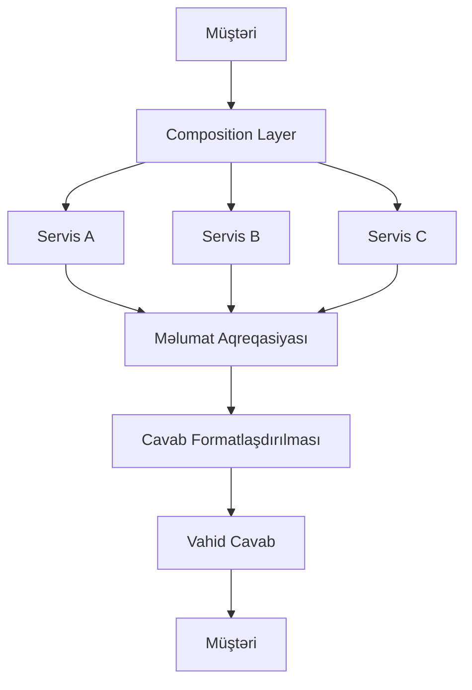

# API Composition Nədir?

API Composition Pattern bir neçə mikroservisin cavablarını tək API endpoint-də birləşdirən nümunədir. Mikroservislər arxitekturasında hər bir servis müəyyən funksionallığı idarə edir və öz API-sini təqdim edir. Müştərilər tez-tez bir neçə servisdən məlumata ehtiyac duyurlar ki, bu da çoxlu şəbəkə çağırışları səbəbindən mürəkkəblik və performans problemlərinə səbəb olur.
API Composition Pattern mikroservislərə çağırışları orkestrasiya edən, onların cavablarını birləşdirən və müştəriyə vahid cavab qaytaran vasitəçi qat rolunu oynayır. Bu adətən API gateway və ya composition servisi vasitəsilə həyata keçirilir.

## Əsas Anlayışlar

* **Aqreqasiya (Aggregation):** Bir neçə servisdən gələn məlumatları tək cavabda birləşdirir.
* **Orkestrasiya (Orchestration):** Servis çağırışlarının ardıcıllığını və onların asılılıqlarını idarə edir.
* **Tək Giriş Nöqtəsi (Single Entry Point):** Müştərilər tək API endpoint-i ilə əlaqə saxlayır, bu da müştəri tərəfindəki məntiqi sadələşdirir.
* **Ayrılma (Decoupling):** Composition qatı müştərini mikroservislərdən ayırır və onların müstəqil inkişafına imkan verir.
* **Məlumat Transformasiyası (Data Transformation):** Məlumatları vahid formata çevirir.
* **Xəta İdarəetməsi (Error Handling):** Servislər uğursuz olduqda fallback mexanizmləri, təkrar cəhdlər və ya qismən nəticələr tətbiq edir.
* **Keşləmə (Caching):** Cavabları keşləyərək performansı yaxşılaşdırır.

## Nə Vaxt İstifadə Etməli?

* **Müştəri-Spesifik Ehtiyaclar:** Müxtəlif müştərilərin məlumat tələblərinə uyğun cavablar təqdim edir.
* **Mürəkkəb Məlumat Əldə Etmə:** Bir neçə servisdən məlumatları tək cavabda birləşdirir.
* **Müştəri Mürəkkəbliyini Azaltma:** Vahid interfeys təqdim edərək qarşılıqlı təsiri sadələşdirir.
* **Performans Optimallaşdırması:** Servis çağırışlarını birləşdirərək şəbəkə gecikmələrini azaldır.
* **Mikroservislər Təkmilləşdirilməsi:** Servislərin müştərilərə təsir etmədən müstəqil genişlənməsi və dəyişdirilməsinə imkan verir.

## Necə İşləyir?

Addım-addım proses:

1. **Müştəri Sorğusu:** Müştəri tək endpoint-ə sorğu göndərir
2. **Sorğu Təhlili:** Composition qatı lazım olan servisləri müəyyən edir
3. **Servis Çağırışları:** Qat servisləri çağırır (paralel və ya ardıcıl)
4. **Məlumat Aqreqasiyası:** Servislərdən gələn məlumatları birləşdirir və transformasiya edir
5. **Cavab Formatlaşdırılması:** Cavabı lazım olan formada strukturlaşdırır
6. **Cavab Qaytarılması:** Vahid cavab müştəriyə göndərilir
7. **Keşləmə:** Cavabları sürətləndirmək üçün tez-tez istifadə olunur
8. **Təhlükəsizlik və Monitorinq:** Təhlükəsizliyi təmin edir və performansı izləyir

## Üstünlüklər

* **Müştəri Qarşılıqlı Təsirini Sadələşdirir:** Müştərilər çoxlu API-lərlə deyil, tək endpoint-lə işləyir.
* **Gecikmələri Azaldır:** Şəbəkə çağırışlarını minimuma endirərək gecikmələri azaldır.
* **Müstəqil Servis İnkişafı:** Servislərin müştərilərə təsir etmədən müstəqil təkamülünə imkan verir.
* **Mərkəzləşdirilmiş Xəta İdarəetməsi:** Xəta idarəetməsini mərkəzləşdirir və sistemin dayanıqlılığını təmin edir.

## Çətinliklər

* **Artan Mürəkkəblik:** Orkestrasiya və məlumat transformasiyası məntiqi əlavə edir.
* **Performans Yükü:** Composition qatı gecikmə yarada bilər.
* **Xəta İdarəetməsi:** Bir neçə servisdən gələn uğursuzluqları idarə etmək mürəkkəb ola bilər.
* **Məlumat Tutarlılığı:** Müxtəlif servislərdən gələn məlumatların tutarlılığını təmin etmək çətindir.
* **Versiya İdarəetməsi:** Servis versiyalarının uyğunluğunu idarə etmək çətin ola bilər.
* **Təhlükəsizlik Mürəkkəbliyi:** Composition qatının təhlükəsizliyini diqqətlə dizayn etmək tələb olunur.

## Dizayn Addımları

1. **Tələbləri Müəyyən Etmək:** Müştəri məlumat ehtiyaclarını və istifadə hallarını anlamaq.
2. **Composition Qatını Arxitekturasını Qurmaq:** Arxitektura qərarı vermək (məsələn, API gateway və ya servis).
3. **Orkestrasiya Tətbiq Etmək:** Servis qarşılıqlı təsir məntiqini dizayn etmək.
4. **Xəta İdarəetməsi:** Təkrar cəhdlər, fallback-lər və timeout-lar üçün planlaşdırma.
5. **Performans Optimallaşdırması:** Asinxron çağırışlar və keşləmə istifadə etmək.
6. **Təhlükəsizliyi Təmin Etmək:** Autentifikasiya, avtorizasiya və şifrələmə tətbiq etmək.
7. **Monitorinq:** Metriklər və xətaları izləmək.
8. **Versiya Nəzarəti:** Geriyə uyğunluğu saxlamaq.
9. **Test Etmək:** Orkestrasiya və məlumat idarəetməsi üçün unit və inteqrasiya testləri yazmaq.
10. **Davamlı Təkmilləşdirmə:** Rəy toplayıb sistemi təkmilləşdirmək.

