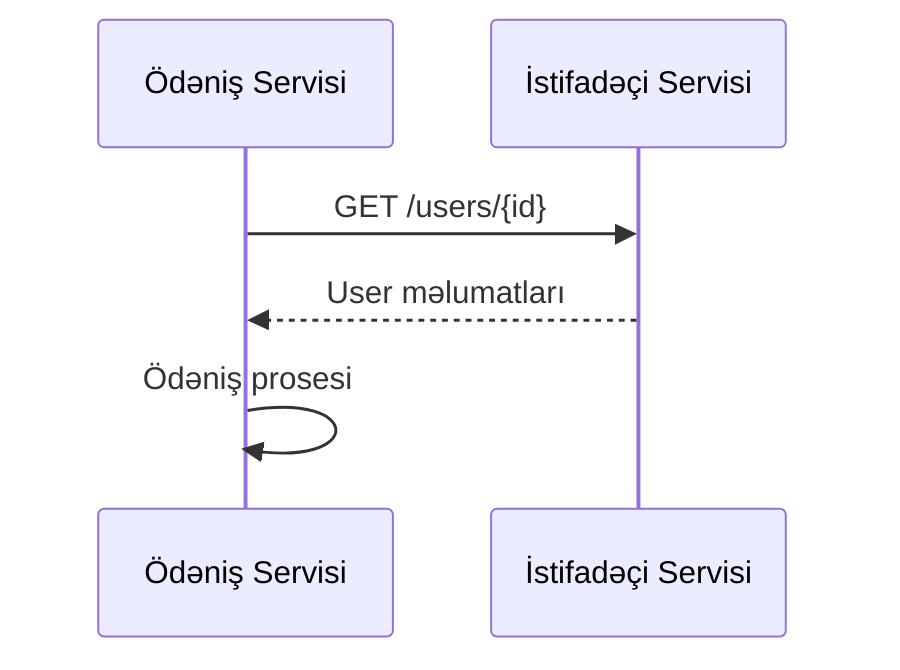
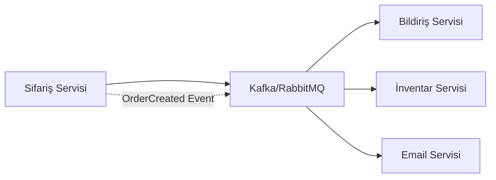

# Mikroservislərin Kommunikasiyası
Mikroservis arxitekturasında, servislər arasında effektiv kommunikasiya sistemin ümumi performansı və dayanıqlılığı üçün kritik əhəmiyyət daşıyır. Mikroservislər arasında kommunikasiya, servislərin bir-biri ilə məlumat mübadiləsi etməsi və əməkdaşlıq etməsi üçün istifadə olunan mexanizmlərdir.

## Kommunikasiya Modelləri

### 1. Sinxron Kommunikasiya

Sinxron kommunikasiyada, sorğu göndərən servis cavab alana qədər gözləyir:

- **Request-Response**: Bir servis digərinə sorğu göndərir və cavab gözləyir
- **Bloklayıcı**: Sorğu göndərən servis cavab alana qədər bloklanır
- **Real-time**: Cavab dərhal tələb olunur

**Texnologiyalar**: REST API, gRPC, GraphQL

**Nümunə**: Ödəniş servisinin müştəri servisindən müştəri məlumatlarını alması



### 2. Asinxron Kommunikasiya

Asinxron kommunikasiyada, sorğu göndərən servis cavabı gözləmədən işinə davam edir:

- **Fire-and-Forget**: Bir servis mesaj göndərir və cavab gözləmir
- **Qeyri-bloklayıcı**: Sorğu göndərən servis bloklanmır
- **Eventual Consistency**: Sistem müvəqqəti olaraq qeyri-ardıcıl vəziyyətdə ola bilər

**Texnologiyalar**: Message Queues, Event Streaming, Pub/Sub

**Nümunə**: Sifariş yaradıldıqdan sonra bildiriş servisinin məlumatlandırılması



## Kommunikasiya Protokolları

### 1. REST (Representational State Transfer)

REST, HTTP protokolu üzərində qurulan, resurs-əsaslı bir kommunikasiya üsuludur:

- **Üstünlükləri**: Sadə, geniş dəstəklənən, standartlaşdırılmış
- **Çatışmazlıqları**: Böyük məlumat həcmləri üçün səmərəsiz, sxema validasiyası məhdud
- **İstifadə halları**: CRUD əməliyyatları, ümumi API-lər

**Nümunə**:
```http
GET /users/123 HTTP/1.1
Host: api.example.com
Accept: application/json
```

### 2. gRPC (Google Remote Procedure Call)

gRPC, Google tərəfindən yaradılmış, yüksək performanslı RPC (Remote Procedure Call) sistemidir:

- **Üstünlükləri**: Yüksək performans, güclü tipləşdirmə, kod generasiyası
- **Çatışmazlıqları**: Öyrənmə əyrisi, brauzerdə dəstək məhdudiyyətləri
- **İstifadə halları**: Mikroservislər arası daxili kommunikasiya, yüksək performans tələb edən ssenarilər

**Nümunə**:
```protobuf
syntax = "proto3";

service UserService {
  rpc GetUser (GetUserRequest) returns (User);
}

message GetUserRequest {
  string user_id = 1;
}

message User {
  string user_id = 1;
  string name = 2;
  string email = 3;
}
```

### 3. GraphQL

GraphQL, Facebook tərəfindən yaradılmış, sorğu dili və runtime-dır:

- **Üstünlükləri**: Çevik sorğular, az şəbəkə sorğuları, güclü tipləşdirmə
- **Çatışmazlıqları**: Server tərəfdə mürəkkəblik, keşləmə çətinlikləri
- **İstifadə halları**: Mobil tətbiqlər, mürəkkəb UI-lər

**Nümunə**:
```graphql
query {
  user(id: "123") {
    id
    name
    email
    orders {
      id
      status
    }
  }
}
```

### 4. Message Queues və Event Streaming

Mesaj növbələri və hadisə axını platformaları asinxron kommunikasiya üçün istifadə olunur:

- **Üstünlükləri**: Dayanıqlılıq, miqyaslanma, servislər arasında zəif əlaqə
- **Çatışmazlıqları**: Əlavə infrastruktur, eventual consistency
- **İstifadə halları**: Hadisə əsaslı arxitektura, asinxron iş axınları

**Texnologiyalar**: Apache Kafka, RabbitMQ, Amazon SQS/SNS, Google Pub/Sub

**Nümunə** (Kafka):
```
// Kafka Producer örneği
// Producer
ProducerRecord record = new ProducerRecord("orders", orderId, orderData);
producer.send(record);

// Consumer
ConsumerRecords records = consumer.poll(100);
for (ConsumerRecord record : records) {
    processOrder(record.value());
}
```

## Servis Kəşfi (Service Discovery)

Servis kəşfi, mikroservislərin bir-birini dinamik olaraq tapması üçün istifadə olunan mexanizmdir:

- **Klient tərəfli kəşf**: Klient servis reyestrindən hədəf servisin ünvanını alır
- **Server tərəfli kəşf**: Proxy/Gateway sorğunu uyğun servisə yönləndirir

**Texnologiyalar**: Netflix Eureka, Consul, etcd, Kubernetes Service Discovery

**Nümunə** (Spring Cloud + Eureka):

<details>
<summary>Koda bax</summary>

```java
@SpringBootApplication
@EnableDiscoveryClient
public class PaymentServiceApplication {
    public static void main(String[] args) {
        SpringApplication.run(PaymentServiceApplication.class, args);
    }
}

@RestController
public class PaymentController {
    @Autowired
    private DiscoveryClient discoveryClient;

    @Autowired
    private RestTemplate restTemplate;

    @GetMapping("/payment/{userId}")
    public Payment getPayment(@PathVariable String userId) {
        // Klient tərəfli servis kəşfi
        List<ServiceInstance> instances = discoveryClient.getInstances("user-service");
        ServiceInstance instance = instances.get(0);
        String userServiceUrl = instance.getUri().toString();

        // Servisə sorğu
        User user = restTemplate.getForObject(userServiceUrl + "/users/" + userId, User.class);
        // ...
    }
}
```
</details>

## Servis Mesh (Service Mesh)

Servis Mesh, mikroservislər arasında kommunikasiyanı idarə edən infrastruktur təbəqəsidir:

### Əsas Komponentlər

- **Data Plane**: Servislər arasında trafikin idarə edilməsi (proxylər)
- **Control Plane**: Proxy konfiqurasiyası və idarəetməsi

### Funksiyalar

1. **Trafik İdarəetməsi**:
   - Load balancing
   - Circuit breaking
   - Retry və timeout
   - Traffic splitting/canary deployment

2. **Təhlükəsizlik**:
   - Mutual TLS (mTLS)
   - Authentication və authorization
   - Şifrələmə

3. **Müşahidə**:
   - Distributed tracing
   - Metrics
   - Logging

**Populyar Servis Mesh Həlləri**:
- **Istio**: Kubernetes üçün tam funksional servis mesh
- **Linkerd**: Yüngül və sadə servis mesh
- **Consul Connect**: HashiCorp-un servis mesh həlli
- **AWS App Mesh**: AWS üçün idarə olunan servis mesh

**Nümunə** (Istio Virtual Service):
```yaml
apiVersion: networking.istio.io/v1alpha3
kind: VirtualService
metadata:
  name: payment-service
spec:
  hosts:
  - payment-service
  http:
  - route:
    - destination:
        host: payment-service
        subset: v1
      weight: 90
    - destination:
        host: payment-service
        subset: v2
      weight: 10
  - fault:
      delay:
        percentage:
          value: 5
        fixedDelay: 2s
```

## API Gateway

API Gateway, klient və mikroservislər arasında vasitəçi rolunu oynayan bir komponentdir:

### Funksiyalar

1. **Routing**: Sorğuların uyğun servislərə yönləndirilməsi
2. **Aggregation**: Bir neçə servisin cavablarının birləşdirilməsi
3. **Authentication**: Mərkəzləşdirilmiş autentifikasiya
4. **Rate Limiting**: Sorğu limitlərinin tətbiqi
5. **Monitoring**: Trafik monitorinqi və analitikası

**Populyar API Gateway Həlləri**:
- **Netflix Zuul/Spring Cloud Gateway**: Java ekosistemi üçün
- **Kong**: Açıq mənbəli, Lua əsaslı
- **AWS API Gateway**: AWS üçün idarə olunan həll
- **Azure API Management**: Azure üçün idarə olunan həll

**Nümunə** (Spring Cloud Gateway):
```yaml
spring:
  cloud:
    gateway:
      routes:
      - id: user-service
        uri: lb://user-service
        predicates:
        - Path=/users/**
        filters:
        - name: CircuitBreaker
          args:
            name: userServiceCircuitBreaker
            fallbackUri: forward:/fallback/users
      - id: payment-service
        uri: lb://payment-service
        predicates:
        - Path=/payments/**
        filters:
        - name: RequestRateLimiter
          args:
            redis-rate-limiter.replenishRate: 10
            redis-rate-limiter.burstCapacity: 20
```

## Kommunikasiya Nümunələri və Anti-nümunələri

### Tövsiyə Olunan Nümunələr

1. **API Kompozisiyası**: Bir neçə mikroservisin məlumatlarını birləşdirmək
2. **Circuit Breaker**: Xəta hallarında alternativ davranış təmin etmək
3. **Bulkhead**: Resursları ayırmaqla kaskad xətaların qarşısını almaq
4. **Retry with Backoff**: Uğursuz sorğuları təkrarlamaq, lakin gecikmə ilə
5. **Idempotent Consumer**: Təkrarlanan mesajların təhlükəsiz emalı

### Anti-nümunələr

1. **Chatty Communication**: Servislər arasında həddindən artıq kommunikasiya
2. **Synchronous Chain**: Uzun sinxron sorğu zəncirləri
3. **Direct Database Access**: Bir servisin digər servisin məlumat bazasına birbaşa müraciəti
4. **Shared Libraries**: Servislər arasında həddindən artıq kod paylaşımı

## Kommunikasiya Strategiyası Seçimi

Mikroservis kommunikasiya strategiyası seçərkən nəzərə alınmalı faktorlar:

1. **Latency Requirements**: Real-time tələblər sinxron kommunikasiyanı tələb edə bilər
2. **Reliability Needs**: Yüksək etibarlılıq tələbləri asinxron kommunikasiyanı üstün tuta bilər
3. **Data Size**: Böyük məlumat həcmləri üçün gRPC və ya hadisə axını daha uyğun ola bilər
4. **Team Expertise**: Komandanın təcrübəsi və bilikləri
5. **Ecosystem Compatibility**: Mövcud texnologiya stack-i ilə uyğunluq

