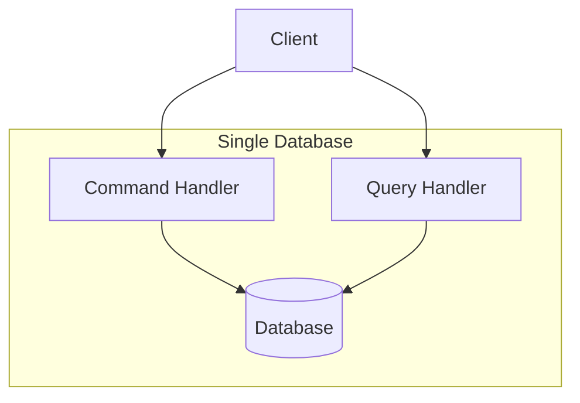
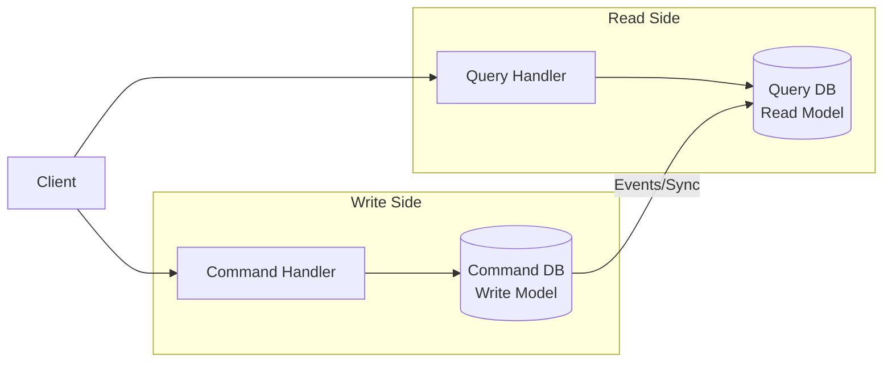
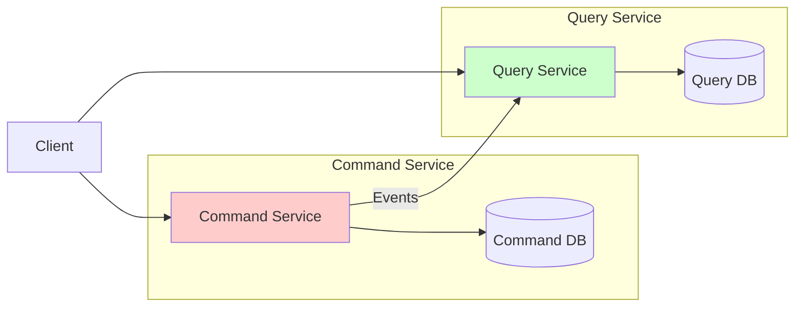

# CQRS Nədir?

## Problem
Mikroservis arxitekturasında məlumatlar müxtəlif servislər arasında bölünür. Bu, aşağıdakı problemlər yaradır:

- **Çoxlu servis məlumatı**: Sorğular (queries) bir neçə servisin məlumatını birləşdirməli olur
- **Mürəkkəb birləşmələr**: API composition pattern ilə in-memory join əməliyyatları bahalı olur
- **Müxtəlif sorğu növləri**: Tək məlumat modeli ilə bütün sorğu növlərini dəstəkləmək çətin olur
- **Event Sourcing məhdudiyyəti**: Event store yalnız primary key əsaslı sorğuları dəstəkləyir

## Həll

CQRS (Command Query Responsibility Segregation) pattern əmr (command) və sorğu (query) əməliyyatlarını ayırır:

- **Command tərəfi**: Məlumatları dəyişdirir, biznes məntiqini icra edir
- **Query tərəfi**: Məlumatları oxuyur, view-ləri saxlayır və sorğulara cavab verir
- **Event-driven sinxronizasiya**: Command tərəfi event-lər göndərir, query tərəfi bu event-lərə abunə olur

## Üstünlükləri

- **Səmərəli sorğular**: Müxtəlif servislərə məxsus məlumatları pre-join etmiş view-lər yaradır
- **Müxtəlif sorğu növləri**: Hər sorğu növü üçün optimal məlumat strukturu istifadə edilir
- **Event Sourcing dəstəyi**: Event store-un məhdudiyyətlərini aradan qaldırır
- **Məsuliyyət ayrılığı (Separation of Concerns)**: Command və query tərəfləri müstəqil inkişaf edir
- **Texnologiya müxtəlifliyi**: Hər tərəf üçün ən uyğun texnologiya seçilə bilər

## Çatışmazlıqları və Çətinlikləri

- **Mürəkkəb arxitektura**: Əlavə query servislər və məlumat bazaları idarə etmək lazımdır
- **Replication lag**: Command və query tərəfləri arasında gecikmə yaranır
- **Eventual consistency**: Dərhal ardıcıllıq (immediate consistency) əldə etmək çətin olur
- **Versiya idarəetməsi**: Client-lər köhnə məlumatla qarşılaşa bilər

:::warning Replication Lag
Client bir aggregate-i yeniləyib dərhal sorğu göndərdikdə köhnə məlumat görə bilər. UI tərtibatçıları bu problemi nəzərə almalıdır.
:::

## Həmişə CQRS İstifadə Etmək Lazımdırmı?

**Xeyr!** CQRS-i yalnız aşağıdakı hallarda istifadə edin:

### CQRS İstifadə Edin:
- API composition pattern bahalı in-memory join-lər yaradırsa
- Event sourcing istifadə edirsinizsə
- Müxtəlif sorğu növləri üçün fərqli performans tələbləri varsa
- Oxuma və yazma yükləri çox fərqlidirsə

### API Composition Seçin:
- Sorğular sadədirsə
- Məlumat həcmi kiçikdirsə
- Real-time məlumat lazımdırsa
- Arxitektura sadəliyi üstünlük təşkil edirsə

## CQRS Həmişə DB Ayırması Deməkdirmi?

**Xeyr!** CQRS-in müxtəlif tətbiq səviyyələri var:

### Səviyyə 1: Sadə Ayrılma

### Səviyyə 2: Ayrı Məlumat Bazaları

### Səviyyə 3: Ayrı Servislər

## Praktik Məsləhətlər

- **Kiçik başlayın**: Sadə command/query ayrılığı ilə başlayın
- **Ehtiyac olduqda genişləndirin**: Performans problemi yarananda məlumat bazalarını ayırın
- **Monitoring əlavə edin**: Replication lag-i izləyin
- **Idempotency təmin edin**: Event handler-lər idempotent olmalıdır

Faydalı resurslar:
- https://martinfowler.com/bliki/CQRS.html
