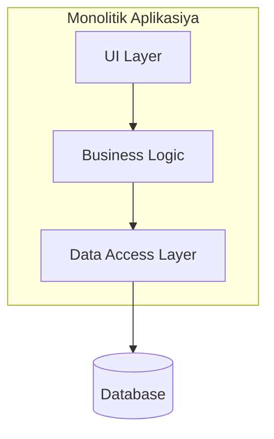
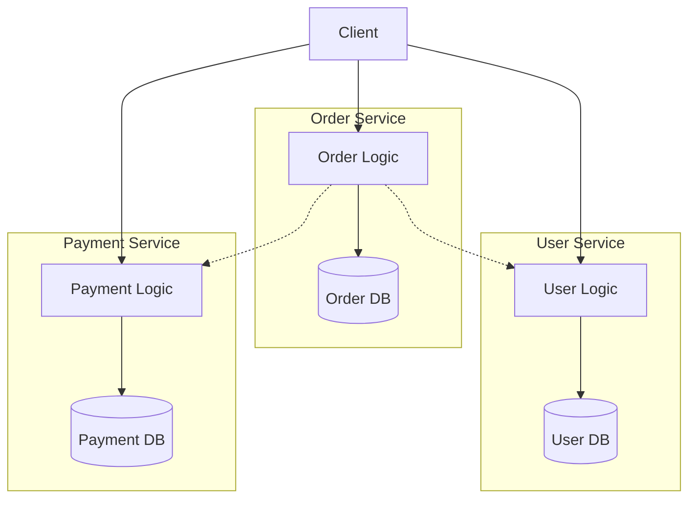

# Mikroservislər

## Mikroservis nədir?

Mikroservis böyük tətbiqi kiçik və müstəqil hissələrə ayıran arxitektura yanaşmasıdır.

Hər servis:
- Öz işini görür
- Ayrı-ayrı işləyir
- Başqa servislə rabitə qurur

## Niyə ehtiyac var?

- Böyük layihələr idarə etmək çətindir
- Komanda işi daha asan olur
- Yenilik əlavə etmək sürətlənir
- Xəta bir yerdə qalarsa, bütün sistem dayanmır

## Üstünlükləri

- **Müstəqillik**: Hər servis ayrı işləyir
- **Scale**: Lazım olan servis böyüdülür
- **Texnologiya seçimi**: Hər servis üçün uyğun texnologiya
- **Deploy**: Hər servis ayrı yenilənir
- **Performance**: Daha yaxşı performans
- **Komanda işi**: Kiçik qruplar işləyir

## Çətinlikləri

- Şəbəkə rabitəsi mürəkkəbdir
- Servislər arası əlaqə çətindir
- Test etmək çox vaxt alır
- Monitorinq çətinləşir
- Data consistency problemi

## Monolitik vs Microservice

### Monolitik Arxitektura
- Bütün kod bir yerdədir
- Bir database istifadə olunur
- Bütün sistem birlikdə deploy olunur
- Sadə başlanğıc üçün yaxşıdır

### Microservice Arxitektura
- Kod ayrı servislərə bölünür
- Hər servisin öz database-i var
- Servislər ayrı-ayrı deploy olunur
- Böyük sistemlər üçün uyğundur

## Arxitektura Diaqramları

### Monolitik Sistem

### Mikroservis Sistemi

