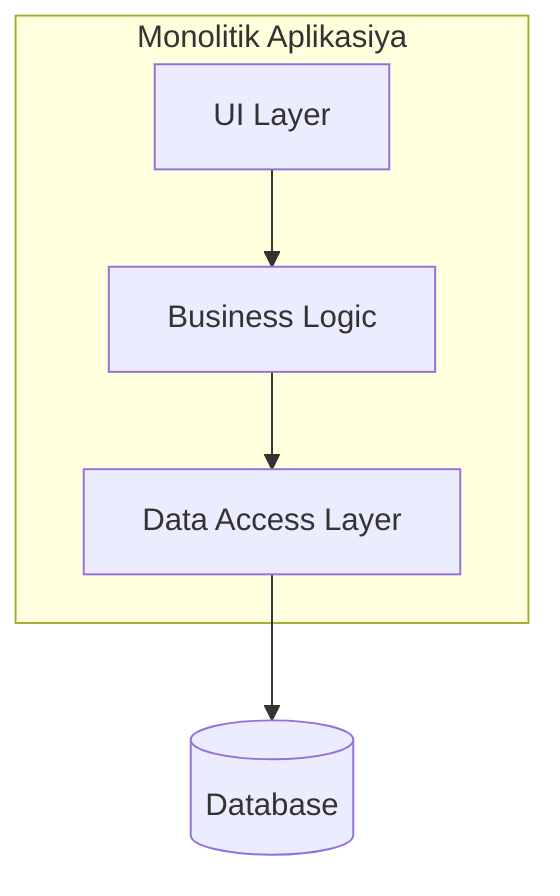
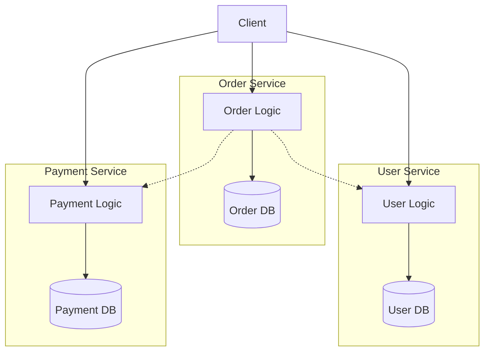

# Mikroservislər

Mikroservis böyük tətbiqi kiçik və müstəqil hissələrə ayıran arxitektura yanaşmasıdır. Hər servis öz işini görür və başqa servislə rabitə qurur.

## Niyə ehtiyac var?

- Böyük layihələr idarə etmək çətindir
- Komanda işi asanlaşır
- Yenilik əlavə etmək sürətlənir  
- Xəta bir yerdə qalarsa, sistem dayanmır

| Üstünlüklər | Çətinliklər |
|-------------|-------------|
| Müstəqil işləmə | Şəbəkə mürəkkəbliyi |
| Asan scale | Servislər arası əlaqə |
| Texnologiya seçimi | Test mürəkkəbliyi |
| Ayrı deploy | Monitorinq çətinliyi |
| Yaxşı performans | Data uyğunsuzluğu |

## Mövzular və Keçidlər

### 🔧 İnfrastruktur və Rabitə
| Mövzu | Təsvir |
|-------|---------|
| [Service Discovery](/mikroservisler/service-discovery) | Servislər bir-birini necə tapır |
| [Kommunikasiya](/mikroservisler/kommunikasiya) | Servislər arası rabitə növləri |
| [Deployment Strategiyaları](/mikroservisler/deployment-strategiyalar) | Servisləri yeniləmə yolları |

### 💾 Data İdarəetməsi  
| Mövzu | Təsvir |
|-------|---------|
| [Database Per Service](/mikroservisler/database-per-service) | Hər servis üçün ayrı database |
| [API Composition](/mikroservisler/api-composition) | Data birləşdirmə pattern-i |
| [CQRS](/mikroservisler/cqrs) | Command Query ayrılığı |

### 🛡️ Etibarlılıq və Resilience
| Mövzu | Təsvir |
|-------|---------|
| [Circuit Breaker](/mikroservisler/circuit-breaker) | Sistem qoruma mexanizmi |
| [Saga](/mikroservisler/saga) | Transaction idarəetməsi |
| [Dead Letter Queue](/mikroservisler/dlq) | Uğursuz mesajlar üçün növbə |

### 🏗️ Arxitektura Pattern-ləri
| Mövzu | Təsvir |
|-------|---------|
| [Domain-Driven Design](/mikroservisler/domain-driven-design) | Domain mərkəzli dizayn |
| [Event-Driven](/mikroservisler/event-driven) | Hadisə əsaslı arxitektura |
| [Hexagonal](/mikroservisler/hexagonal) | Port və Adapter pattern-i |

## Monolitik vs Microservice

### Monolitik Arxitektura
- Bütün kod bir yerdədir
- Bir database istifadə olunur
- Bütün sistem birlikdə deploy olunur
- Sadə başlanğıc üçün yaxşıdır

### Microservice Arxitektura
- Kod ayrı servislərə bölünür
- Hər servisin öz database-i var
- Servislər ayrı-ayrı deploy olunur
- Böyük sistemlər üçün uyğundur

## Arxitektura Diaqramları

### Monolitik Sistem

### Mikroservis Sistemi

